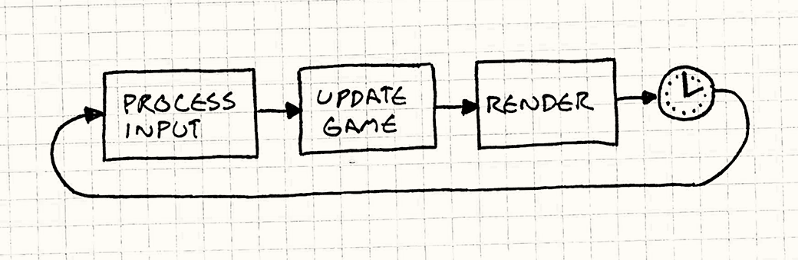
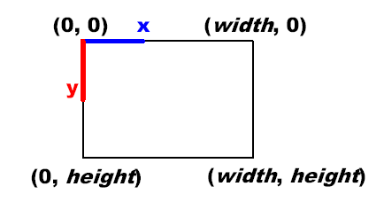
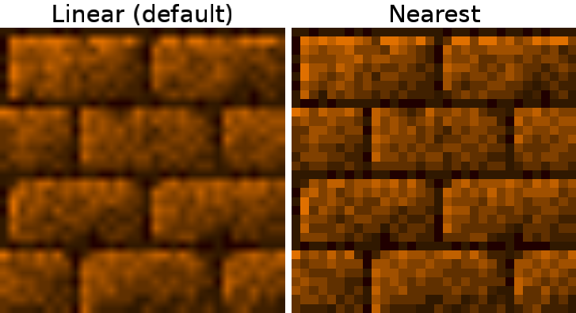
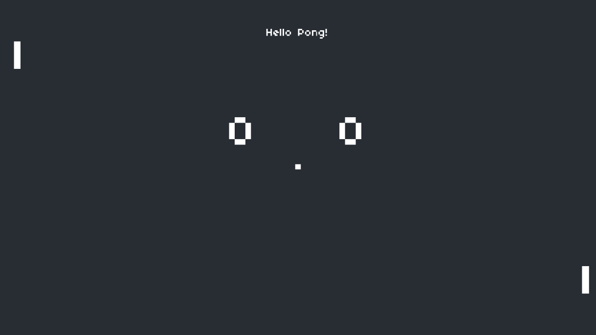
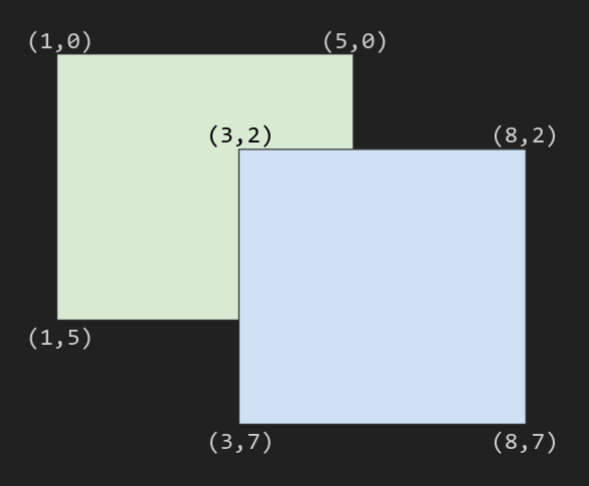

# Aula 00 - Pong

> ~27 min de leitura.

## Introdução

Começaremos nossa primeira aula apresentando a linguagem de programação Lua, a biblioteca *LÖVE*, conceitos fundamentais para criar jogos e finalizaremos implementando nosso primeiro jogo, o clássico **PONG**!

## Lua - A Linguagem de Programação Brasileira

Lua é uma linguagem de programação **brasileira**, criada em 1993 na PUC-RIO, é uma linguagem interpretada de tipagem dinâmica (ou seja variáveis podem mudar de tipo)[^2] . Seu propósito original era ser uma linguagem de configuração em aplicações maiores, graças a sua flexibilidade, velocidade - ela é conhecida como a linguagem interpretada mais rápida! - e facilidade de integração com linguagens como C. Tornou-se muito popular no mercado de jogos para desenvolver mods no Roblox, prototipagem e até mesmo jogos reais como Dota 2, Angry Birds e Wold of Warcraft. 

Para instalar o Lua na sua máquina siga as instruções do seu sistema operacional:
- **Linux**:
Lua pode ser simplesmente instalado utilizando o repositório *apt*:

```sh
sudo apt install lua5.4
```

- **MacOS**:
Utilize o comando `brew` no seu terminal para instalação:

```sh
brew update
brew install lua
```

- **Windows**:
Acesse este [link](https://luabinaries.sourceforge.net/). Vá pra baixo e seleciona versão que você quer instalar, vá na pasta "Tools Executables". Baixe ou a *Win32_bin.zip* ou a *Win64_bin.zip*, a depender da sua máquina. Extraia o zip. Coloque a pasta contendo os `.exe` na sua variável PATH (se não souber fazer isso, siga este [passo a passo](https://stackoverflow.com/questions/44272416/how-to-add-a-folder-to-path-environment-variable-in-windows-10-with-screensho) do *StackOverflow*)

>Se você ficou preso nessa etapa peça ajuda no nosso fórum de *issues*.

Infelizmente esse não é um curso de Lua, então não vamos nos aprofundar muito na sua sintaxe e outros detalhes técnicos, mas vamos explicar o que cada trecho de código significa. Se quiser aprender Lua de verdade antes disso, sugiro que veja o material deste outro [curso](https://github.com/ConwayUSP/Hiten_Hagoromo/blob/main/lua/1-introducao/introducao.md). Caso você tenha uma experiência com outras linguagens, essa aula também inclui uma *colinha* mostrando como declarar variáveis, chamar funções e usar condicionais. Dê uma olhada [aqui](src/lua_demo.lua).

## Conhecendo LÖVE

É uma framework desenvolvida em C++ que usa a linguagem Lua para criar scripts. Ela é bem completa, incluindo módulos para renderização gráfica, áudio, entradas com teclado e *joystick*, matemática, simulação física, etc. Alguns jogos feitos com LÖVE são Balatro, Arco, Gravity Circuit e mais. Utilizaremos ela na primeira metade do curso em quanto apresentamos o mundo dos jogos 2D, graças a facilidade em prototificar jogos.

Para instalar o LÖVE acesse sua página oficial e siga as instruções de acordo com seu sistema operacional: https://love2d.org/#download. Caso fique em dúvida, pergunte no fórum de *issues* ou veja como rodar projetos na página oficial: https://love2d.org/wiki/Getting_Started.

Para rodar um projeto LÖVE, tudo que você precisa fazer é invocar o comando `love` passando como parâmetro a pasta em que o arquivo `main.lua`, ponto de entrada do nosso programa. Experimente rodar alguns dos scripts na pasta `src`. 

## Conceitos Fundamentais de GameDev

Apresentaremos os principais conceitos para desenvolver jogos, eles serão válidos independente do framework, biblioteca ou *game engine* que você utilizar, então lembre-se de entendê-los **muito bem**!

### Game Loop

O **Game Loop** ou **Laço do Jogo**, é um nada mais que um laço infinito. A cada iteração desse laço executamos um conjunto de ações que faz o jogo funcionar, chamamos cada iteração deste laço de *Frame*, algumas das ações a serem executadas dentro de um frame são:
- **Processar sinais entrada**, o usuário apertou um botão do teclado, ou moveu o mouse, precisamos detectar essa ação.
- **Atualizar o estado do jogo**, precisamos responder a entrada do usuário, bem como atualizar qualquer outro valor, como o movimento de objetos, detectar colisões, etc.
- **Renderizar o jogo**. Depois de atualizar o estado interno, temos que redesenhar a tela com essas novas informações.



Fonte: https://gameprogrammingpatterns.com/game-loop.html. Clique também para saber mais sobre Game Loops.

### Sistema de Coordenadas

O jeito mais fácil de ver um mundo é através de um **Sistema de Coordenas**. Em um mundo 2D, temos as coordenadas x e y. Se queremos desenhar qualquer coisa na tela, precisamos posicionar de acordo com essas coordenas.

Diferente do que se aprende na escola, na área de renderização gráfica é uma convenção que o sistema de coordenadas 2D tenha a origem, o ponto $(0, 0)$, no canto superior esquerdo da sua tela, com x crescendo para direita e y para baixo.



Fonte: http://rbwhitaker.wdfiles.com/local--files/monogame-introduction-to-2d-graphics/2DCoordinateSystem.png

### Delta Time

A variável mais **importante** de qualquer jogo é o DeltaTime, apelidado de *delta*, ou *dt* para os mais íntimos. É uma variável que guarda o tempo decorrido desde o final do último frame. No LÖVE, este tempo é calculado em segundos. Essa variável é muito importante pois é utilizado, entre outras coisas, para atualizar o movimento de objetos.

### Outros Conceitos

Seguem outros conceitos e termos de GameDev que serão usados na próxima seção.

**Game State**: podemos descrever jogos como uma série de estados, o estado de tela inicial, de pausa, de *gameplay*, então é importante visualizar e entender este conceito na hora de renderizar a tela.

**Hitboxes**: também chamadas de **Caixas de Colisões**, é um conceito muito útil em jogos, colocamos nossas "*entidades*" dentro de caixas imaginárias (que só existem em variáveis internas), caso uma caixa esteja indo de encontro a outra, dizemos que há uma **colisão** e utilizamos um algoritmo para tratá-la. Veremos isto, mais a frente nesta aula.

## Objetivo desta aula: Criando o Pong

A fim de apresentar de forma prática estes conceitos iniciais, vamos criar um dos primeiros jogos já criados, o **Pong**. Criado em 1972 pela empresa *Atari*, Pong é um jogo de *arcade* que simula uma partida de tênis[^1]. Ele é composto de duas raquetes e uma bola. Cada jogador controla uma raquete, podendo movimentá-la para cima ou para baixo, o objetivo é fazer com que a bola passe para fora do campo adversário, quem fizer 10 pontos primeiro vence.

## Implementando o Projeto

> Cada etapa desta aula possui um diretório correspondente dentro da pasta `src`. Então se ficar com dúvida, não hesite em dar uma olhadinha.

### Criando uma janela (pong-0)

Vamos botar a mão na massa! Primeiro, crie uma nova pasta ou escolha um local no seu computador para criar nosso jogo. Feito isso, crie um arquivo chamado `main.lua`, ele será o ponto de entrada do nosso jogo. 

Agora insira neste arquivo o seguinte trecho de código:

```lua
WINDOW_WIDTH = 1280
WINDOW_HEIGHT = 720

function love.load()
	love.window.setMode(WINDOW_WIDTH, WINDOW_HEIGHT, {
		fullscreen = false,
		resizable = false,
		vsync = true
	})
end

function love.draw()
	love.graphics.printf(
		"Olá, Pong!",
		0,
		WINDOW_HEIGHT / 2 - 6,
		WINDOW_WIDTH,
		"center")
end
```

Salve o arquivo e experimente rodar o código com `love <pasta do arquivo>`. Você verá uma janela com uma mensagem escrita no centro "Olá, Pong!". Agora vamos explicar o que esse código faz em partes.

```lua
WINDOW_WIDTH = 1280 -- largura
WINDOW_HEIGHT = 720 -- altura

function love.load()
	love.window.setMode(WINDOW_WIDTH, WINDOw_HEIGHT, {
		fullscreen = false,
		resizable = false,
		vsync = true
	})
end
```

Primeiro criamos duas variáveis globais (acessíveis por qualquer função ou módulo), que contém a largura e altura da janela que queremos criar, em pixels é claro. Isso feito, declaramos a função `love.load()`, que inicializa o primeiro estado do nosso jogo, tudo que colocarmos aqui será chamado no **começo do programa**. 

Nessa função, abrimos uma nova janela com a função `love.window.setMode()`. Onde definimos sua altura e largura, bem como alguns parâmetros no formato de uma tabela ou "*table*" do Lua. Esses parâmetros definem que queremos uma janela cheia (*fullscreen*) ou não, que se podemos redimensionar (*resizable*) a janela. E se queremos que a taxa de frames (quantas vezes a tela é redesenhada por segundo) esteja sincronizada com a taxa de *refresh* do nosso monitor. É comum em jogos ter essa configuração, pois torna o jogo mais fluído.

> Nota:
> > Lua gira em torno da sua estrutura de dados mais básica, a tabela/*table*, que funciona como lista ou como dicionário de valores. Elementos adicionados serão indexados por números de 1 a n, mas você também pode declarar seus próprios indices ou chaves como no código acima. 

```lua
function love.draw()
	love.graphics.printf(
		"Olá, Pong!",
		0,
		WINDOW_HEIGHT / 2 - 6,
		WINDOW_WIDTH,
		"center")
end
```

Em sequência, temos uma das funções do nosso game loop. `love.draw()` é chamada no final de cada frame para redesenhar a tela. Nesse caso, estamos usando a função `love.graphics.printf` para escrever uma string de texto, centralizado na tela.

O primeiro parâmetro é o texto que queremos escrever, o segundo e terceiro, as coordenadas x e y de onde posicionar o texto. Os dois últimos são `width` e `align`, que servem para definir o tamanho da nossa "caixa de texto" e seu alinhamento, no caso queremos que a caixa tenha o mesmo tamanho da nossa tela e o texto esteja centralizado nessa caixa &mdash; subtrair 6 é necessário para subir o texto 6 pixels acima do centro, apenas uma questão estética.

Brinque um pouco com os valores dessa função para entender como ela funciona.

### Diminuindo a resolução (pong-1)

Pong é um jogo de 1972, naquela época a resolução das telas não era das melhores. Porém nosso texto está com uma resolução muito boa, boa até demais... Vamos abaixar um pouco a resolução do texto para criar um estilo *retrô*. Faça as seguintes atualizações:

```lua
-- NOVO
push = require 'push'

VIRTUAL_WIDTH = 432
VIRTUAL_HEIGHT = 243

-- (...) 

function love.load()
	-- NOVO
	love.graphics.setDefaultFilter('nearest', 'nearest')
	
	push:setupScreen(VIRTUAL_WIDTH, VIRTUAL_HEIGHT, WINDOW_WIDTH, WINDOW_HEIGHT,{
		fullscreen = false,
		resizable = false,
		vsync = true
	})
end

-- NOVO (aperte <Esc> para fechar o jogo)
function love.keypressed(key)
	if key == 'escape' then
		love.event.quit()
	end
end

function love.draw()
	-- NOVO
	push:apply('start')
	
	love.graphics.printf(
	"Olá, Pong!",
	0,
	WINDOW_HEIGHT / 2 - 6,
	WINDOW_WIDTH,
	"center")
	
	-- NOVO
	push:apply('end')
end
```

Já começamos com uma novidade, a primeira linha do nosso programa `push = require('push')`. O que estamos fazendo é importar um módulo/arquivo lua para o contexto do nosso arquivo. Esse módulo se chama *push*, é uma biblioteca que permite mudar a resolução dos nossos desenhos independente do tamanho da janela, dando um aspecto retrô. Essa biblioteca foi desenvolvida pelo *[Ulydev](https://uly.dev/)*, você pode conseguir uma cópia baixando o arquivo `push.lua` no repositório do push: https://github.com/Ulydev/push, ou copiando o mesmo [arquivo](src/pong-1/push.lua) deste repositório.

Feito isso, fazemos as adaptações para usar essa biblioteca, primeiro declaramos duas novas variáveis globais, `VIRTUAL_WIDTH`, `VIRTUAL_HEIGHT`, são a resolução que queremos simular. `love.load` agora usa `love.graphics.setDefaultFilter()`, essa função define como nossa fonte/textura vai ser minimizada ou magnificada. Isso serve para criar um efeito de *blur* ou embaçado, mas não queremos isso! Queremos algo pixelado bem retrô. Se quiser experimente, substituir os atributos pelo valor `linear` para ver o efeito.



Fonte: http://love2d.org/wiki/FilterMode

Também, passamos a criar a janela usando uma função do push, a `push:setupScreen`, ela funciona de modo similar a `love.window.setMode`, mas ela aceita nossa resolução virtual bem como a real. 

Isso feito, atualizamos a função `love.draw()` envolvendo seu conteúdo com `push:apply`, garantindo que tudo seja desenhado na resolução virtual. Nas próximas seções, garanta que tudo sendo renderizado está *entre* essas chamadas.

Por último, adicionamos uma pequena conveniência. Declaramos uma função do tipo *callback*, ou seja, ela vai ser chamada sempre que um certo evento ocorrer. Essa função é `love.keypressed` e é fácil deduzir a que evento ela corresponde, ela é chamada sempre que uma tecla do teclado é pressionada. A função recebe como parâmetro uma string indicando a tecla. Em seu corpo, temos uma condicional simples, se a tecla pressionada nesse frame for `<Esc>`, chamada de `escape`, chamamos uma função que vai fechar o jogo. Assim, incluímos mais uma peça do nosso game loop.

Rode o projeto novamente e veja as alterações, não esqueça de fechar o programa com `<Esc>`. Inclusive, aqui vai uma atividade, mude para diferentes tipos de tecla, como `q`, ou `<Enter>`. Dê uma olhada na [documentação](https://love2d.org/wiki/love.keypressed) para saber tipos de combinação possíveis.

### Criando um retângulo (pong-2)

Nessa seção vamos criar algumas formas na tela e dar mais vida ao nosso jogo. Para fazer isso, vamos precisar usar algumas funções:

- `love.graphics.newFont(path, size)` para carregar um arquivo de fonte na memória e usar no nosso jogo, bem como o tamanho a ser usado da fonte. O padrão é a fonte *Arial, 12*.
- `love.graphics.setFont(font)` serve para definir qual fonte o LÖVE vai usar, permitindo trocar de fonte dinamicamente.
- `love.graphics.clear(r, g, b, a)` limpa a tela inteira utilizando uma cor definida no formato RGBA, cada componente pode ter valor de 0-255, ou entre 0.0 e 1.0 para versões mais modernas. Se quer saber o porquê, olhe [aqui](https://en.wikipedia.org/wiki/RGBA_color_model).
- `love.graphics.rectangle(mode, x, y, width, height)` permite desenhar um retângulo com a cor ativa do momento (definida com `love.graphics.setColor`, mas o padrão é branco, que iremos usar). Seus parâmetros são `mode` para saber se o retângulo deve ser preenchido ou não (`fill` para preenchido, `line` para apenas borda), enquanto os outros quatro parâmetros são para dimensionar e posicionar a forma geométrica.

Vamos trocar a fonte padrão por algo com mais *personalidade*, neste repositório tem um arquivo `font.ttf`, adicione ao seu projeto. Inclua em `love.load` nossa nova fonte:

```lua
smallFont = love.graphics.newFont("font.ttf", 8)
love.graphics.setFont(smallFont)
```

Muito bem! Antes de rodar de novo, vamos limpar a tela com um novo tom e posicionar nosso retângulos, adicione o seguinte trecho em `love.draw()`.

```lua
-- Um tom de preto
love.graphics.clear(40/255, 45/255, 52/255, 255/255)

-- Nossa frase de antes vai para outro canto
love.graphics.printf('Hello Pong!', 0, 20, VIRTUAL_WIDTH, 'center')

-- Retângulos!
love.graphics.rectangle('fill', 10, 30, 5, 20)
love.graphics.rectangle('fill', VIRTUAL_WIDTH - 10, VIRTUAL_HEIGHT - 50, 5, 20)
love.graphics.rectangle('fill', VIRTUAL_WIDTH / 2 - 2, VIRTUAL_HEIGHT / 2 - 2, 4, 4)
```

Agora temos nossas raquetes nos cantos e uma bola (que é quadrada!) no centro.

### Mexendo a raquete (pong-3)

Vamos adicionar movimento as raquetes, com as teclas `w` e `s` para a da esquerda, e com as setas `up` e `down` para a direita.

Para isso apresentamos duas novas funções:
- `love.keyboard.isDown(key)` retorna `true` ou `false` (verdadeiro ou falso) dependendo se a tecla está pressionada naquele frame. Diferentemente dá `love.keypressed(key)`, que é chamada apenas uma vez quando uma tecla é pressionada. Se quiser fazer o teste, faça as duas imprimirem um texto no terminal, com a função `print` ao apertar uma tecla. A diferença será clara.
- `love.update(dt)`, a última função do nosso game loop, chamada a cada frame do jogo para atualizarmos o estado do nosso programa. Ela recebe como parâmetro, o delta entre o último frame e o atual. 

Para essa etapa, adicione uma nova variável global que representará a velocidade com que nossa raquete se moverá.

```lua
-- pixels / segundo
PADDLE_SPEED = 200 
```

Esse um valor arbitrário, experimente outros valores. Vamos multiplicar essa velocidade pelo nosso delta, obtendo a distância em pixels percorrida pela raquete, para então atualizar a imagem. Esse é o poder do *DeltaTime*!

Após isso, adicione as seguintes variáveis a `love.load()`:

```lua
scoreFont = love.graphics.newFont('font.ttf', 32)

player1Score = 0
player2Score = 0

player1Y = 30
player2Y = VIRTUAL_HEIGHT - 50
```

Criamos uma fonte maior para representar a pontuação dos jogadores, além disso, criamos variáveis para guardar suas pontuações, bem como a posição inicial de cada raquete.

Agora, adicione a função `love.update()` para nosso código:

```lua
function love.update(dt)
	if love.keyboard.isDown('w') then
		player1Y = player1Y + -PADDLE_SPEED * dt
	elseif love.keyboard.isDown('s') then
		player1Y = player1Y + PADDLE_SPEED * dt
	end
	
	if love.keyboard.isDown('up') then
		player2Y = player2Y + -PADDLE_SPEED * dt
	elseif love.keyboard.isDown('down') then
		player2Y = player2Y + PADDLE_SPEED * dt
	end
end
```

Desse modo, checamos se as respectivas teclas estão pressionadas e atualizamos a posição da raquete de acordo. Por último, atualize `love.draw()` para imprimir as pontuações com a fonte correta.

```lua
  love.graphics.setFont(scoreFont)
  love.graphics.print(tostring(player1Score), VIRTUAL_WIDTH / 2 - 50, VIRTUAL_HEIGHT / 3)
  love.graphics.print(tostring(player2Score), VIRTUAL_WIDTH / 2 + 30, VIRTUAL_HEIGHT / 3)
```

Veja como estamos até agora.


Fonte: Autoral

### Atualizando a Bola (pong-4)

Nossa próxima etapa será fazer a bola se mover pela tela ao apertar a tecla `<Enter>`. Para isso vamos precisar das seguintes funções:

- `math.randomseed(num)`, essa função faz parte da biblioteca padrão do Lua `math`. Ela define a *seed* ou semente, que será utilizada para gerar número aleatórios. Uma mesma seed gera a mesma sequência de números. Pense em *seeds* do Minecraft, caso já tenha jogado.
- `os.time()`, outra função nativa do Lua, ela retorna um inteiro, representando o tempo atual em segundos desde a [UNIX Epoch](https://en.wikipedia.org/wiki/Unix_time). É a forma padrão que os computadores lidam com o tempo.
- `math.random(min, max)` retorna um número aleatório (com base na seed) entre `min` e `max` inclusivo. Seu valor padrão para `min` é `1`.
- `math.min(num1, num2)` e `math.max(num1, num2)` comparam dois números e retornam o menor ou maior, respectivamente.

Hora de programar. Adicione no inicio da função `love.load()` o seguinte trecho.

```lua
math.randomseed(os.time())
```

Dessa forma, sempre que o jogo for iniciado uma nova seed será usada (pois o programa sempre começa em tempos distintos), portanto a bola começará em uma posição diferente toda vez. Agora no final da função adicione o essas novas variáveis:

```lua
ballX = VIRTUAL_WIDTH / 2 - 2
ballY = VIRTUAL_HEIGHT / 2 - 2

-- um jeito de escolher entre 100 e -100.
ballDX = math.random(2) == 1 and 100 or -100
ballDY = math.random(-50, 50)

gameState = 'start'
```

Nesse trecho, `ballX` e `ballY` manterão a posição da bola enquanto `ballDX` e `ballDY` sua velocidade em cada um dos eixos (facilita as contas).  Em adição, vamos começar a definir os estados do nosso jogo, que será armazenado em `gameState` e o estado inicial será `'start'`.

Caso não tenha notado, é possível mover as raquetes para fora da tela! Vamos consertar isso. Em  `love.update()` atualize a movimentação com as funções `math.max()` e `math.min()` para impedir que as posição das raquetes passe dos limites da tela. Veja para `Player1`:

```lua
	if love.keyboard.isDown('w') then
		player1Y = math.max(0, player1Y + -PADDLE_SPEED * dt)
	elseif love.keyboard.isDown('s') then
		player1Y = math.min(VIRTUAL_HEIGHT, player1Y + PADDLE_SPEED * dt)
	end
```

Faça o mesmo para `Player2`.

Ainda na função de atualização, vamos adicionar o trecho que permite que a bola se mova caso o jogo tenha começado.

```lua
if gameState == 'play' then
    ballX = ballX + ballDX * dt
      ballY = ballY + ballDY * dt
end
```

Em seguida, volte para a função `love.keypressed(key)`, vamos adicionar a funcionalidade de começar o jogo (ou resetar) ao apertar `Enter` ou `Return`.

```lua
elseif key == 'enter' or key == 'return' then
	if gameState == 'start' then
		gameState = 'play'
	else
		gameState = 'start'
		
        ballX = VIRTUAL_WIDTH / 2 - 2
        ballY = VIRTUAL_HEIGHT / 2 - 2
        ballDX = math.random(2) == 1 and 100 or -100
        ballDY = math.random(-50, 50) * 1.5
	end
end
```

### Uma questão de classe (pong-5)

Até agora fizemos um bom trabalho estruturando nosso jogo, mas estamos adicionando cada vez mais funcionalidades e fazendo uso de muitas variáveis globais. Já vou avisando que isso é uma receita para o desastre. Esse é um problema muito comum na computação, projetos começam pequenos e vão crescendo e com isso o código se torna cada vez mais desorganizado e confuso até que chegue ao que chamamos de código *spaghetti*. Nesta seção, vamos organizar nosso código em diferentes arquivos e nossa entidades em *classes* seguindo o conceito de **Orientação à Objetos**. 

#### O que é Orientação à Objetos

> Se você já conhece esse conceito vindo de outras linguagens como C++, Java, JS, Python, etc. Fique à vontade para pular essa parte.

É um **paradigma** de programação, ou seja, um conjunto de "regras" ou preceitos a serem seguidos ao programar. A Orientação à Objetos gira em torno dos conceitos de **classe** e **objetos**. Uma *Classe* é essencialmente uma caixa para guardar atributos (valores/variáveis) e métodos (funções). Pense como uma planta que define como criar dados e como esses dados se relacionam com o resto do código. Esse paradigma é muito utilizado para representar conceitos abstratos do mundo, que vão além dos tipos primitivos que as linguagens disponibilizam, ex.: inteiros, reais e strings.

Enquanto um *Objeto* é uma instância dessa classe, se a classe é a planta, então o objeto é a construção. Trazendo isso para o nosso caso, podemos criar classes que representam conceitos do nosso jogo, como a Raquete/*Paddle* e a Bola/*Ball*, e teremos duas instâncias/objetos da raquete (uma de cada jogador) e uma instância para bola em campo.
#### Modificando nosso projeto 

Antes de mais nada, saiba que Lua não foi pensada para utilizar Orientação à Objetos (é um paradigma que ficou popular recentemente). Portando, as ferramentas nativas da própria linguagem, podem ser um tanto quanto *desagradáveis* de trabalhar. Por isso, vamos adicionar outra biblioteca externa para melhorar nossa vida. Procure pelo arquivo `class.lua` no repositório deste projeto e inclua ele ao seu.

Isso feito, vamos começar pela raquete, como estamos criando uma classe, é uma convenção que o nome da classe tenha a primeira letra capitalizada. Então crie um arquivo `Paddle.lua` na mesma pasta que sua *main*.

Agora vamos criar nossa classe:

```lua
Paddle = Class{}

function Paddle:init(x, y, width, height)
	self.x = x
	self.y = y
	self.width = width
	self.height = height
	self.dy = 0
end
```

O que esse código faz é simples, criamos uma classe chamada `Paddle` (raquete), utilizando `Class` (vindo da biblioteca `class`). Feito isso, criamos um *método* que nada mais é que uma função que opera sobre um objeto `Paddle`. Nesse caso criamos o método `init()` que será usado para criar os atributos da nossa classe. O atributo `self` é comum na OO e nos diz que estamos nos referindo ao objeto que chamou aquele método, por assim dizer.

Assim, colocamos todos os atributos da raquete, dentro dessa classe. A próxima etapa é definir métodos para atualizá-la e desenhá-la. Veja só:

```lua
function Paddle:update(dt) 
	-- impede de chegar aos negativos
	if self.dy < 0 then
		self.y = math.max(0, self.y + self.dy * dt)
	else 
		self.y = math.min(VIRTUAL_HEIGHT - self.height, self.y + self.dy * dt)
	end
end

function Paddle:render()
	love.graphics.rectangle('fill', self.x, self.y, self.width, self.height)
end
```

Desse jeito, todas as raquetes que criarmos usarão o mesmo código. 

Sendo assim, vamos criar nossa classe *Ball*, abra um novo arquivo chamado `Ball.lua`. Com o seguinte código:

```lua
Ball = Class{}

function Ball:init(x, y, width, height)
	self.x = x
	self.y = y
	self.width = width
	self.height = height
	
	self.dx = math.random(2) == 1 and -100 or 100
	self.dy = math.random(-50, 50)
end

function Ball:reset()
	self.x = VIRTUAL_WIDTH / 2 - 2
	self.y = VIRTUAL_HEIGHT / 2 - 2
	self.dx = math.random(2) == 1 and -100 or 100
	self.dy = math.random(-50, 50)
end

function Ball:update(dt)
	self.x = self.x + self.dx * dt
	self.y = self.y + self.dy * dt
end

function Ball:render()
	love.graphics.rectangle('fill', self.x, self.y, self.width, self.height)
end

```

Transferimos toda a lógica da bola para seus métodos, incluindo um método para resetar o estado da bola. Feito isso vamos atualizar o `main.lua` com nossas classes. Primeiro de tudo, no topo do arquivo inclua o seguinte trecho:

```lua
Class = require 'class'

require 'Paddle'
require 'Ball'
```

Estamos importando, ou trazendo ao contexto do nosso código estas classes e módulo. 

Agora, em `love.load()` substitua o código antigo por instâncias das classes.

```lua
-- (...)
player1 = Paddle(10, 30, 5, 20)
player2 = Paddle(VIRTUAL_WIDTH - 10, VIRTUAL_HEIGHT - 30, 5, 20)

ball = Ball(VIRTUAL_WIDTH / 2 - 2, VIRTUAL_HEIGHT / 2 - 2, 4, 4)
-- (...)
```
Substituimos `player1Y` e `player2Y` com dois objetos de `Paddle`, com as mesmas posições. Chamar nossa classe utilizando `()` invoca a função `init()` que declaramos anteriormente. Reformule a função `love.update(dt)` para incluir nossos objetos.

```lua
function love.update(dt)
	if love.keyboard.isDown('w') then
		player1.dy = -PADDLE_SPEED
	elseif love.keyboard.isDown('s') then
		player1.dy = PADDLE_SPEED
	else
		player1.dy = 0
	end
	
	-- Repita para o player2
	(...)
	
	if gameState == 'play' then
		ball:update(dt)
	end
	
	player1:update(dt)
	player2:update(dt)
end
```

Por fim, não esqueça de substituir o código em `love.draw()` chamando o método `render()` e de re-setar o estado da bola em `love.keypressed()`. 

Excelente trabalho, foi está indo muito bem! Nosso projeto está mais flexível, organizado e elegante, nosso `main.lua` também está mais legível e limpa. Enfim, hora da pausa para o café, te vejo na próxima seção!

### Título e calculando o FPS (pong-6)

Até agora o título da nossa janela está 'Untitled', isso é sem graça. Hora de mudar isso e aproveitado, vamos adicionar o FPS (*frames por segundo*) na tela. Para fazer isso, você deve conhecer essas funções:

- `love.window.setTitle(title)` seta o título da janela (o nome na borda superior).
- `love.timer.getFPS()` retorna o FPS atual da aplicação, permitindo fazer monitorar seu desempenho em tempo real.

Essa atualização é facinha, vá para `love.load()` e adicione o seguinte trecho:

```lua
love.window.setTitle('Pong')
```

Depois disso, crie uma nova função em `main.lua` que vai nos ajudar a mostrar o FPS de um jeito mais fácil.

```lua
function displayFPS()
	love.graphics.setFont(smallFont)
	love.graphics.setColor(0, 255/255, 0, 255/255)
	-- Concatenando strings in Lua
	love.graphics.print('FPS: ' .. tostring(love.timer.getFPS()), 10, 10)
end
```

Chamamos esse tipo de função de *helper* ou ajudante, ela executa uma tarefa repetitiva ou faz alguma conveniência para nós. Invoque-a em `love.draw()`.
### Tratamento de Colisões (pong-7)

Essa atualização vai fazer com que a bola colida com as raquetes e com as bordas da janela. Usaremos o conceito de *AABB Collision*. Que significa "axis-aligned bounding boxes", algo como caixas delimitadores alinhadas de acordo com seu eixo. Em palavras mais simples, cada entidade que possa colidir com alguma coisa precisa ter uma caixa delimitadora paralela com nossos eixos, como na imagem abaixo.



Fonte: https://cdn.cs50.net/games/2018/spring/lectures/0/lecture0.pdf

Esse é um dos modelo mais simples de colisão que há, utilizando uma fórmula que veremos a frente, podemos checar se a bola colidiu com uma raquete e tratar de acordo esse caso.

Adicione um método `collides()` que recebe um atributo `paddle`. Essa função retorna `true` ou `false` caso a bola esteja colidindo com a raquete.

```lua
function Ball:collides(paddle)
	-- Se o lado esquerdo da bola esta mais longe que o lado direito da raquete elas não colidem
	if self.x > paddle.x + paddle.width or paddle.x > self.x + self.width then
		return false
	end
	-- A mesma lógica aqui mas aplicada ao topo e parte inferior.
	if self.y > paddle.y + paddle.height or paddle.y > self.y + self.height then
		return false
	end
	
	-- Se tudo isso falhar, então elas colidem
	return true
end
```

Introduza essa mudança em `love.update()`, tanto a colisão com raquetes quanto com a borda da janela.

```lua
if ball:collides(player1) then
  ball.dx = -ball.dx * 1.03
  ball.x = player1.x + 5

  if ball.dy < 0 then
	  ball.dy = -math.random(10, 150)
  else
	  ball.dy = math.random(10, 150)
  end
end

if ball:collides(player2) then
  ball.dx = -ball.dx * 1.03
  ball.x = player2.x - 4

  if ball.dy < 0 then
	  ball.dy = -math.random(10, 150)
  else
	  ball.dy = math.random(10, 150)
  end
end

-- Colisão com a janela, apenas invertemos a direção do movimento
if ball.y <= 0 then
  ball.y = 0
  ball.dy = -ball.dy
end

if ball.y >= VIRTUAL_HEIGHT - 4 then
  ball.y = VIRTUAL_HEIGHT - 4
  ball.dy = -ball.dy
end
```

Note que afastamos a bola da raquete antes de inverter o movimento, isso impede que a colisão entre em loop e a bola "grude" na raquete (experiência própria).

### Atualizando a Pontuação (pong-8)

Esse jogo está cada vez melhor e mais completo, a próxima etapa é atualizar a pontuação dos jogadores. Basicamente, tudo que precisa ser feito é incrementar a pontuação sempre que a bola colidir com o "gol" ou lado oposto do jogador. Vamos introduzir também uma variável `servingPlayer` que será útil na próxima seção. Introduza dentro de `love.update(dt)` o seguinte trecho:

```lua
if ball.x < 0 then
  servingPlayer = 1
  player2Score = player2Score + 1
  ball:reset()
  gameState = 'start'
end

if ball.x > VIRTUAL_WIDTH then
  servingPlayer = 2
  player1Score = player1Score + 1
  ball:reset()
  gameState = 'start'
end
```

Teste mais uma vez seu jogo e parta para a próxima seção.

### Servindo a Bola (pong-9)

No jogo de tênis existe o ato de "servir", que no nosso jogo vai ser apenas definir qual jogador vai "arremessar" a bola para o adversário. Vamos adicionar essa funcionalidade inserindo um novo estado, o `serve`. Mas antes disso, hora de explicar o que é uma **Máquina de Estado**.

Nós já definimos estados anteriormente no nosso jogo como o estado de `start` e `play`. Trocamos do estado de inicio para o de jogo quando apertamos Enter. Isso é justamente uma **máquina de estado**, ela se preocupa em **armazenar** o estado atual e como **transicionar** para outro estado, onde uma transição pode ter uma lógica bem diferente da outra.

O estado de "servir", significa que sempre que o jogador serve a bola quando ele sofre deixa a bola passar. Assim deixando o jogo mais dinâmico (o que está perdendo tem a chance de atacar). Fazemos isso introduzindo um estado de `serve` em `love.update()` e arremessando a bola para o lado oposto:

```lua
if gameState == 'serve' then
	ball.dy = math.random(-50, 50)
	if servingPlayer == 1 then
		ball.dx = math.random(140, 200)
	else
		ball.dx = -math.random(140, 200)
	end
elseif ...
```

Não esqueça de atualizar o sistema de pontuação que mostramos anteriormente, troque `start` por `serve` na mudança de estado. Agora o jogador pode "servir a bola" apertando `Enter`.

### Veni, Vidi, Vici (pong-10)

O jogo está funcionando, mas ele vai *ad infinitum* (pro infinito). Introduzindo agora, o sistema de vitória! Faremos isso, incluindo um novo estado no jogo o `done`, que ocorre quando uma das pontuações chega a 10. 

Primeiro, modifique `love.update()` para fazer essa checagem:

```lua
(...)
if ball.x < 0 then
  servingPlayer = 1
  player2Score = player2Score + 1

	if player2Score == 10 then
		winningPlayer = 2
		gameState = 'done'
	else
		gameState = 'serve'
		ball:reset()
	end
end

-- Repita para a outra checagem
(...)
```

Quando o jogo acabar queremos exibir na tela quem venceu o jogo, para isso atualize `love.draw()`:

```lua
elseif gameState == 'done' then
      love.graphics.setFont(largeFont) # Novo
      love.graphics.printf('Player ' .. tostring(winningPlayer) .. ' wins!', 0, 10, VIRTUAL_WIDTH, 'center')
      love.graphics.setFont(smallFont)
      love.graphics.printf('Press Enter to restart!', 0, 30, VIRTUAL_WIDTH, 'center')
end
```

Não esqueça de incluir na função `love.load()`, a variável `largeFonte = love.fonts.newFont('font.ttf', 16)`.

Por fim, vamos adicionar código para voltar ao estado de `serve` e re-setar a pontuação, caso os jogadores queiram jogar de novo. Isso é muito simples, apenas adicione este trecho em `love.keypressed(key)`:

```lua
elseif key == 'enter' or key == 'return' then
	...
	elseif gameState == 'done' then
		gameState = 'serve'

		ball:reset()

		player1Score = 0
		player2Score = 0

		if winningPlayer == 1 then
			servingPlayer = 2
		else
			servingPlayer = 1
	  end
	end
end
```

### Adicionando Efeitos Sonoros (pong-11)

Os aspectos visuais e lógicos estão *prontos*! Mas um jogo não é só isso, eles também tem música, descubra como fazer isso nesta seção.

Para isso, vamos usar a seguinte função:
- `love.audio.newSource(path, [type])` cria um objeto de áudio dentro do LÖVE que podemos tocar a qualquer momento do programa. `path` é o caminho do arquivo e `type` aceita dois tipos `stream` e `static`. `stream` vai enviar dados do disco sob demanda, o que é útil para arquivos pesados e trilhas sonoras, já `static` vai manter tudo na memória, o que funciona melhor para arquivos leves, como o que vamos usar.

Incluímos três arquivos de áudio nessa atualização, eles foram feitos com a ferramenta **bfxr** (https://www.bfxr.net/), que pode ser usada para gerar sons aleatórios, ela será usado em aulas futuras.

Na parte do código, incluímos uma *table* em `love.load()` que terá nossos áudios.

```lua
sounds = {
	['paddle_hit'] = love.audio.newSource('sounds/paddle_hit.wav', 'static'),
	['score'] = love.audio.newSource('sounds/score.wav', 'static'),
	['wall_hit'] = love.audio.newSource('sounds/wall_hit.wav', 'static')
}
```

Agora, chame cada áudio em cada caso, quando uma pontuação é feita, quando a parede/raquete é atingida e invoque o método `play()` do objeto da seguinte forma, `sounds['score']:play()`. Pronto, temos nossos efeitos sonoros!

### Mudando o tamanho da tela (pong-12)

Como última modificação do nosso jogo, vamos tornar a tela redimensionável. Para fazer isso precisamos introduzir outra função:
- `love.resize(width, height)` é um *callback* que é chamado sempre que o tamanho da janela muda. Com isso podemos atualizar a interface.

Modifique dois lugares na `main.lua`, primeiro em `love.load()`, altere a construção da janela para ter  `resizable = true`. O outro ponto é introduza a função `love.resize()` e chame a biblioteca `push` para que ela também atualize o seu tamanho de tela.

```lua
function love.resize(w, h)
	push:resize(w, h)
end
```

## Conclusão

 Meus parabéns! Você completou sua primeira aula desse curso com sucesso e agora tem um jogo de Pong funcionando. Isso foi apenas o começo, porém muitos conceitos iniciais foram introduzidos. As próximas aulas focaram em outros conceitos e como implementar outros jogos. Vejo você lá! 

[^1]: https://pt.wikipedia.org/wiki/Pong

[^2]: https://www.lua.org/portugues.html
