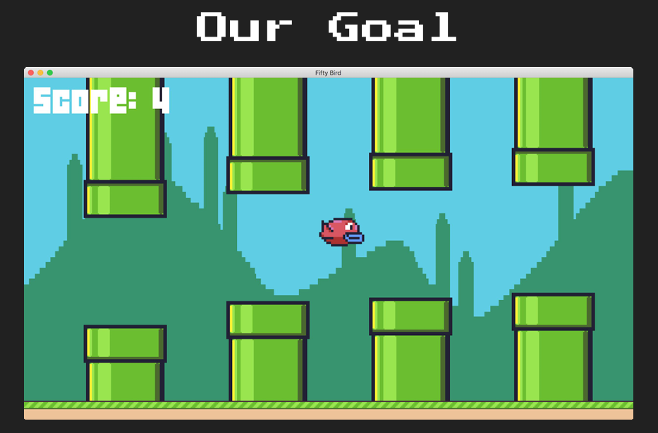
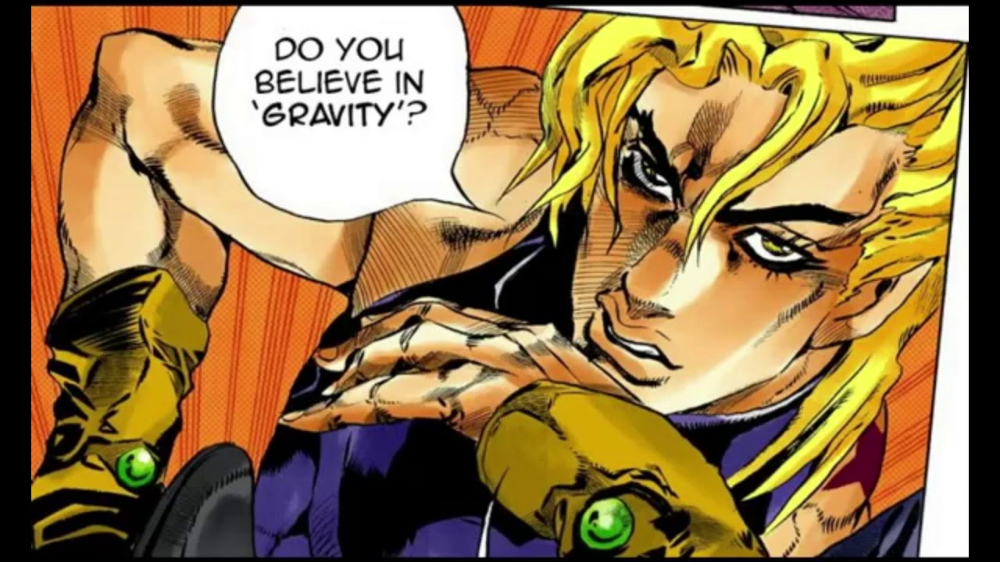
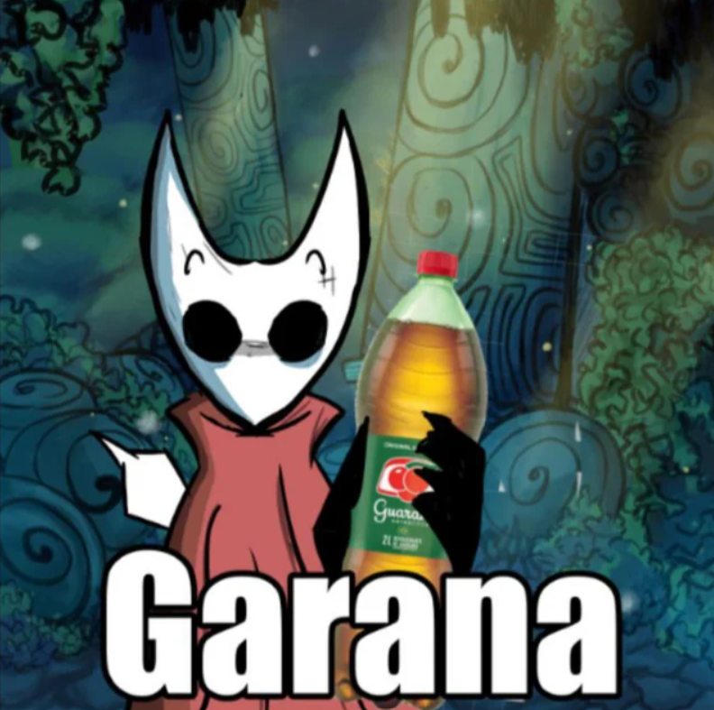
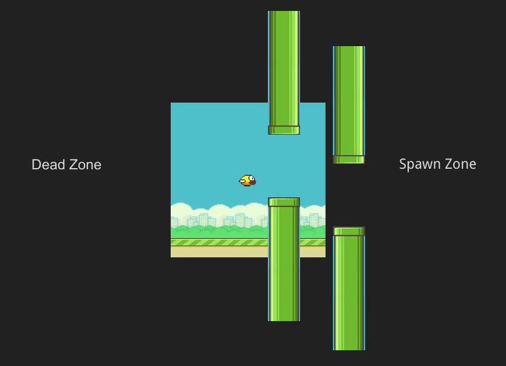
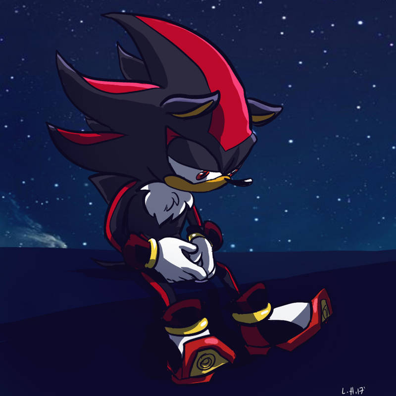

# Introdução

Bem vindo de volta ao nosso curso! Anteriormente, nós recriamos o **Pong**, aquele que é o vovôzinho dos videogames. Agora, vamos avançar algumas décadas para frente, mais especificamente para 2013, e recriar aquele que foi um tremendo fenômeno mobile: **o Flappy Bird**.
Apesar de parecer simples, tanto visualmente quanto na sua proposta, este jogo introduz conceitos vitais para qualquer desenvolvedor de jogos 2D moderno:

- **Sprites**: Chega de só quadrados brancos! Vamos usar imagens reais.

- **Geração Procedural**: Como criar um mundo infinito que nunca é igual.

- **Máquina de Estados**: Como organizar o fluxo do jogo (Menu -> Jogo -> Game Over) de forma profissional.
    
- **Parallax Scrolling**: A ilusão de profundidade em um mundo 2D.

Então, vamos aprender um pouco com ele hoje!  Mas antes, aqui vai alguns fun facts:

*Fatos curiosos*:  O criador do jogo, **Dong Nguyen**, removeu o jogo do ar quando estava ganhando cerca de US$ 50 mil por dia, no auge do sucesso em 2014.
Dong Nguyen afirmou que o jogo estava se tornando viciante demais e que ele se sentia culpado por ver pessoas frustradas, estressadas e até brigando por causa dele. Então, ao contrário de muitos jogos populares que se encerram por conta da queda de popularidade, Flappy Bird se encerrou por decisão ética do próprio criador. E após essa remoção, celulares com Flappy Bird instalado chegaram a ser anunciados por milhares de dólares na internet. Um caso certamente único do fim de um jogo!

# Conceitos Fundamentais 

### Jogos são Ilusões

No Pong, a bola realmente se movia pela tela, porém, em jogos de "corrida infinita" (os infinite runners), como o Flappy Bird, o que de fato ocorre é uma ilusão.
O pássaro (que está na horizontal) geralmente está **parado** no eixo X. Quem de fato se mexe é o mundo, no caso do Flappy Bird, o chão e os canos que se movem para a esquerda. E é isso que cria a ilusão que o pássaro está voando e se movendo.

### Parallax Scrolling

**Parallax Scrolling** é uma técnica visual usada principalmente em jogos e interfaces 2D para **simular profundidade** em uma tela plana. Ela se baseia em um princípio da percepção humana:

> **objetos mais próximos parecem se mover mais rápido do que objetos distantes quando nos deslocamos**.

Nos jogos, isso é simulado fazendo **camadas diferentes do cenário se moverem a velocidades diferentes**.

- **Camadas de fundo** (céu, nuvens, montanhas, prédios distantes) → movem-se **devagar**
    
- **Camadas intermediárias** (árvores, postes, construções médias) → movem-se a uma velocidade **média**
    
- **Primeiro plano** (chão, personagens, obstáculos) → movem-se **mais rápido**

E mesmo com tudo ainda sendo 2D, o nosso cérebro acaba intepretando essa diferença de movimento como profundidade e distância. E isso acontece porque o parallax imita o que vemos na vida real.
Por exemplo, imagina que você está em um carro, viajando para a praia, e decide olhar para a janela, a sua percepção sobre aos arredores vai ser a seguinte:

- As **montanhas ao longe** irão parecerem quase paradas
    
- As **árvores na beira da estrada** irão passar rapidamente
    
- O **asfalto** parece “correr” sob você

Ou seja, nosso cérebro já reconhece esse padrão! Logo quando o parallax é usado em algum jogo, o nosso cérebro automaticamente e imediatamente entende a cena como tridimensional.

### Máquina de Estados (State Machine)

Uma **Máquina de Estados** é uma forma de pensar e organizar o jogo como uma **sequência de situações bem definidas**, onde cada situação representa _o que o jogo é_ naquele momento.

Em vez de o jogo estar “meio menu, meio jogando, meio game over” ao mesmo tempo, **ele vai está sempre em exatamente um estado**.

Alguns exemplos clássicos que você já deve está familiarizado:

- Menu
    
- Jogando
    
- Pausado
    
- Game Over
    
- Cutscene
    

Cada um desses estados tem **regras próprias**, comportamentos próprios e até controles diferentes.

E isso serve para resolver um possível problema que pode surgir a medida que o jogo cresce. No caso, podem surgir algumas do tipo:

- " Ah esse input funciona agora ou só no menu?”
    
- “Será que essa lógica roda durante o pause?”
    
- “Esse som deve tocar no game over ou nem?”

Caso não haja uma State Machine, essas regras ficaram espalhadas em vários *if/else* (alô Undertale), misturadas umas com as outras, o que acaba resultando naquele código que mais parece um espaguete, onde tudo depende de tudo, e qualquer mudança pode vir a ser um risco.
Com a State Machine, ela resolve isso **separando responsabilidades**. E a ideia central é relativamente simples:

- Cada **estado** é responsável apenas pelo que acontece **dentro dele**
    
- O jogo principal não conhece os detalhes internos
    
- Ele apenas delega:
    
    > “Estado atual, faça seu update”  
    > “Estado atual, desenhe a tela”
    

Isso cria uma **fronteira clara** entre as partes do jogo.

Sei que isso pode parecer um pouco confuso de primeira kkkkk, mas tenta pensar em estados como mini-programas indepedentes!

- O estado Menu, por exemplo, saberá lidar com seleção de opções.
- Já o estado Jogando sabe lidar com a física, inimigos, pontuação, etc.
- E o Game Over sabe mostrar o resultado e esperar uma decisão do jogador.

Com isso fica um pouco mais claro de entender: cada estado tem seu próprio ritmo, regras e objetivos. Eles **não se misturam**.

#### Transições

Outro conceito importante é a **transição entre estados**.

O jogo não muda de comportamento aos poucos, mas sim ele **troca de estado**:

- Menu → Jogando
    
- Jogando → Pausado
    
- Jogando → Game Over
    

Essas transições deixam explícito:

- _quando_ algo muda
    
- _por que_ mudou
    

E isso torna o fluxo do jogo muito mais fácil de entender e debugar.

Ufa! Finalmente esse lenga-lenga de explicação conceitual acabou kkkkk. Vamos agora para a parte divertida (e o objetivo desta aula), recriar o Flappy Bird!

# Objetivo desta aula: Flappy Bird

O objetivo é fazer um pássaro voar por entre canos gerados infinitamente. O jogador ganha pontos por cada par de canos que ultrapassar e perde se tocar no chão ou em um cano.



Fonte:  [CS50’s Introduction to Game Development](https://cs50.harvard.edu/games/)

## Implementando o Projeto

> Lembre-se: Baixe os "assets" (imagens e sons) do repositório original ou use os seus próprios. Você precisará de imagens para o pássaro (`bird.png`), chão (`ground.png`), fundo (`background.png`) e canos (`pipe.png`).

### Parte 0: O Palco (Bird-0)

Antes de fazer o mundo se mover, vamos precisamos desenhá-lo. Abra seu editor e vamos criar o `main.lua`.

O primeiro passo é configurar nossas dimensões. Jogos de pixel art como Flappy Bird geralmente rodam em resoluções muito baixas para que os pixels fiquem "crocantes" e visíveis. No entanto, se abrirmos uma janela de 512x288 em um monitor moderno, ela ficará minúscula.

É aqui que entra a biblioteca `push`. Ela permite definirmos uma **resolução virtual** (o tamanho do jogo na lógica) e uma **resolução da janela** (o tamanho físico na tela do computador), e cuida de esticar a imagem mantendo o aspecto correto.

#### 1. Configurando a Resolução e Carregando Imagens

No topo do seu `main.lua`, vamos definir essas constantes e carregar os "Atores" do nosso cenário: o fundo (`background`) e o chão (`ground`).

Lua

``` lua
-- push é a biblioteca que vai gerenciar nossa resolução
push = require 'push' 

-- Dimensões físicas da janela (o que o usuário vê)
WINDOW_WIDTH = 1280 
WINDOW_HEIGHT = 720 

-- Dimensões virtuais (o tamanho real do "canvas" do jogo)
VIRTUAL_WIDTH = 512 
VIRTUAL_HEIGHT = 288 

-- Carregamos as imagens da memória para variáveis locais
local background = love.graphics.newImage('background.png') 
local ground = love.graphics.newImage('ground.png') 
```

#### 2. Inicializando o Jogo (`love.load`)

Agora, precisamos dizer ao LOVE para usar o filtro `nearest`. Isso é algo crucial para pixel art. O filtro padrão (`linear`) tenta suavizar as bordas quando esticamos a imagem, deixando tudo borrado. O `nearest` (vizinho mais próximo) mantém os pixels quadrados e nítidos.

Também inicializamos o `push` passando as dimensões que definimos acima:

``` lua
function love.load()
    -- Usa filtro "nearest-neighbor" para manter o pixel art nítido, sem borrões
    love.graphics.setDefaultFilter('nearest', 'nearest')
    love.window.setTitle('Fifty Bird') 
    -- Inicializa a tela virtual
    push:setupScreen(VIRTUAL_WIDTH, VIRTUAL_HEIGHT, WINDOW_WIDTH, WINDOW_HEIGHT, {
        vsync = true,
        fullscreen = false,
        resizable = true
    }) 
end
```

> **Dica:** Note que habilitamos `resizable = true`. Para que isso funcione, precisamos adicionar a função `love.resize` chamando o `push:resize`, garantindo que o jogo se adapte se o jogador esticar a janela.

``` lua
function love.resize(w, h)
    push:resize(w, h) 
end
```

#### 3. Desenhando o Cenário (`love.draw`)

Finalmente, agora vamos desenhar! Lembre-se do "Algoritmo do Pintor": o que desenhamos por último fica por cima. Por isso, desenhamos o fundo primeiro e o chão depois.

Tudo o que for desenhado deve ficar entre `push:start()` e `push:finish()`.

``` lua
function love.draw()
    push:start()
    -- Desenha o fundo no canto superior esquerdo (0, 0)
    love.graphics.draw(background, 0, 0) 
    -- Desenha o chão. A posição Y é a altura da tela MENOS a altura da imagem do chão (16 pixels)
    -- Isso garante que o chão fique alinhado perfeitamente na base
    love.graphics.draw(ground, 0, VIRTUAL_HEIGHT - 16)
    push:finish()
end
```

Se você rodar o jogo agora (`bird0`), verá o cenário estático. O chão e o céu estão lá, mas nada se move. É como uma fotografia. Na próxima etapa, vamos criar a ilusão de movimento.

### Parte 1: O Mundo e o Scroll Infinito (Bird-1)

No passo anterior, configuramos o palco, mas ele estava estático. Agora, vamos criar a ilusão de voo. Como haviamos comentado no início, em jogos runner infinitos geralmente o personagem  fica parado no eixo X, e é o mundo que se move para trás.

Para isso, usaremos duas imagens: o fundo (céu/prédios) e o chão. E aplicaremos o efeito **Parallax**: o fundo se moverá mais devagar que o chão, criando uma sensação de profundidade.

#### 1. Variáveis de Controle

No topo do `main.lua`, além de carregar as imagens, precisamos definir a velocidade e a posição atual de cada camada.

``` lua
-- Carregamos as imagens
local background = love.graphics.newImage('background.png')
local ground = love.graphics.newImage('ground.png')

-- Variáveis para armazenar onde a imagem está desenhada no eixo X (começa em 0)
local backgroundScroll = 0
local groundScroll = 0

-- Constantes de velocidade (pixels por segundo)
-- O chão é mais rápido (60) que o fundo (30) para criar o efeito Parallax
local BACKGROUND_SCROLL_SPEED = 30
local GROUND_SCROLL_SPEED = 60

-- Ponto de loop: Onde a imagem do fundo se repete visualmente?
-- O valor 413 foi escolhido com base na largura da imagem 'background.png'
local BACKGROUND_LOOPING_POINT = 413
```

#### 2. A Matemática do Loop Infinito (`love.update`)

Esta é a parte mais importante da lógica deste update. Precisamos atualizar a posição das imagens a cada frame. Se apenas diminuíssemos o X para sempre, eventualmente a imagem sairia da tela e ficaria tudo preto.

Para criar um loop infinito, usamos o operador **módulo** (`%`).

``` lua
function love.update(dt)
    -- Atualiza a posição do fundo
    -- (posição atual + velocidade * delta time) % PONTO_DE_LOOP
    backgroundScroll = (backgroundScroll + BACKGROUND_SCROLL_SPEED * dt) 
        % BACKGROUND_LOOPING_POINT

    -- Atualiza a posição do chão
    -- O chão repete quando percorre a largura total da tela virtual
    groundScroll = (groundScroll + GROUND_SCROLL_SPEED * dt) 
        % VIRTUAL_WIDTH
end
```

**Por que usamos `%` (Módulo)?** O módulo retorna o _resto da divisão_.

- Imagine que `BACKGROUND_LOOPING_POINT` é 413.
    
- Se o `backgroundScroll` chegar em 414, a conta `414 % 413` resulta em `1`.
    
- Isso faz a variável voltar para o início automaticamente, criando um ciclo perfeito sem precisarmos de `if scroll > 413 then scroll = 0`.
    

#### 3. Renderizando a Ilusão (`love.draw`)

Agora desenhamos as imagens. O truque aqui é desenhar em coordenadas **negativas**. Queremos que o mundo vá para a esquerda, então subtraímos o valor do `scroll`.

``` lua
function love.draw()
    push:start()
    
    -- Desenhamos o background deslocado para a esquerda pelo valor do scroll
    love.graphics.draw(background, -backgroundScroll, 0)

    -- Desenhamos o chão por cima do background
    -- Note o VIRTUAL_HEIGHT - 16, para alinhar o chão na base da tela
    love.graphics.draw(ground, -groundScroll, VIRTUAL_HEIGHT - 16)
    
    push:finish()
end
```


Se você rodar o jogo agora, verá o chão correndo rápido e o fundo deslizando suavemente atrás. Parabéns jovem aprendiz, você acabou de criar um sistema de Parallax Scrolling infinito! Nada mal!

### Parte 2: O Bendito Pássaro finalmente aparece! (Bird-2)

Agora que temos um mundo se movendo, precisamos de alguém para percorrê-lo. Poderíamos apenas carregar uma imagem `birdImage` no `main.lua` e desenhar, mas lembre-se, queremos evitar o temido e infame vilão "código espaguete".

Então, para manter o projeto organizado, vamos criar uma **Classe** para o nosso pássaro. Isso isola a lógica dele (posição, desenho, e futuramente física) em um arquivo separado.

#### 1. A Biblioteca `class.lua`

Você notará um arquivo novo chamado `class.lua`. É a mesma biblioteca que usamos no Pong. Ela permite que Lua (que não tem classes nativas) simule o comportamento de Orientação a Objetos.

#### 2. Criando a Classe (`Bird.lua`)

Crie um arquivo novo. Aqui, definimos quem é o nosso pássaro.

``` lua
Bird = Class{}

function Bird:init()
    -- Carregamos a imagem do disco para a memória
    self.image = love.graphics.newImage('bird.png')
    
    -- Pegamos a largura e altura para usar em cálculos de colisão depois
    self.width = self.image:getWidth()
    self.height = self.image:getHeight()

    -- Posicionamos o pássaro exatamente no meio da tela
    -- (Largura da Tela / 2) - (Largura do Pássaro / 2)
    self.x = VIRTUAL_WIDTH / 2 - (self.width / 2)
    self.y = VIRTUAL_HEIGHT / 2 - (self.height / 2)
end

function Bird:render()
    love.graphics.draw(self.image, self.x, self.y)
end
```

> **Matemática de Centralização:** Se colocarmos apenas `VIRTUAL_WIDTH / 2`, o canto esquerdo da imagem ficará no centro da tela, fazendo o pássaro parecer deslocado para a direita. Subtrair metade da largura do próprio pássaro (`self.width / 2`) garante que o **centro da imagem** fique no **centro da tela**.

#### 3. Integrando no Jogo (`main.lua`)

Agora precisamos avisar o jogo que o pássaro existe.

No topo do arquivo, importamos a classe:

``` lua
Class = require 'class' -- Importamos a biblioteca de classes
require 'Bird'          -- Importamos o nosso arquivo Bird.lua
```

Antes do `love.load`, criamos a instância (o objeto real):

``` lua
-- ... variáveis de scroll ...

-- Instanciamos nosso pássaro
local bird = Bird()
```

E finalmente, no `love.draw`, mandamos ele se desenhar. Lembre-se que a ordem importa! Se desenharmos o pássaro antes do fundo, ele ficará escondido atrás do cenário.


``` lua
function love.draw()
    push:start()
    
    -- 1. Desenha Fundo
    love.graphics.draw(background, -backgroundScroll, 0)
    
    -- 2. Desenha Chão (Note que o chão deve ficar POR CIMA do background)
    love.graphics.draw(ground, -groundScroll, VIRTUAL_HEIGHT - 16)

    -- 3. Desenha Pássaro (Por cima de tudo)
    bird:render()
    
    push:finish()
end
```

Ao rodar o `bird2`, você verá o cenário passando (efeito parallax) e o pássaro parado no centro. Como o mundo se move para trás, nosso cérebro já começa a acreditar que o pássaro está voando para frente. Na próxima etapa, vamos fazer o danado cair!


### Parte 3: A Física da Gravidade, Bora Fazer o Pássaro Bater de Cara no Chão! (Bird-3)

Agora que temos nosso pássaro na tela, ele precisa obedecer às leis da física. Se você rodar o jogo agora, ele flutua no meio do nada. Como você deve saber, no nosso mundo real (e no Flappy Bird kkkkk), existe uma força assustadora constante puxando tudo e todos nós para baixo. E não, não é a depressão nem as responsablidades da vida adulta! E sim: a **Gravidadeeeee** 👻.



Fonte: JoJo Referência

Para simular isso, precisamos entender duas variáveis:

1. **Posição (Y):** Onde o pássaro está na tela.
    
2. **Velocidade (DY):** O quão rápido ele está se movendo para cima ou para baixo.
    
3. **Aceleração (Gravidade):** O quanto a velocidade muda a cada segundo.
    

#### 1. Atualizando a Classe `Bird` (`Bird.lua`)

Abra seu arquivo `Bird.lua`. Vamos adicionar a constante de gravidade e a variável de velocidade.

Lua

``` lua
Bird = Class{}

-- A gravidade é uma constante positiva.
-- Lembre-se: No LOVE2D, Y positivo é para BAIXO.
local GRAVITY = 20

function Bird:init()
    self.image = love.graphics.newImage('bird.png')
    self.width = self.image:getWidth()
    self.height = self.image:getHeight()

    self.x = VIRTUAL_WIDTH / 2 - (self.width / 2)
    self.y = VIRTUAL_HEIGHT / 2 - (self.height / 2)

    -- dy representa "Delta Y" (Variação de Y), ou seja, nossa velocidade vertical.
    -- Começamos parados (0).
    self.dy = 0 
end
```

Agora, a mágica acontece na função `update`. Diferente da raquete do Pong que tinha velocidade constante (se movia sempre igual), o pássaro **acelera**.


``` lua
function Bird:update(dt)
    -- 1. Aceleração: Aumentamos a velocidade (dy) com base na gravidade
    self.dy = self.dy + GRAVITY * dt

    -- 2. Movimento: Atualizamos a posição (y) com base na velocidade atual
    self.y = self.y + self.dy
end
```

> **Atenção ao `dt` (Delta Time):** Multiplicar por `dt` é essencial. Se o computador rodar a 30 quadros por segundo ou 144 quadros por segundo, o `dt` garante que a gravidade afete o pássaro na mesma intensidade, mantendo o jogo justo em qualquer máquina.

#### 2. Atualizando o Loop Principal (`main.lua`)

Agora que o pássaro sabe como cair, precisamos avisar o jogo para atualizar o pássaro a cada frame.

Vá até a função `love.update(dt)` no seu `main.lua` e adicione a chamada:


``` lua
function love.update(dt)
    -- Código do scroll do fundo (backgroundScroll) ...
    -- Código do scroll do chão (groundScroll) ...

    -- Atualiza a física do pássaro
    bird:update(dt)
end
```

#### 3.O Resultado

Ao rodar o código (`bird3`), você verá o cenário passando e o pássaro começando a cair lentamente até sair da tela pelo fundo.

**"Mas ele atravessou o chão!"** Sim! Isso é esperado. O computador ainda não sabe que o chão é sólido. Ele apenas desenha a imagem do chão e a imagem do pássaro. Na lógica do código, não existe colisão ainda (veremos isso mais à frente).

Por enquanto, celebramos que temos **Física** e **Gravidade** (alô Isaac Newton)! No próximo passo, vamos desafiar a gravidade implementando o pulo.

### Parte 4: Desafiando a Gravidade (Bird-4)

Nosso pássarinho já cai, mas um jogo onde a gente só perde não é tão divertido, para isso já temos o Tigrinho e Bilewater/Bilebrejo em Silksong. Então precisamos fazer nosso pássaro voar! E para isso, vamos detectar quando o jogador aperta a tecla `Espaço` e aplicar uma velocidade negativa (para cima).



Fonte: Shaw!

Mas temos um pequeno problema arquitetural: a função `love.keypressed` fica no `main.lua`, mas a lógica do pássaro está em `Bird.lua`. Como o pássaro sabe que a tecla foi apertada?

Poderíamos passar a tecla para o `bird:update`, mas o CS50 propõe uma solução mais elegante e escalável: criar um **Gerenciador de Input Global**.

#### 1. Um novo sistema de Input (`main.lua`)

Vamos modificar o `main.lua` para armazenar quais teclas foram apertadas _neste frame_ em uma tabela global. Assim, qualquer classe (Bird, Pipe, Menu) pode perguntar: "O espaço foi apertado?".

Primeiro, inicializamos a tabela no `love.load`:

``` lua
function love.load()
    -- ... configurações de vídeo ...
    
    -- Tabela para guardar teclas pressionadas neste frame
    love.keyboard.keysPressed = {}
end
```

Modificamos o `love.keypressed` para preencher essa tabela:

``` lua
function love.keypressed(key)
    -- Marca a tecla como verdadeira na nossa tabela
    love.keyboard.keysPressed[key] = true
    
    if key == 'escape' then
        love.event.quit()
    end
end
```

Agora, criamos uma função auxiliar para verificar essa tabela facilmente:

``` lua
-- Função global para verificar se uma tecla foi pressionada
function love.keyboard.wasPressed(key)
    if love.keyboard.keysPressed[key] then
        return true
    else
        return false
    end
end
```

E o passo mais importante: **Limpar a tabela**. No final de cada frame (`love.update`), precisamos esvaziar a tabela, senão o jogo vai achar que você está segurando o espaço para sempre.

``` lua
function love.update(dt)
    -- ... scroll do fundo ...
    -- ... update do pássaro ...

    bird:update(dt)

    -- Reseta a tabela de input para o próximo frame
    love.keyboard.keysPressed = {}
end
```

#### 2. Fazendo o Pássaro Pular (`Bird.lua`)

Agora que temos o sistema de input global, implementar o pulo na classe `Bird` é de boas.

Abra o `Bird.lua` e modifique o `update`. Vamos verificar se 'space' foi pressionado. Se sim, definimos a velocidade (`dy`) para um valor negativo.

``` lua
function Bird:update(dt)
    -- Aplica a gravidade (aceleração constante para baixo)
    self.dy = self.dy + GRAVITY * dt

    -- Se apertou espaço, aplicamos um "impulso" para cima (Anti-Gravidade)
    if love.keyboard.wasPressed('space') then
        self.dy = -5
    end

    -- Atualiza a posição Y
    self.y = self.y + self.dy
end
```

> **Por que -5?** Lembre-se que no LOVE2D o eixo Y cresce para baixo. Para subir, precisamos diminuir o Y, logo, a velocidade deve ser negativa. Diferente da gravidade que é somada a cada frame (aceleração), o pulo substitui o `dy` instantaneamente (`self.dy = -5`). Isso cria aquela sensação de "flap" ou batida de asa imediata.

#### 3. Resultado


Fonte: [Exploring Game Space](https://game.engineering.nyu.edu/projects/exploring-game-space/)

Ao rodar o `bird4`, você tem a mecânica central do Flappy Bird pronta! O pássaro cai devido à gravidade, mas ao teclar espaço, ele ganha altitude. O equilíbrio entre o valor da `GRAVITY` (20) e do pulo (-5) é o que define o a sensação de jogo. Sinta-se à vontade para ajustar esses números e ver como o jogo fica mais "pesado" ou "flutuante".

### Parte 5: Obstáculos Infinitos Surgem! (Bird-5)

Temos um pássaro que voa, mas o céu está vazio. Em jogos endless runners, não desenhamos a fase à mão, como no Mario por exemplo. Mas sim ensinamos o computador a gerar a fase enquanto o jogador avança.

Vamos implementar o sistema de Canos (`Pipes`).

#### 1. A Classe `Pipe` (`Pipe.lua`)

Primeiro, criamos a "planta" do nosso obstáculo. Crie o arquivo `Pipe.lua`.

A lógica é similar à do Pássaro, mas com duas diferenças:

1. Ele nasce fora da tela (à direita).
    
2. Ele se move sozinho para a esquerda.
    
``` lua
Pipe = Class{}

local PIPE_IMAGE = love.graphics.newImage('pipe.png')

-- A velocidade do cano deve ser IGUAL à velocidade do chão (-60)
-- para manter a ilusão de que fazem parte do mesmo mundo físico.
local PIPE_SCROLL = -60

function Pipe:init()
    -- Começa escondido logo após a borda direita da tela
    self.x = VIRTUAL_WIDTH

    -- Escolhemos uma altura aleatória para o cano
    self.y = math.random(VIRTUAL_HEIGHT / 4, VIRTUAL_HEIGHT - 10)

    self.width = PIPE_IMAGE:getWidth()
end

function Pipe:update(dt)
    -- Move o cano para a esquerda
    self.x = self.x + PIPE_SCROLL * dt
end

function Pipe:render()
    love.graphics.draw(PIPE_IMAGE, math.floor(self.x + 0.5), math.floor(self.y))
end
```

#### 2. Gerenciando Múltiplos Canos (`main.lua`)

No `main.lua`, não podemos criar apenas _uma_ variável `pipe`. Precisamos de uma lista (tabela) que guarde todos os canos que estão na tela naquele momento.

Vamos precisar de:

1. Uma tabela `pipes = {}`.
    
2. Um cronômetro `spawnTimer` para saber quando criar o próximo cano.
    

No topo de `main.lua`:

``` lua
require 'Pipe'

-- Lista para armazenar os canos
local pipes = {}

-- Temporizador para controlar o nascimento dos canos
local spawnTimer = 0
```

#### 3. O Spawner e o Limpador (`love.update`)

Esta é a lógica central da geração infinita.

1. **Spawn (Nascimento):** Acumulamos o `dt` no `spawnTimer`. Se passar de 2 segundos, criamos um novo `Pipe` e zeramos o timer.
    
2. **Update:** Percorremos a lista de canos e mandamos cada um se atualizar.
    
3. **Cleanup (Limpeza):** Se um cano sair da tela pela esquerda (x < -width), nós o removemos da tabela.
    

``` lua
function love.update(dt)
    -- ... scroll do background e ground ...

    -- 1. Lógica de Spawn
    spawnTimer = spawnTimer + dt
    if spawnTimer > 2 then
        table.insert(pipes, Pipe()) -- Insere um novo cano na tabela
        spawnTimer = 0
    end

    -- 2. Atualiza o Pássaro
    bird:update(dt)

    -- 3. Atualiza e Limpa Canos
    for k, pipe in pairs(pipes) do
        pipe:update(dt)

        -- Se o cano saiu totalmente da tela pela esquerda...
        if pipe.x < -pipe.width then
            -- ...removemos ele da tabela para liberar memória!
            table.remove(pipes, k)
        end
    end
    
    -- ... input handling ...
end
```

> **Por que remover os canos?** Se você não remover os canos que saíram da tela, o jogo continuará calculando a posição deles para sempre. Depois de alguns minutos, você teria milhares de canos invisíveis consumindo a memória RAM e processamento, fazendo o jogo travar.

#### 4. Desenhando a Lista (`love.draw`)

Por fim, percorremos a tabela para desenhar todos eles.

``` lua
function love.draw()
    push:start()
    
    -- Desenha fundo...

    -- Desenha cada cano da lista
    for k, pipe in pairs(pipes) do
        pipe:render()
    end

    -- Desenha chão e pássaro...
    push:finish()
end
```

#### 5. Resultado

Ao rodar o `bird5`, você verá canos surgindo da direita a cada 2 segundos e deslizando para a esquerda. O jogo agora é infinito! Na próxima etapa, vamos transformar esses canos simples no clássico par de canos (cima e baixo) do Flappy Bird.

### Parte 6: O Desafio dos Pares de Canos, Hora de Dificultar! (Bird-6)

No passo anterior, criamos canos aleatórios. Mas no Flappy Bird real, o desafio é passar por um **buraco** entre dois canos. Se apenas gerarmos canos aleatórios em cima e embaixo, muitas vezes o buraco ficará impossível de passar (fechado) ou fácil demais.

Para resolver isso, criaremos uma classe `PipePair` (Par de Canos). Ela será responsável por criar dois canos ao mesmo tempo e garantir que exista um espaço fixo (`GAP_HEIGHT`) entre eles.

#### 1. Atualizando o Cano (`Pipe.lua`)

Primeiro, precisamos ensinar o cano a "olhar" para baixo ou para cima. Vamos reusar a mesma imagem `pipe.png`, mas invertê-la verticalmente quando for o cano de cima.

No `Pipe:init`, adicionamos a orientação:

``` lua
function Pipe:init(orientation, y)
    self.x = VIRTUAL_WIDTH
    self.y = y
    self.width = PIPE_IMAGE:getWidth()
    self.height = PIPE_HEIGHT
    self.orientation = orientation -- 'top' ou 'bottom'
end
```

No `Pipe:render`, usamos a mágica do `love.graphics.draw`. Os últimos parâmetros controlam a escala. Se passarmos `-1` no eixo Y, a imagem é desenhada de ponta-cabeça!

``` lua
function Pipe:render()
    love.graphics.draw(PIPE_IMAGE, self.x, 
        -- Se for o cano de cima, desenhamos ele deslocado para baixo (pois será invertido)
        (self.orientation == 'top' and self.y + PIPE_HEIGHT or self.y), 
        0, -- Rotação
        1, -- Escala X
        self.orientation == 'top' and -1 or 1 -- Escala Y (Inverte se for 'top')
    )
end
```

#### 2. O Gerente de Canos (`PipePair.lua`)

Crie o arquivo `PipePair.lua`. Esta classe não tem imagem própria; ela apenas gerencia dois objetos `Pipe`.

``` lua
PipePair = Class{}

-- O tamanho do buraco por onde o pássaro passa (90 pixels)
local GAP_HEIGHT = 90

function PipePair:init(y)
    -- O par começa fora da tela
    self.x = VIRTUAL_WIDTH + 32
    
    -- 'y' aqui representa a borda SUPERIOR do buraco (onde termina o cano de cima)
    self.y = y

    -- Criamos dois canos.
    -- O de cima ('top') termina na altura y.
    -- O de baixo ('bottom') começa em y + tamanho do buraco.
    self.pipes = {
        ['upper'] = Pipe('top', self.y),
        ['lower'] = Pipe('bottom', self.y + PIPE_HEIGHT + GAP_HEIGHT)
    }

    self.remove = false
end

function PipePair:update(dt)
    if self.x > -PIPE_WIDTH then
        self.x = self.x - PIPE_SPEED * dt
        self.pipes['lower'].x = self.x
        self.pipes['upper'].x = self.x
    else
        self.remove = true
    end
end

function PipePair:render()
    -- Pede para os dois canos se desenharem
    for k, pipe in pairs(self.pipes) do
        pipe:render()
    end
end
```

#### 3. A Lógica de Spawn Inteligente (`main.lua`)

Agora, no `main.lua`, trocamos a lista de `pipes` por `pipePairs`.

A parte mais complexa aqui é calcular o `y`. Não queremos que o buraco apareça totalmente aleatório (ex: um lá no teto e o próximo lá no chão), pois seria impossível para o jogador acompanhar. Queremos que o próximo buraco esteja **próximo** do anterior.

``` lua
-- Guardamos a altura do último buraco gerado
local lastY = -PIPE_HEIGHT + math.random(80) + 20

function love.update(dt)
    -- ... (scroll code) ...

    spawnTimer = spawnTimer + dt

    if spawnTimer > 2 then
        -- Matematica para garantir que o buraco seja jogável:
        
        -- 1. Pegamos o último Y e somamos um valor aleatório entre -20 e 20 pixels.
        -- Isso faz o buraco subir ou descer suavemente.
        local y = math.max(-PIPE_HEIGHT + 10, 
            math.min(lastY + math.random(-20, 20), VIRTUAL_HEIGHT - 90 - PIPE_HEIGHT))
        
        lastY = y -- Atualiza para o próximo spawn
        
        -- Adiciona o novo par na tabela
        table.insert(pipePairs, PipePair(y))
        spawnTimer = 0
    end
    
    -- ... (resto do update) ...
end
```

> **Entendendo o `math.max` e `math.min`:** Este "sanduíche" de funções serve para **limitar** (clamp) o valor. Garantimos que o buraco nunca fique alto demais (cortando o cano de cima) nem baixo demais (escondendo o cano de baixo).

#### 4. Desenhando os Pares

Por fim, no `love.draw`, iteramos sobre os pares:


``` lua
-- render all the pipe pairs
for k, pair in pairs(pipePairs) do
    pair:render()
end
```

#### 5. Resultado



Fonte:  [CS50's Introduction to Game Development](https://cs50.harvard.edu/games/)

Ao rodar o `bird6`, você verá o jogo tomando sua forma final. Temos canos duplos, espaçamento consistente e o pássaro passando (ou tentando passar) entre eles. O próximo passo lógico? Fazer o jogo acabar quando batemos neles!

### Parte 7: Colisões e Game Over (Bird-7)

Até agora, nosso pássaro era um fantasma que atravessava canos. Vamos solidificar o mundo implementando a colisão AABB (_Axis-Aligned Bounding Box_), a mesma lógica que usamos no Pong, mas com uma melhoria vital para a jogabilidade.

#### 1. A Lógica de Colisão com "Folga" (`Bird.lua`)

Abra o `Bird.lua`. Vamos adicionar a função `collides`.

Em jogos de _pixel art_, muitas vezes a imagem quadrada tem pixels transparentes nos cantos. Se usarmos o tamanho exato da imagem para calcular a colisão, o jogador vai morrer mesmo quando parecer que "passou raspando". Isso pode ser BEM frustrante kkkkkkk.

Para corrigir isso, encolhemos a caixa de colisão (hitbox) em 2 ou 4 pixels. Isso dá uma "folga" ao jogador.

``` lua
function Bird:collides(pipe)
    -- Definimos offsets (margens) para a caixa de colisão.
    -- O '+2' e '-4' servem para encolher a caixa um pouquinho.
    -- Isso evita que o jogador morra ao tocar na "borda transparente" ou pixel mais externo do sprite.
    local left = self.x + 2
    local right = (self.x + 2) + (self.width - 4)
    local top = self.y + 2
    local bottom = (self.y + 2) + (self.height - 4)

    -- AABB Clássico: Verifica se as caixas se sobrepõem
    if right >= pipe.x and left <= pipe.x + PIPE_WIDTH then
        if bottom >= pipe.y and top <= pipe.y + PIPE_HEIGHT then
            return true
        end
    end

    return false
end
```

#### 2. Parando o ~~Za Warudo~~ Mundo (`main.lua`)

Quando a colisão acontece, precisamos parar o jogo. Em vez de fechar a janela, vamos simplesmente parar de **atualizar** a posição dos objetos, criando um efeito de "congelamento".

No `main.lua`, criamos uma variável de controle:

``` lua
-- Variável para pausar o jogo na colisão
local scrolling = true
```

Agora, no `love.update`, envolvemos a lógica de movimento dentro de um `if scrolling`:

``` lua
function love.update(dt)
    if scrolling then
        -- ... códigos de scroll do fundo e chão ...
        -- ... spawn de canos ...

        bird:update(dt)

        -- Checagem de Colisão
        for k, pair in pairs(pipePairs) do
            pair:update(dt)

            -- Verifica colisão com cada cano do par (cima e baixo)
            for l, pipe in pairs(pair.pipes) do
                if bird:collides(pipe) then
                    scrolling = false -- PARE TUDO!
                end
            end
        end

        -- ... limpeza de canos ...
    end
    
    -- O input reset continua fora do 'if'
    love.keyboard.keysPressed = {}
end
```

#### 3. O Resultado

Ao rodar o `bird7`:

1. Você joga normalmente.
    
2. Ao bater em um cano, a variável `scrolling` vira `false`.
    
3. O `love.update` para de mover o chão, os canos e o pássaro.
    
4. O `love.draw` continua desenhando tudo onde parou, criando uma tela de "Game Over" estática instantânea.
    

Isso conclui a mecânica básica de "perder". Nas próximas etapas, transformaremoss esse congelamento simples em uma **State Machine** completa, com contagem de pontos, sons e tela de menu, como vimos na introdução.


### Parte 8: A Máquina de Estados (Bird-8)

À medida que adicionamos funcionalidades (Menu, Jogo, Game Over, High Scores), o nosso `main.lua` começa a ficar cheio de condicionais `if/else` complexas, o que nos leva a ter um "Código Esparguete" (Oh no!). Para resolver isto, iremos implementar a solução que vimos na introdução para esse problema: uma **Máquina de Estados** (State Machine).

A ideia é simples: o jogo só pode estar num "Estado" de cada vez. Se estivermos no Menu, não precisamos de calcular a física do pássaro. Se estivermos jogando, não precisamos de verificar se o utilizador carregou em "Enter" para começar.


Fonte: [CS50's Introduction to Game Development](https://cs50.harvard.edu/games/)

#### 1. A Infraestrutura (`StateMachine` e `BaseState`)

Primeiro, precisamos de duas classes auxiliares que farão a gestão disto tudo (estes ficheiros já são fornecidos na estrutura do curso, mas é importante perceber o que fazem):

- **`BaseState.lua`**: É apenas um modelo (uma classe abstrata). Define que todos os estados devem ter métodos como `init`, `enter`, `exit`, `update` e `render`, mesmo que estejam vazios.
    
- **`StateMachine.lua`**: É o "gerente". Ele guarda o estado atual na variável `self.current`. Quando chamamos `gStateMachine:update(dt)`, ele delega a tarefa para o `self.current:update(dt)`.
    

#### 2. O Menu Principal (`TitleScreenState`)

Vamos criar o nosso primeiro estado: o ecrã de título. Em vez de desenhar texto no `main.lua`, criamos o ficheiro `TitleScreenState.lua`.

Este estado é muito simples. No `update`, ele apenas espera que o jogador aprte Enter. Se isso acontecer, ele manda a Máquina de Estados mudar para o estado `'play'`.

``` lua
-- TitleScreenState.lua
function TitleScreenState:update(dt)
    -- Se o jogador apertar Enter, começamos o jogo
    if love.keyboard.wasPressed('enter') or love.keyboard.wasPressed('return') then
        gStateMachine:change('play')
    end
end

function TitleScreenState:render()
    -- Desenha o título e a instrução
    love.graphics.setFont(flappyFont)
    love.graphics.printf('Fifty Bird', 0, 64, VIRTUAL_WIDTH, 'center')
    -- ...
end
```

#### 3. A Lógica do Jogo (`PlayState`)

Aqui é para onde vai todo o código de jogabilidade que escrevemos nas partes 2 a 7. 

Repare que o método `init()` inicializa o pássaro (`self.bird`) e a tabela de canos (`self.pipePairs`). O `update(dt)` trata da gravidade, do spawn dos canos e das colisões.

A grande mudança está no que acontece quando há uma colisão. Antes, a gente apenas parava o scroll. Já agora, mudamos de estado:


``` lua
-- PlayState.lua
function PlayState:update(dt)
    -- (...) lógica de spawn e movimento (...)

    -- Verifica colisões
    for k, pair in pairs(self.pipePairs) do
        for l, pipe in pairs(pair.pipes) do
            if self.bird:collides(pipe) then
                -- Se bater, volta para o menu inicial (por enquanto)
                gStateMachine:change('title')
            end
        end
    end

    -- Se bater no chão, também reinicia
    if self.bird.y > VIRTUAL_HEIGHT - 15 then
        gStateMachine:change('title')
    end
end
```

#### 4. O Novo `main.lua` Limpo

Agora, voltamos ao `main.lua` pra fazer uma limpa na casa. Removemos as variáveis soltas do pássaro e dos canos. Em vez disso, inicializamos a Máquina de Estados no `love.load`.

``` lua
-- main.lua
require 'StateMachine'
require 'states/BaseState'
require 'states/PlayState'
require 'states/TitleScreenState'

function love.load()
    -- ... configurações de ecrã ...

    -- Inicializamos a máquina com os estados disponíveis
    gStateMachine = StateMachine {
        ['title'] = function() return TitleScreenState() end,
        ['play'] = function() return PlayState() end,
    }
    
    -- Começamos no título
    gStateMachine:change('title')
    
    love.keyboard.keysPressed = {}
end
```

**Um Detalhe Importante sobre o Scroll:** Note que o código de scroll do fundo (`backgroundScroll`) e do chão (`groundScroll`) **permaneceu no `main.lua`**. Porquê? Porque queremos que o fundo continue a mexer-se suavemente mesmo quando estamos no Menu Principal, para dar um aspeto dinâmico. No `love.draw`, desenhamos o fundo, _depois_ o estado atual (Menu ou Jogo), e _depois_ o chão.


``` lua
function love.draw()
    push:start()

    -- Desenha o fundo (global)
    love.graphics.draw(background, -backgroundScroll, 0)
    
    -- Desenha o Estado Atual (seja ele o Menu ou o Jogo)
    gStateMachine:render()
    
    -- Desenha o chão (global)
    love.graphics.draw(ground, -groundScroll, VIRTUAL_HEIGHT - 16)
    
    push:finish()
end
```

#### 5. Resultado

Com esta atualização, criámos um **Ciclo de Jogo Completo**: O jogo começa no Título -> O jogador carrega em Enter -> Passa para o Jogo -> O jogador perde -> Volta para o Título. O código está agora organizado e pronto para receber funcionalidades mais complexas, como a pontuação.

### Parte 9: Pontuação e Recompensa (Bird-9)

Um jogo sem pontuação é apenas uma simulação. Para transformar o nosso projeto num verdadeiro jogo de arcade, precisamos recompensar o jogador por sobreviver.

Nesta atualização, vamos implementar a lógica para contar quantas barreiras o pássaro ultrapassou e exibir um ecrã final com o resultado.

#### 1. Evitando Pontuação Dupla (`PipePair.lua`)

Primeiro, precisamos de garantir que cada par de canos só dá pontos **uma vez**. Sem um controle, o jogo somaria pontos em todos os _frames_ enquanto o pássaro estivesse à direita do cano.

Para resolver isto, adicionamos uma "flag" (uma variável booleana) à nossa classe `PipePair`.

``` lua
function PipePair:init(y)
    -- ... (código anterior) ...
    
    -- Flag para saber se este par já foi contabilizado
    self.scored = false
end
```

#### 2. Contando Pontos (`PlayState.lua`)

Agora, no coração do jogo (`PlayState`), vamos verificar a posição do pássaro em relação aos canos.

No método `init`, inicializamos a pontuação: `self.score = 0`.

No método `update`, adicionamos a lógica de verificação. Se o cano passar pelo pássaro (ou seja, se a direita do cano estiver à esquerda do pássaro) e ainda não tiver sido pontuado, incrementamos o valor:

``` lua
function PlayState:update(dt)
    -- ...
    
    for k, pair in pairs(self.pipePairs) do
        -- Se o par ainda não deu pontos...
        if not pair.scored then
            -- E se o cano já passou pelo pássaro...
            if pair.x + PIPE_WIDTH < self.bird.x then
                self.score = self.score + 1
                pair.scored = true -- Marca como pontuado para não somar de novo!
            end
        end
        
        pair:update(dt)
    end
    -- ...
end
```

#### 3. Passando Dados entre Estados

Esta é provavelmente a parte mais técnica e interessante desta aula. Quando o jogador colide, mudamos para o estado `'score'`. Mas como é que o estado `'score'` sabe quanto foi a pontuação?

A nossa `StateMachine` permite passar um segundo argumento para a função `change`: uma tabela com parâmetros!

**No `PlayState.lua` (quando morre):**

``` lua
if self.bird:collides(pipe) then
    gStateMachine:change('score', {
        score = self.score
    })
end
```

**No `ScoreState.lua` (quando inicia):** O método `enter` do estado recebe esses parâmetros.

``` lua
ScoreState = Class{__includes = BaseState}

-- O método enter é chamado automaticamente pela StateMachine ao transitar
function ScoreState:enter(params)
    self.score = params.score
end

function ScoreState:render()
    -- Mostra a pontuação guardada
    love.graphics.setFont(flappyFont)
    love.graphics.printf('Oof! You lost!', 0, 64, VIRTUAL_WIDTH, 'center')

    love.graphics.setFont(mediumFont)
    love.graphics.printf('Score: ' .. tostring(self.score), 0, 100, VIRTUAL_WIDTH, 'center')
    
    love.graphics.printf('Press Enter to Play Again!', 0, 160, VIRTUAL_WIDTH, 'center')
end
```

#### 4. Registar o Novo Estado (`main.lua`)

Por fim, não se esqueça de avisar o `main.lua` que o novo estado existe, importando-o e adicionando-o à lista da máquina:

``` lua
require 'states/ScoreState'

-- ...

gStateMachine = StateMachine {
    ['title'] = function() return TitleScreenState() end,
    ['play'] = function() return PlayState() end,
    ['score'] = function() return ScoreState() end,
}
```

#### 5. Resultado

Agora, o ciclo do jogo está fechado com um objetivo claro: bater o recorde! Nas próximas etapas, vamos adicionar contagens decrescentes para preparar o jogador e, claro, efeitos sonoros.

### Parte 10: Preparar, Apontar, Fogo! (Bird-10)

Já notou que no Mario Kart, no  Sonic Racing Crossworlds (aliás o Sonic 3 devia ter ganho o prêmio de Melhor Adaptação no The Game Awards 2025, sabotaram o Shadow!) e em jogos de corrida existe sempre um "3, 2, 1" antes de começar? Isso serve para o jogador preparar os dedos nas teclas. No nosso Flappy Bird, vamos implementar isso criando um estado `CountdownState` que fica entre o Menu e o Jogo.



Fonte: Shadow após ter seu prêmio injustamente roubado no TGA, [Sad Shadow by copyofA on DeviantArt](https://www.deviantart.com/copyofa/art/Sad-Shadow-710557961)

#### 1. Novas Fontes (`main.lua`)

Para fazer um "3, 2, 1" impactante no centro do ecrã, precisamos de uma fonte gigante. Até agora usávamos a `font.ttf` (pixelada genérica). Vamos adicionar uma nova fonte mais estilizada, a `flappy.ttf`, e carregá-la em vários tamanhos.

No `love.load` do `main.lua`:

``` lua
-- Carregamos a fonte original pequena
smallFont = love.graphics.newFont('font.ttf', 8)
mediumFont = love.graphics.newFont('flappy.ttf', 14)
flappyFont = love.graphics.newFont('flappy.ttf', 28)

-- A fonte gigante para a contagem
hugeFont = love.graphics.newFont('flappy.ttf', 56)

love.graphics.setFont(flappyFont)
```

> **Nota:** Certifique-se de que o ficheiro `flappy.ttf` está na pasta do projeto.

#### 2. O Estado de Contagem (`CountdownState.lua`)

Este estado é simples: ele desenha um número grande no ecrã e diminui esse número a cada 0.75 segundos.

A lógica matemática no `update` usa o operador módulo para contar o tempo:

``` lua
-- CountdownState.lua
local COUNTDOWN_TIME = 0.75

function CountdownState:init()
    self.count = 3
    self.timer = 0
end

function CountdownState:update(dt)
    self.timer = self.timer + dt

    -- Se passou o tempo definido (0.75s)
    if self.timer > COUNTDOWN_TIME then
        -- Subtrai o tempo para reiniciar o temporizador
        self.timer = self.timer % COUNTDOWN_TIME
        
        -- Diminui a contagem
        self.count = self.count - 1

        -- Se chegou a 0, começa o jogo!
        if self.count == 0 then
            gStateMachine:change('play')
        end
    end
end

function CountdownState:render()
    love.graphics.setFont(hugeFont)
    love.graphics.printf(tostring(self.count), 0, 120, VIRTUAL_WIDTH, 'center')
end
```

#### 3. Reconectando os Fios

Agora precisamos alterar o fluxo do jogo.

1. O **Menu Principal** não deve ir para o `play`, mas sim para o `countdown`.
    
2. O **Ecrã de Pontuação** (quando reiniciamos) também deve ir para o `countdown`.
    

No `TitleScreenState.lua`:


``` lua
if love.keyboard.wasPressed('enter') or love.keyboard.wasPressed('return') then
    gStateMachine:change('countdown') -- Antes era 'play'
end
```

No `ScoreState.lua`:

``` lua
if love.keyboard.wasPressed('enter') or love.keyboard.wasPressed('return') then
    gStateMachine:change('countdown') -- Antes era 'play'
end
```

E, claro, registe o novo estado no `main.lua`:


``` lua
require 'states/CountdownState'

gStateMachine = StateMachine {
    ['title'] = function() return TitleScreenState() end,
    ['countdown'] = function() return CountdownState() end, -- Novo!
    ['play'] = function() return PlayState() end,
    ['score'] = function() return ScoreState() end,
}
```

#### 4. Resultado

Ao rodar o `bird10`, o jogo parece muito mais profissional. A transição suave prepara o jogador para a ação. Estamos na chegando na reta final! 

### Parte 11: A Atualização de Áudio (Bird-11)

Um jogo silencioso parece morto, incompleto e bem sem graça kkkkk. A música define a atmosfera, e os efeitos sonoros dão o feedback necessário para as ações do jogador. Quando você pula, você quer "ouvir" o esforço. Quando bate, quer ouvir o impacto. Quando morre, o som sinalizando que você morreu, e por ai vai.

Nesta aula, além de implementar os efeitos sonoros, vamos aprender como o LOVE gerencia áudio.

#### 1. Estático vs. Stream (Teoria)

No LOVE2D, lidamos com dois tipos de carregamento de áudio. É crucial entender a diferença para não sobrecarregar seu jogo:

1. **Static (Estático):** O arquivo inteiro é decodificado e carregado na memória RAM.
    
    - _Uso:_ Ideal para sons curtos e repetitivos (pulo, colisão, pontuação).
        
    - _Vantagem:_ Toca instantaneamente sem atraso.
        
2. **Stream (Fluxo):** O arquivo é lido do disco rígido aos poucos, sob demanda.
    
    - _Uso:_ Ideal para músicas de fundo longas.
        
    - _Vantagem:_ Economiza muita memória RAM (imagine carregar uma música de 50MB inteira na memória x ler pedacinhos dela).
        

#### 2. Carregando os Sons (`main.lua`)

Vamos criar uma tabela global chamada `sounds` dentro do `love.load`. Ao fazer isso, qualquer arquivo do nosso jogo (seja o Pássaro ou os Estados) poderá tocar um som acessando essa tabela.

Abra seu `main.lua` e atualize o `love.load`:

``` lua
-- main.lua

function love.load()
    -- ... configurações de tela e filtro ...

    love.window.setTitle('Fifty Bird')

    -- Inicializamos nossa tabela de sons
    -- 'static' para efeitos curtos, 'stream' para música
    sounds = {
        ['jump'] = love.audio.newSource('jump.wav', 'static'),
        ['explosion'] = love.audio.newSource('explosion.wav', 'static'),
        ['hurt'] = love.audio.newSource('hurt.wav', 'static'),
        ['score'] = love.audio.newSource('score.wav', 'static'),
        
        -- Música de fundo
        ['music'] = love.audio.newSource('marios_way.mp3', 'stream')
    }

    -- Começamos a tocar a música de fundo
    sounds['music']:setLooping(true) -- Faz a música repetir quando acabar
    sounds['music']:play()

    -- ... inicialização da StateMachine ...
end
```

#### 3. Integrando os Sons na Lógica

Agora que os sons estão carregados, precisamos tocá-los nos momentos certos.

**A. Som de Pulo (`Bird.lua` ou `PlayState.lua`)** Podemos colocar isso direto na classe do Pássaro. Sempre que ele pular, toca o som.

No arquivo `Bird.lua`:

``` lua
function Bird:update(dt)
    self.dy = self.dy + GRAVITY * dt

    if love.keyboard.wasPressed('space') then
        self.dy = -5
        sounds['jump']:play() -- TOCA O SOM DE PULO
    end

    self.y = self.y + self.dy
end
```

**B. Som de Pontuação (`PlayState.lua`)** No estado de jogo, quando detectamos que o cano passou pelo pássaro, tocamos o som de _score_.

No arquivo `PlayState.lua`, dentro de `update(dt)`:


``` lua
    -- Trecho onde checamos a pontuação
    for k, pair in pairs(self.pipePairs) do
        if not pair.scored then
            if pair.x + PIPE_WIDTH < self.bird.x then
                self.score = self.score + 1
                pair.scored = true
                sounds['score']:play() -- TOCA O SOM DE PONTO
            end
        end
        pair:update(dt)
    end
```

**C. Som de Colisão (`PlayState.lua`)** Quando o jogador bate num cano ou no chão, queremos um som mais dramático. O CS50 usa dois sons simultâneos (`explosion` e `hurt`) para dar mais peso ao impacto.

Ainda no `PlayState.lua`:

``` lua
    -- Colisão com Canos
    for k, pair in pairs(self.pipePairs) do
        for l, pipe in pairs(pair.pipes) do
            if self.bird:collides(pipe) then
                sounds['explosion']:play() -- KABOOM
                sounds['hurt']:play()      -- AI!
                
                gStateMachine:change('score', {
                    score = self.score
                })
            end
        end
    end

    -- Colisão com o Chão
    if self.bird.y > VIRTUAL_HEIGHT - 15 then
        sounds['explosion']:play()
        sounds['hurt']:play()

        gStateMachine:change('score', {
            score = self.score
        })
    end
```

#### 4. Sons na Contagem (`CountdownState.lua`)

Para dar um polimento final, vamos adicionar um som suave na contagem regressiva.

No arquivo `CountdownState.lua`:

``` lua
    if self.timer > COUNTDOWN_TIME then
        self.timer = self.timer % COUNTDOWN_TIME
        self.count = self.count - 1
        
        -- Toca um som se a contagem ainda não acabou
        if self.count > 0 then
            sounds['score']:play()
        end
        -- ...
    end
```

#### 5. Resultado

Agora nosso jogo tem vida! A música toca em loop, o pássaro faz barulho ao voar e bater nos canos é uma experiência barulhenta (e trágica).

### Parte 12: Dando um Toque Final, Adicionado Suporte ao Mouse! (Bird-12)

Para finalizar, vamos implementar um sistema de input para o mouse idêntico ao que fizemos para o teclado.

#### 1. Preparando o `main.lua`

Precisamos capturar o clique no exato momento em que ele acontece e guardar essa informação durante o frame atual.

No `love.load`, inicializamos a tabela:

``` lua
function love.load()
    -- ... (código anterior) ...

    -- Tabela para guardar cliques do mouse
    love.mouse.buttonsPressed = {}
end
```

Adicionamos o callback do LOVE que detecta o clique:

``` lua
function love.mousepressed(x, y, button)
    -- 'button' é um número: 1 para esquerdo, 2 para direito, etc.
    love.mouse.buttonsPressed[button] = true
end
```

Criamos a função auxiliar para verificar o clique (igual fizemos com `keyboard.wasPressed`):

``` lua
function love.mouse.wasPressed(button)
    return love.mouse.buttonsPressed[button]
end
```

E, claro, limpamos a tabela no final do `update`:


``` lua
function love.update(dt)
    -- ... (scroll e state machine) ...

    gStateMachine:update(dt)

    -- Resetamos os inputs no final do frame
    love.keyboard.keysPressed = {}
    love.mouse.buttonsPressed = {}
end
```

#### 2. Atualizando o Pássaro (`Bird.lua`)

Agora, o pássaro deve pular se apertarmos Espaço **OU** se clicarmos com o botão esquerdo do mouse (botão 1).

``` lua
function Bird:update(dt)
    self.dy = self.dy + GRAVITY * dt

    -- Agora aceitamos Espaço ou Clique Esquerdo (1)
    if love.keyboard.wasPressed('space') or love.mouse.wasPressed(1) then
        self.dy = -5
        sounds['jump']:play()
    end

    self.y = self.y + self.dy
end
```

#### 3. Atualizando a Navegação nos Menus

Agora que o clique do mouse funciona, precisamos garantir que o jogador consiga navegar pelo jogo inteiro sem tocar no teclado.

Temos três estados de "menu" ou transição, mas apenas dois exigem ação do jogador:

**TitleScreenState**: O jogador aperta Enter (ou clica) para iniciar.

**ScoreState**: O jogador aperta Enter (ou clica) para jogar de novo.

**CountdownState**: Este estado é automático (apenas conta o tempo), então não precisamos alterá-lo.

Vamos atualizar os dois estados interativos:

**A. Tela de Título (TitleScreenState.lua)** Adicione a verificação do botão do mouse na condição de troca de tela.


``` lua
function TitleScreenState:update(dt)
    -- Verifica se apertou Enter ou se Clicou com o Mouse (botão 1)
    if love.keyboard.wasPressed('enter') or love.keyboard.wasPressed('return') or love.mouse.wasPressed(1) then
        gStateMachine:change('countdown')
    end
end
```

**B. Tela de Pontuação (ScoreState.lua)** Faça o mesmo na tela de Game Over para permitir reiniciar o jogo com um clique.
``` lua
function ScoreState:update(dt)
    -- Volta para o jogo (via countdown) se apertar Enter ou Clicar
    if love.keyboard.wasPressed('enter') or love.keyboard.wasPressed('return') or love.mouse.wasPressed(1) then
        gStateMachine:change('countdown')
    end
end
```

## Conclusão

Parabéns! Você acabou de recriar um dos jogos mais icônicos da história recente.

**O que aprendemos:**

1. **Imagens e Sprites:** Como carregar e desenhar arte real em vez de retângulos.
    
2. **Parallax Scrolling:** A ilusão de profundidade movendo o fundo e o chão em velocidades diferentes.
    
3. **Física Básica:** Implementação de gravidade e impulsos (pulo).
    
4. **Geração Procedural:** Criação infinita de obstáculos (canos) com alturas aleatórias.
    
5. **Máquina de Estados:** A arquitetura profissional para gerenciar o fluxo do jogo (Menu -> Jogo -> Game Over).
    
6. **Áudio e Input:** Polimento final para dar vida e interatividade ao jogo.
    

Na próxima aula, vamos explorar o mundo da física de colisão avançada e sistemas de partículas com outro clássico: **Breakout**. Se prepare para quebrar alguns tijolos com a gente!
