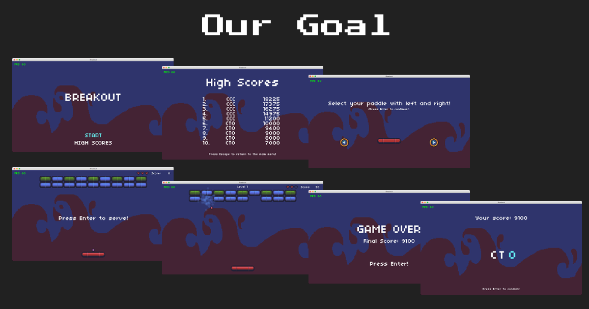
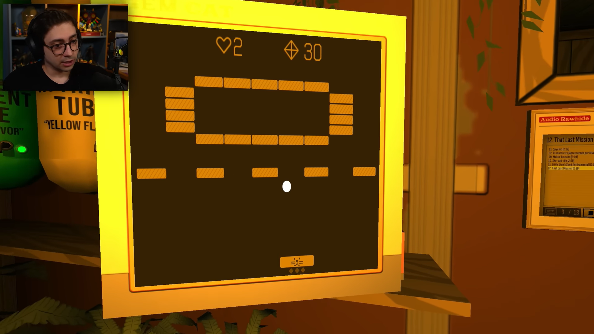
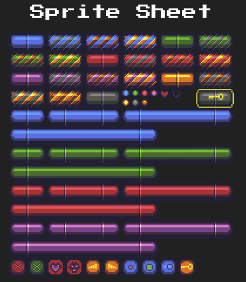
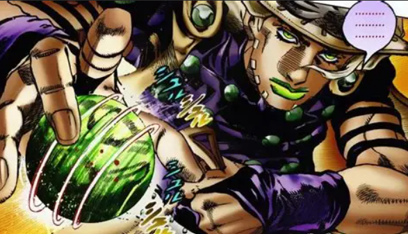

# Aula 02 - Breakout 

Bem-vindo à nossa Aula 2! Nessa aula, vamos recriar o **Breakout**, um clássico do Atari desenvolvido originalmente em 1976.  Mesmo que o nome não te soe familiar, você provavelmente já deve ter visto ou jogado alguma variação dele em algum outro jogo como minigame, é aquele joguinho que onde você controla uma barra e precisa controlar ela para rebater uma bolinha que irá destruir os tijolos que estão acima de você.



Fonte: Objetivo desta aula. [cs50.harvard.edu/games/weeks/2/](https://cs50.harvard.edu/games/weeks/2/)



Fonte: Nosso icônico e adorado streamer Alanzoka jogando um minigame estilo Breakout no jogo (muito daora inclusive) Skin Deep. [IMMERSIVE SIM FANTÁSTICO! - SKIN DEEP](https://www.youtube.com/watch?v=MyFrW408-jE)

Apesar de a mecânica parecer simples, este projeto nos permitirá explorar conceitos vitais para qualquer desenvolvedor de jogos:

- **Sprite Sheets (Quads):** Como usar uma única imagem grande para desenhar centenas de objetos diferentes (como tijolos e bolas).
    
- **Geração Procedural:** Como criar layouts de fases infinitos e variados via código, em vez de desenhar cada fase à mão.
    
- **Sistemas de Partículas:** Adicionar vida e impacto ao jogo com explosões visuais.
    
- **Persistência de Dados:** Salvar recordes no disco para que não sumam quando fechamos o jogo.
    
- **Máquina de Estados Avançada:** Passar dados entre estados (ex: levar sua pontuação do "Jogo" para a tela de "Game Over").
    

## Parte 0: A Infraestrutura (Breakout-0)

Como você deve ter notado na nossa Aula 01 do Flappy Bird, o nosso arquivo `main.lua` estava ficando comicamente gigante e um demasiado bagunçado. Tínhamos classes misturadas, `require` espalhados e variáveis globais soltas, a coisa tava feia e fazia os olhos sangrarem 🥲

Para o Breakout, que é um jogo mais complexo, vamos adotar uma estrutura de projeto **Profissional e Modular**.

### 1. A Nova Organização de Pastas

Em vez de jogar tudo na raiz, organizamos o projeto em diretórios específicos:

- **`src/`**: Todo o código-fonte lógico do jogo fica aqui.
    
- **`lib/`**: Bibliotecas de terceiros (como `push` e `class`) ficam separadas.
    
- **`sounds/`, `graphics/`, `fonts/`**: Pastas dedicadas para os assets (recursos).
    

Isso mantém a raiz limpa e facilita a manutenção (além de deixar a organização do projeto mais bonitinha no geral).

### 2. O Gerenciador de Dependências (`src/Dependencies.lua`)

No Flappy Bird, o topo do nosso `main.lua` tinha uma lista enorme de `require`. No Breakout, vamos limpar isso criando um arquivo centralizador.

Ele funciona como um "índice". Ele carrega todas as bibliotecas, classes e arquivos de configuração que o jogo precisa.

``` lua
-- src/Dependencies.lua

-- Bibliotecas (agora na pasta 'lib')
push = require 'lib/push'
Class = require 'lib/class'

-- Configurações Globais
require 'src/constants'

-- Gerenciador de Estados
require 'src/StateMachine'

-- Estados do Jogo
require 'src/states/BaseState'
require 'src/states/StartState'
```

Agora, o nosso `main.lua` só precisa fazer `require 'src/Dependencies'` uma única vez!

### 3. Constantes Globais (`src/constants.lua`)

Outra má prática que vamos eliminar são os "Números Mágicos". Sabe quando você vê `x = 432` no meio do código e não sabe o que aquele número significa? Vamos centralizar esses valores.

``` lua
-- src/constants.lua

-- Dimensões da janela física
WINDOW_WIDTH = 1280
WINDOW_HEIGHT = 720

-- Dimensões da resolução virtual (estética retrô)
VIRTUAL_WIDTH = 432
VIRTUAL_HEIGHT = 243
```

### 4. O Coração do Jogo (`main.lua`)

Com tudo organizado agora, o nosso `main.lua` fica muito bem mais focado e fácil de compreender batendo o olho. Ele agora é responsável por:

1. Carregar os Assets globais (`gFonts`, `gTextures`, `gSounds`).
    
2. Inicializar a Máquina de Estados.
    
3. Gerenciar o loop principal (`load`, `update`, `draw`).
    

Veja como carregamos os recursos em tabelas globais para fácil acesso:


``` lua
-- main.lua

require 'src/Dependencies'

function love.load()
    love.graphics.setDefaultFilter('nearest', 'nearest')
    math.randomseed(os.time())
    love.window.setTitle('Breakout')

    -- Inicializa fontes globais
    gFonts = {
        ['small'] = love.graphics.newFont('fonts/font.ttf', 8),
        ['medium'] = love.graphics.newFont('fonts/font.ttf', 16),
        ['large'] = love.graphics.newFont('fonts/font.ttf', 32)
    }
    love.graphics.setFont(gFonts['small'])

    -- Carrega texturas globais
    gTextures = {
        ['background'] = love.graphics.newImage('graphics/background.png'),
        ['main'] = love.graphics.newImage('graphics/breakout.png'),
        ['arrows'] = love.graphics.newImage('graphics/arrows.png'),
        ['hearts'] = love.graphics.newImage('graphics/hearts.png'),
        ['particle'] = love.graphics.newImage('graphics/particle.png')
    }
    
    -- Inicializa a resolução virtual
    push:setupScreen(VIRTUAL_WIDTH, VIRTUAL_HEIGHT, WINDOW_WIDTH, WINDOW_HEIGHT, {
        vsync = true,
        fullscreen = false,
        resizable = true
    })

    -- Inicializa sons globais
    gSounds = {
        ['paddle-hit'] = love.audio.newSource('sounds/paddle_hit.wav', 'static'),
        ['score'] = love.audio.newSource('sounds/score.wav', 'static'),
        ['music'] = love.audio.newSource('sounds/music.wav', 'static'),
        -- ... (outros sons)
    }

    -- Inicializa a StateMachine com o estado inicial 'start'
    gStateMachine = StateMachine {
        ['start'] = function() return StartState() end
    }
    gStateMachine:change('start')

    love.keyboard.keysPressed = {}
end
```

### 5. O Menu Inicial (`src/states/StartState.lua`)

Neste primeiro momento (breakout0), implementamos apenas o `StartState`. Ele exibe o título e permite navegar entre duas opções ("START" e "HIGH SCORES") usando as setas do teclado.

A lógica é simples: usamos uma variável `highlighted` (1 ou 2) para saber qual opção pintar de azul.


``` lua
-- src/states/StartState.lua

StartState = Class{__includes = BaseState}

local highlighted = 1

function StartState:update(dt)
    -- Alterna a opção destacada ao pressionar Cima ou Baixo
    if love.keyboard.wasPressed('up') or love.keyboard.wasPressed('down') then
        highlighted = highlighted == 1 and 2 or 1
        gSounds['paddle-hit']:play()
    end

    if love.keyboard.wasPressed('escape') then
        love.event.quit()
    end
end

function StartState:render()
    -- Título
    love.graphics.setFont(gFonts['large'])
    love.graphics.printf("BREAKOUT", 0, VIRTUAL_HEIGHT / 3, VIRTUAL_WIDTH, 'center')
    
    -- Opções do Menu
    love.graphics.setFont(gFonts['medium'])

    -- Se highlighted for 1, pintamos de azul
    if highlighted == 1 then love.graphics.setColor(103/255, 1, 1, 1) end
    love.graphics.printf("START", 0, VIRTUAL_HEIGHT / 2 + 70, VIRTUAL_WIDTH, 'center')
    love.graphics.setColor(1, 1, 1, 1) -- Reseta a cor

    -- Se highlighted for 2, pintamos de azul
    if highlighted == 2 then love.graphics.setColor(103/255, 1, 1, 1) end
    love.graphics.printf("HIGH SCORES", 0, VIRTUAL_HEIGHT / 2 + 90, VIRTUAL_WIDTH, 'center')
    love.graphics.setColor(1, 1, 1, 1)
end
```

Com isso, temos a base sólida do nosso jogo pronta. Temos um sistema modular, recursos carregados e um menu funcional. Na próxima etapa, vamos começar a trabalhar nos gráficos principais usando **Sprite Sheets** para desenhar a raquete e os tijolos!

# Parte 1 - Sprite Sheets e a Raquete (Breakout-1)

Agora que a nossa infraestrutura está montada, vamos dar vida visual ao jogo. Nesta etapa, vamos abandonar os retângulos brancos simples e aprender a trabalhar com **Sprite Sheets** (folhas de sprites) para desenhar uma raquete (Paddle) que se move e tem diferentes aparências.

## 1. Fatiando Imagens (`src/Util.lua`)

Se abrirem a pasta `graphics`, verão `breakout.png`. Ele contém _todas_ as imagens do jogo num único lugar. Isto é chamado de **Sprite Sheet** ou **atlas**



Fonte: [Week 2 Breakout - CS50's Introduction to Game Development](https://cs50.harvard.edu/games/weeks/2/)

Para usar isto, precisamos de ensinar o LOVE a desenhar apenas um pedacinho dessa imagem de cada vez. Criamos retângulos virtuais chamados **Quads**.

No `Util.lua`, temos agora duas funções essenciais:

1. **`GenerateQuads(atlas, tilewidth, tileheight)`:** Uma função genérica que divide uma imagem em pedaços iguais (usaremos para os tijolos mais tarde).
    
2. **`GenerateQuadsPaddles(atlas)`:** Esta é específica para as raquetes.
    
Um pequeno desafio que temos com as raquetes, é que nem todas elas possuem o mesmo tamanho. Temos 4 tamanhos (Pequena, Média, Grande, Gigante) e 4 cores (Skins). Logo, a função `GenerateQuadsPaddles` precisa ser manual para capturar estas larguras variáveis (32px, 64px, 96px, 128px):

``` lua
-- src/Util.lua

function GenerateQuadsPaddles(atlas)
    local x = 0
    local y = 64 -- As raquetes começam na posição Y 64 do sprite sheet

    local counter = 1
    local quads = {}

    for i = 0, 3 do
        -- Pequena (32px)
        quads[counter] = love.graphics.newQuad(x, y, 32, 16, atlas:getDimensions())
        counter = counter + 1
        -- Média (64px)
        quads[counter] = love.graphics.newQuad(x + 32, y, 64, 16, atlas:getDimensions())
        counter = counter + 1
        -- Grande (96px)
        quads[counter] = love.graphics.newQuad(x + 96, y, 96, 16, atlas:getDimensions())
        counter = counter + 1
        -- Gigante (128px)
        quads[counter] = love.graphics.newQuad(x, y + 16, 128, 16, atlas:getDimensions())
        counter = counter + 1

        -- Prepara o X e Y para a próxima cor (próxima linha)
        x = 0
        y = y + 32
    end

    return quads
end
```

## 2. A Classe da Raquete (`src/Paddle.lua`)

Agora criamos a classe `Paddle`. Ela não é apenas uma imagem; ela tem posição, velocidade, tamanho e cor.

Suas principais responsabilidades são:

- **`init`:** Posiciona a raquete no centro horizontal e próximo ao fundo do ecrã (`VIRTUAL_HEIGHT - 32`). Define a `skin` (cor, que começa como 1) e o `size` (tamanho, que começa como 2 - Média).
    
- **`update`:** Verifica se as setas Esquerda/Direita estão premidas para definir a velocidade (`dx`). O detalhe crucial aqui é usar `math.max` e `math.min` para impedir que a raquete saia da tela:
    

``` lua
-- src/Paddle.lua

function Paddle:update(dt)
    -- Input do teclado
    if love.keyboard.isDown('left') then
        self.dx = -PADDLE_SPEED
    elseif love.keyboard.isDown('right') then
        self.dx = PADDLE_SPEED
    else
        self.dx = 0
    end

    -- Movimento com limitação de borda (Clamp)
    if self.dx < 0 then
        -- Não deixa o X ser menor que 0
        self.x = math.max(0, self.x + self.dx * dt)
    else
        -- Não deixa o X passar da largura do ecrã menos a largura da raquete
        self.x = math.min(VIRTUAL_WIDTH - self.width, self.x + self.dx * dt)
    end
end
```

- **`render`:** Usa uma fórmula matemática para escolher o Quad correto na tabela, baseado na skin e tamanho atual: `self.size + 4 * (self.skin - 1)`.
    

## 3. `main.lua`

O `main.lua` recebeu algumas atualizações para integrar os gráficos:

**A. Carregando as Texturas (`gTextures`)** Carregamos todas as imagens na tabela global `gTextures`. A imagem `graphics/breakout.png` é carregada com a chave `'main'`, pois é o nosso Atlas principal.

**B. Gerando os Quads (`gFrames`)** Usamos a função `GenerateQuadsPaddles` que criamos no `Util.lua` para fatiar a textura `'main'`. O resultado é guardado na tabela global `gFrames['paddles']`.

``` lua
-- main.lua
gFrames = {
    ['paddles'] = GenerateQuadsPaddles(gTextures['main'])
}
```

## 4. O Estado de Jogo (`src/states/PlayState.lua`)

Finalmente, atualizamos o `PlayState` para colocar a raquete no mundo.

- No `init`, criamos `self.paddle = Paddle()`.
    
- No `render`, chamamos `self.paddle:render()`.
    
- No `update`, implementamos o movimento da raquete e uma lógica simples de **Pausa**:
    
``` lua
-- src/states/PlayState.lua

function PlayState:update(dt)
    -- Lógica de Pausa com a tecla Espaço
    if self.paused then
        if love.keyboard.wasPressed('space') then
            self.paused = false
            gSounds['pause']:play()
        else
            return -- Se está pausado, não atualiza nada abaixo daqui
        end
    elseif love.keyboard.wasPressed('space') then
        self.paused = true
        gSounds['pause']:play()
        return
    end

    -- Atualiza a raquete se não estiver pausado
    self.paddle:update(dt)
end
```

### 5. Resultado do Breakout-1

Ao rodar o jogo agora e selecionar Start, verão a raquete azul na parte inferior. Podem movê-la para a esquerda e para a direita, e ela irá parar nas bordas da tela. Apertando espaço o jogo é pausado. A base da jogabilidade está pronta!

# Parte 2 - A Bola e a Física de Rebote (Breakout-2)

Agora que temos a Raquete, precisamos também da Bola. Diferente da raquete, que obedece ao teclado, a bola obedece deverá obedecer à física, mais em específico à velocidade e a colisão

### 1. A Classe `Ball` (`src/Ball.lua`)

Criamos um novo arquivo para representar a bola. Ela é uma entidade pequena (8x8 pixels) que precisa saber onde está, para onde vai e como desenhar a si mesma.

Algumas propriedades importantes:

- **`x`, `y`**: Posição atual.
    
- **`dx`, `dy`**: Velocidade horizontal e vertical.
    
- **`skin`**: A cor da bola (existem 7 variações no Sprite Sheet).
    

**Lógica de Colisão AABB:** Antes de quicar, a bola precisa saber _se_ bateu em algo. Implementamos a colisão AABB (Axis-Aligned Bounding Box), que basicamente verifica se dois retângulos estão sobrepostos.


``` lua
-- src/Ball.lua

function Ball:collides(target)
    -- Verifica se as caixas NÃO se tocam. Se nenhuma dessas condições for verdade, elas tocam.
    if self.x > target.x + target.width or target.x > self.x + self.width then
        return false
    end

    if self.y > target.y + target.height or target.y > self.y + self.height then
        return false
    end 

    return true
end
```

**Atualização e Paredes:** No `update`, movemos a bola e verificamos se ela bateu nos limites da tela.

- **Esquerda/Direita:** Invertemos o `dx` (`self.dx = -self.dx`) e tocamos um som.

- **Topo:** Invertemos o `dy`.

- **Fundo:** Por enquanto, não fazemos nada se ela cair (ela só vai embora).
    

``` lua
-- src/Ball.lua

function Ball:update(dt)
    self.x = self.x + self.dx * dt
    self.y = self.y + self.dy * dt

    -- Rebote na parede esquerda
    if self.x <= 0 then
        self.x = 0
        self.dx = -self.dx
        gSounds['wall-hit']:play()
    end

    -- Rebote na parede direita
    if self.x >= VIRTUAL_WIDTH - 8 then
        self.x = VIRTUAL_WIDTH - 8
        self.dx = -self.dx
        gSounds['wall-hit']:play()
    end

    -- Rebote no teto
    if self.y <= 0 then
        self.y = 0
        self.dy = -self.dy
        gSounds['wall-hit']:play()
    end
end
```

### 2. Integrando no `PlayState` (`src/states/PlayState.lua`)

Agora precisamos colocar a bola no jogo.

No `init`, criamos a bola e damos a ela uma velocidade aleatória para que cada jogo comece de um jeito diferente.

``` lua
-- src/states/PlayState.lua

function PlayState:init()
    self.paddle = Paddle()

    -- Inicializa a bola com a skin 1
    self.ball = Ball(1)

    -- Dá uma velocidade inicial aleatória
    self.ball.dx = math.random(-200, 200)
    self.ball.dy = math.random(-50, -60) -- Começa subindo

    -- Posiciona no centro
    self.ball.x = VIRTUAL_WIDTH / 2 - 4
    self.ball.y = VIRTUAL_HEIGHT - 42
end
```

**A Colisão Raquete-Bola:** No `update`, além de mover a bola, verificamos se ela colidiu com a raquete. Se sim, invertemos o `dy` para fazê-la subir novamente, simulando uma defesa.

``` lua
-- src/states/PlayState.lua

function PlayState:update(dt)
    -- ... (lógica de pausa)

    self.paddle:update(dt)
    self.ball:update(dt)

    -- Colisão Bola x Raquete
    if self.ball:collides(self.paddle) then
        -- Reverte a velocidade Y
        self.ball.dy = -self.ball.dy
        gSounds['paddle-hit']:play()
    end
    
    -- ...
end
```

### 3. Atualizando o `main.lua`

Para finalizar, o `main.lua` precisa gerar os Quads das bolas (recortá-las do Sprite Sheet). 

``` lua
-- main.lua

gFrames = {
    ['paddles'] = GenerateQuadsPaddles(gTextures['main']),
    ['balls'] = GenerateQuadsBalls(gTextures['main']) -- Novo!
}
```

### Resultado do Breakout2

Ao rodar o jogo agora, você verá uma bola pequena surgindo no centro. Ela voará em uma direção aleatória, quicará nas paredes e, se você for rápido o suficiente com a raquete, quicará nela também fazendo um som de "blip". Se deixar ela cair, ela some pela parte inferior da tela (ainda não temos "Game Over").

Agora, precisamos de alvos! Vamos implementar a classe `Brick` e o gerador de níveis `LevelMaker` para encher a tela de tijolos coloridos.

# Parte 3 - Os Tijolos e o LevelMaker (Breakout3)

Nesta etapa, vamos implementar os **Tijolos (Bricks)** e a **Geração Procedural** de níveis.

### 1. A Classe `Brick` (`src/Brick.lua`)

O tijolo é o objeto que queremos destruir. Ele parece simples, mas tem algumas propriedades importantes para a mecânica de jogo futura (pontuação e dificuldade).

**Propriedades:**

- **`tier` e `color`**: Tijolos terão diferentes cores e "níveis" de resistência.
    
- **`inPlay`**: Esta é uma variável booleana (verdadeiro/falso).
    
    - **Otimização:** Em vez de destruir o objeto e removê-lo da memória (o que pode ser pesado para o processador se feito constantemente), nós apenas marcamos `inPlay = false`. Se for falso, o jogo ignora o tijolo no desenho e na colisão.
        

**Renderização Inteligente:** O método `render` usa uma fórmula matemática para escolher o sprite correto baseado na cor e no tier:

``` lua
gFrames['bricks'][1 + ((self.color - 1) * 4) + self.tier]
```

Isso permite que mudemos a aparência do tijolo apenas alterando um número na variável `self.color`.


``` lua
-- src/Brick.lua

function Brick:hit()
    -- Toca o som e tira o tijolo de jogo
    gSounds['brick-hit-2']:play()
    self.inPlay = false
end

function Brick:render()
    if self.inPlay then
        -- Desenha apenas se estiver em jogo
        love.graphics.draw(gTextures['main'], 
            gFrames['bricks'][1 + ((self.color - 1) * 4) + self.tier],
            self.x, self.y)
    end
end
```

### 2. O Arquiteto de Fases: `src/LevelMaker.lua`

Aqui entra a **Geração Procedural**. Criamos uma classe estática (sem o método `:init` de instância) chamada `LevelMaker` para fabricar tabelas cheias de tijolos.

**Como funciona o `createMap(level)`:**

1. **Aleatoriedade:** Decide um número aleatório de linhas (1 a 5) e colunas (7 a 13).
    
2. **Matemática de Layout:** Para garantir que os tijolos fiquem centralizados na tela, calculamos um "Padding" (margem) baseado no número de colunas.
    
    - Se tivermos 13 colunas (o máximo), a margem é pequena.
        
    - Se tivermos 7 colunas, a margem esquerda aumenta para empurrar os tijolos para o meio.
        
3. **Instanciação:** Cria os objetos `Brick`, calcula o X e Y deles e insere na tabela `bricks`.
    

``` lua
-- src/LevelMaker.lua

function LevelMaker.createMap(level)
    local bricks = {}
    local numRows = math.random(1, 5)
    local numCols = math.random(7, 13)

    for y = 1, numRows do
        for x = 1, numCols do
            b = Brick(
                -- Cálculo complexo do X para centralizar e dar espaçamento
                (x-1) * 32 + 8 + (13 - numCols) * 16,
                y * 16
            ) 
            table.insert(bricks, b)
        end
    end 
    return bricks
end
```

### 3. Integrando no `PlayState` (`src/states/PlayState.lua`)

O `PlayState` agora precisa gerenciar essa lista de tijolos.

**Inicialização:** No `init`, chamamos o nosso arquiteto para construir o mapa.


``` lua
self.bricks = LevelMaker.createMap()
```

**Atualização e Colisão:** No `update`, precisamos verificar se a bola bateu em _algum_ dos tijolos. Percorremos a lista inteira:


``` lua
-- src/states/PlayState.lua

for k, brick in pairs(self.bricks) do
    -- Só checa colisão se o tijolo estiver ativo (inPlay)
    if brick.inPlay and self.ball:collides(brick) then
        brick:hit() -- Desativa o tijolo e toca som
    end
end
```

**Renderização:** No `render`, percorremos a lista novamente para desenhar os tijolos (o `brick:render()` já cuida de verificar o `inPlay`).

### 4. Atualizando o `main.lua`

Por fim, precisamos garantir que o `main.lua` saiba cortar os sprites dos tijolos. Adicionamos a chamada para `GenerateQuadsBricks` (que deve estar no `Util.lua`, seguindo a lógica dos anteriores).


``` lua
-- main.lua
gFrames = {
    ['paddles'] = GenerateQuadsPaddles(gTextures['main']),
    ['balls'] = GenerateQuadsBalls(gTextures['main']),
    ['bricks'] = GenerateQuadsBricks(gTextures['main']) -- Novo!
}
```

### Resultado do Breakout3

Ao rodar o jogo agora, você verá linhas coloridas de tijolos no topo da tela. A cada vez que reiniciar o jogo, o layout será diferente (mais linhas, menos colunas, etc.). Ao lançar a bola, ela destruirá os tijolos ao tocá-los, sumindo da tela e tocando um som satisfatório.

Temos um jogo funcional! Mas a física ainda é beeeemmm básica. Se a bola bater de lado no tijolo, ela atravessa? Como fazemos pontuação e vidas? ~~Deltarune Capitulo 5 sai esse ano mesmo~~? Descobiremos na próxima parte!

![[Pasted image 20260101162635.png]]
Fonte: ['Deltarune Tomorrow' Meme Might Now Be 'Deltarune Today' Following An Announceme... | Know Your Meme](https://trending.knowyourmeme.com/editorials/in-the-media/deltarune-tomorrow-meme-might-now-be-deltarune-today-following-an-announcement-from-toby-fox)

![[Pasted image 20260101162804.png]]
Fonte: Espero que o Papyrus saia de casa e finalmente apareça no Cap 5. [These are real memes about the last 5 chapters of deltarune source: trust me : r/Deltarune](https://www.reddit.com/r/Deltarune/comments/vrosaq/these_are_real_memes_about_the_last_5_chapters_of/)

# Parte 4 - Colisões Avançadas e Resolução (Breakout-4)

Nesta etapa, transformamos a física básica em algo divertido e livre de bugs. O foco aqui é o `PlayState:update`.

### 1. Colisão com a Raquete: O Efeito "Spin" (alô Gyro)



Fonte: Spin mentioned. Jojo Part 7 on March 19th

No Pong clássico, a bola apenas rebate. No Breakout, queremos dar controle ao jogador. Se você bater na bola com a ponta da raquete enquanto se move, você deve conseguir "cortar" a bola ou mudar o ângulo dela drasticamente.

**A Lógica:** Calculamos a distância entre o centro da bola e o centro da raquete.

- Se a bola bater na **esquerda** e a raquete estiver indo para a **esquerda**: Jogamos a bola forte para a esquerda.
    
- Se a bola bater na **direita** e a raquete estiver indo para a **direita**: Jogamos a bola forte para a direita.
    

``` lua
-- src/states/PlayState.lua

if self.ball:collides(self.paddle) then
    -- Primeiro, corrigimos a posição para evitar que a bola fique presa dentro da raquete
    self.ball.y = self.paddle.y - 8
    self.ball.dy = -self.ball.dy

    -- Agora ajustamos o ângulo (dx)
    -- Se bateu na esquerda enquanto movemos para esquerda...
    if self.ball.x < self.paddle.x + (self.paddle.width / 2) and self.paddle.dx < 0 then
        self.ball.dx = -50 + -(8 * (self.paddle.x + self.paddle.width / 2 - self.ball.x))
    
    -- Se bateu na direita enquanto movemos para direita...
    elseif self.ball.x > self.paddle.x + (self.paddle.width / 2) and self.paddle.dx > 0 then
        self.ball.dx = 50 + (8 * math.abs(self.paddle.x + self.paddle.width / 2 - self.ball.x))
    end

    gSounds['paddle-hit']:play()
end
```

### 2. Colisão com Tijolos: Detectando o Lado

O maior desafio do Breakout é saber **onde** a bola bateu no tijolo.

- Bateu em cima/baixo? Inverter `dy`.
- Bateu dos lados? Inverter `dx`.
    

Mas como sabemos se foi uma batida lateral? Verificamos se a borda da bola estava fora do tijolo no eixo X antes de colidir.

1. **Margem de Erro:** O código usa `self.ball.x + 2` em vez de apenas `x`. Isso cria uma margem de 2 pixels para evitar que quinas sejam detectadas incorretamente.
    
2. **Reset de Posição:** Assim que detectamos a colisão, **empurramos** a bola para fora do tijolo (ex: `ball.x = brick.x - 8`). Se não fizermos isso, no próximo frame a bola ainda estará dentro do tijolo, colidirá de novo e ficará presa num loop infinito ("vibrando").
    

``` lua
-- src/states/PlayState.lua

-- Checagem Esquerda: Borda da bola está à esquerda do tijolo E bola indo para direita
if self.ball.x + 2 < brick.x and self.ball.dx > 0 then
    self.ball.dx = -self.ball.dx
    self.ball.x = brick.x - 8 -- Empurra para fora!

-- Checagem Direita
elseif self.ball.x + 6 > brick.x + brick.width and self.ball.dx < 0 then
    self.ball.dx = -self.ball.dx
    self.ball.x = brick.x + 32 -- Empurra para fora!

-- Checagem Topo
elseif self.ball.y < brick.y then
    self.ball.dy = -self.ball.dy
    self.ball.y = brick.y - 8

-- Checagem Fundo
else
    self.ball.dy = -self.ball.dy
    self.ball.y = brick.y + 16
end
```

### 3. Acelerando o Jogo

Para adicionar tensão, sempre que a bola bate em um tijolo, aumentamos ligeiramente a velocidade vertical dela. Isso garante que o final da fase seja mais frenético que o início.


``` lua
-- Acelera em 2% a cada batida
self.ball.dy = self.ball.dy * 1.02
```

### Resultado do Breakout4

Agora a bola quica de forma previsível e justa nas laterais dos tijolos. Você consegue mirar usando a raquete para acertar aquele último tijolo mais dificilzinho.

Nosso jogo está ficando legal! Mas ainda falta algumas, como Vidas (Corações), Pontuação, Game Over etc.. Vamos implementar isso no **Breakout5**!

# Parte 5 - Score, Vidas e Game Over (Breakout5)

Vamos fazer o jogador agora começar com 3 corações, ganhar pontos ao destruir tijolos e perder se suas vidas acabarem.

### 1. Interface Global: Desenhando Score e Vida (`main.lua`)

Como a pontuação e os corações precisam aparecer em vários estados diferentes (no Jogo, no Saque e na Vitória), criamos funções auxiliares globais no `main.lua` para não repetir código.

- **`renderHealth(health)`:** Desenha corações cheios ou vazios baseados no valor de `health`. O Sprite Sheet de corações tem dois frames (cheio e vazio).
    
- **`renderScore(score)`:** Desenha o número da pontuação no canto superior direito.


``` lua
-- main.lua

function renderHealth(health)
    local healthX = VIRTUAL_WIDTH - 100
    
    -- Desenha corações cheios
    for i = 1, health do
        love.graphics.draw(gTextures['hearts'], gFrames['hearts'][1], healthX, 4)
        healthX = healthX + 11
    end

    -- Desenha corações vazios (o que falta para 3)
    for i = 1, 3 - health do
        love.graphics.draw(gTextures['hearts'], gFrames['hearts'][2], healthX, 4)
        healthX = healthX + 11
    end
end
```

### 2. O Estado de Saque (`src/states/ServeState.lua`)

Quando você perde uma vida ou começa o jogo, a bola não deve sair voando imediatamente. Criamos o `ServeState` para dar uma espécie de respiro ao jogador.

Neste estado, a bola fica **grudada** na raquete, acompanhando o movimento do jogador, esperando que ele aperte **Enter** para lançar.

**Passagem de Dados:** Observe o método `enter(params)`. Ele recebe a raquete, os tijolos, a vida e o score do estado anterior. Isso é crucial para manter o progresso do jogo entre transições.


``` lua
-- src/states/ServeState.lua

function ServeState:update(dt)
    self.paddle:update(dt)
    
    -- A bola segue a raquete
    self.ball.x = self.paddle.x + (self.paddle.width / 2) - 4
    self.ball.y = self.paddle.y - 8

    if love.keyboard.wasPressed('enter') or love.keyboard.wasPressed('return') then
        -- Transfere tudo para o PlayState
        gStateMachine:change('play', {
            paddle = self.paddle,
            bricks = self.bricks,
            health = self.health,
            score = self.score,
            ball = self.ball
        })
    end
end
```

### 3. Atualizando o `PlayState` (`src/states/PlayState.lua`)

**A. Recebendo o Estado:** Em vez de criar uma raquete e bola novas no `init`, agora usamos o `enter(params)` para receber os objetos que vieram do `ServeState`.

**B. Pontuação:** Quando a bola bate num tijolo ativo, aumentamos o score.

``` lua
if brick.inPlay and self.ball:collides(brick) then
    self.score = self.score + 10 -- Ganha 10 pontos
    brick:hit()
    -- ... (lógica de colisão)
end
```

**C. Perdendo Vida:** Se a bola cair abaixo da tela (`self.ball.y >= VIRTUAL_HEIGHT`), o jogador perde uma vida.

- Se vidas == 0: Vai para `GameOverState`.
- Se vidas > 0: Volta para `ServeState` (para sacar novamente com uma vida a menos).
    
``` lua
-- src/states/PlayState.lua

if self.ball.y >= VIRTUAL_HEIGHT then
    self.health = self.health - 1
    gSounds['hurt']:play()

    if self.health == 0 then
        gStateMachine:change('game-over', {
            score = self.score
        })
    else
        gStateMachine:change('serve', {
            paddle = self.paddle,
            bricks = self.bricks,
            health = self.health,
            score = self.score
        })
    end
end
```

### 4. O Fim do Jogo (`src/states/GameOverState.lua`)

Este é um estado simples que exibe GAME OVER e a pontuação final. Se o jogador apertar Enter, ele volta para o `StartState` para jogar de novo.

### 5. O Início (`src/states/StartState.lua`)

Finalmente, atualizamos o `StartState`. Quando o jogador escolhe "Start", não vamos mais direto para o jogo. Vamos para o `ServeState` e inicializamos os valores padrão: 3 vidas, 0 pontos e um mapa novo.

``` lua
-- src/states/StartState.lua

gStateMachine:change('serve', {
    paddle = Paddle(1),
    bricks = LevelMaker.createMap(),
    health = 3,
    score = 0
})
```

### 6. Resultado do Breakout-5

Agora temos um jogo de verdade! :D

1. Você começa no Menu.
    
2. Vai para o Saque (bola presa na raquete).
    
3. Joga, ganha pontos destruindo tijolos.
    
4. Se deixar cair, perde um coração e volta para o Saque.
    
5. Se perder todos os corações, Game Over.
    

Porém, o  jogo ainda é meio simples. Os tijolos são todos iguais (visualmente e em comportamento) e não há progressão de nível (se você quebrar tudo, nada acontece). Vamos resolver isso e adicionar polimento visual nas próximas etapas.

# Parte 6 - Geração Procedural Avançada e Cores (Breakout6)

Nesta etapa, reescreveremos bastante o `LevelMaker`, introduzindo padrões e simetria.
### 1. Simetria e Progressão (`src/LevelMaker.lua`)

Primeiro, queremos que as fases pareçam organizadas.

- **Colunas Ímpares:** Forçamos o número de colunas a ser ímpar. Por quê? Porque layouts centralizados com um número ímpar de colunas garantem simetria perfeita nas bordas esquerda/direita da tela.
    
- **Cores e Tiers Dinâmicos:** O nível de dificuldade (`level`) agora dita quais tijolos aparecem.
    
    - `highestTier`: Aumenta a cada 5 níveis (`math.floor(level / 5)`).
        
    - `highestColor`: Muda conforme o nível avança, ciclando as cores para garantir variedade visual.
        


``` lua
-- src/LevelMaker.lua

-- Garante número ímpar de colunas para simetria
numCols = numCols % 2 == 0 and (numCols + 1) or numCols

-- Define o Tier máximo baseado no nível (max 3)
local highestTier = math.min(3, math.floor(level / 5))

-- Define a Cor máxima baseada no nível (max 5)
local highestColor = math.min(5, level % 5 + 3)
```

### 2. Os Padrões de Linha (Row Patterns)

A grande novidade é que cada **linha** de tijolos pode ter seu próprio comportamento. O gerador decide aleatoriamente duas "flags" (regras) para cada linha:

1. **`skipPattern` (Pular):** Cria espaços vazios. Tijolo sim, tijolo não.
    
2. **`alternatePattern` (Alternar):** Alterna entre duas cores e tiers diferentes (ex: Azul, Ouro, Azul, Ouro).
    

Podemos ter linhas sólidas, linhas alternadas, linhas com buracos ou **ambos** (alternada e com buracos, criando um efeito de xadrez).

**A Lógica do Loop:** Dentro do loop que cria os tijolos, usamos bandeiras booleanas (`skipFlag`, `alternateFlag`) que invertemos (`not flag`) a cada iteração para criar o padrão.


``` lua
-- src/LevelMaker.lua

for x = 1, numCols do
    -- Lógica de Pular (Skip)
    if skipPattern and skipFlag then
        skipFlag = not skipFlag
        goto continue -- Pula esta iteração (não cria tijolo)
    else
        skipFlag = not skipFlag
    end

    -- Cria o tijolo...
    b = Brick(...)

    -- Lógica de Alternar (Alternate)
    if alternatePattern and alternateFlag then
        b.color = alternateColor1
        b.tier = alternateTier1
        alternateFlag = not alternateFlag
    else
        b.color = alternateColor2
        b.tier = alternateTier2
        alternateFlag = not alternateFlag
    end
    
    -- ...
    
    ::continue:: -- Label para o goto
end
```

> **Curiosidade Técnica:** Lua (antes da versão 5.2/JIT) não tinha a palavra-chave `continue`. O uso de `goto continue` e o label `::continue::` é o "jeitinho" oficial de pular uma iteração de loop nesta linguagem.

### 3. Resultado do Breakout6

Ao rodar o jogo, a diferença é drástica.

- Em vez de uma parede sólida, você verá padrões interessantes: linhas pontilhadas, linhas xadrez, mistura de cores fracas e fortes.
    
- Conforme você passa de nível (lembra da lógica de vitória que fizemos no Breakout5?), os tijolos ficam com cores mais "quentes" e tiers mais altos (com texturas mais detalhadas).
    

Agora que temos tijolos de **Tier Alto** (Ouro, por exemplo), precisamos fazer com que eles sejam mais difíceis de quebrar. No momento, um tijolo de Ouro quebra com um toque. Partiu implementar a lógica de pontuação avançada e degradação de tijolos!

# Parte 7 - Tiers, Cores e Pontuação (Breakout7)

Até agora, um tijolo era apenas um tijolo. Se a bola tocasse nele, ele sumia. No **Breakout-7**, implementamos a mecânica de **Resistência** e um sistema de **Pontuação** que recompensa o risco.

### 1. Pontuação Dinâmica (`src/states/PlayState.lua`)

No código do `PlayState`, quando detectamos uma colisão, não somamos mais apenas 10 pontos fixos. A pontuação agora depende da raridade do tijolo.

**A Fórmula:**

- **Tier (Nível):** Vale muito (200 pontos por nível).
    
- **Color (Cor):** Vale um pouco (25 pontos por cor).
    

Isso incentiva o jogador a buscar os tijolos mais difíceis (geralmente posicionados mais acima ou protegidos).


``` lua
-- src/states/PlayState.lua

if brick.inPlay and self.ball:collides(brick) then
    
    -- Fórmula de Pontuação: (Tier * 200) + (Cor * 25)
    self.score = self.score + (brick.tier * 200 + brick.color * 25)

    -- Aciona a lógica de dano do tijolo
    brick:hit()
    
    -- ... (resto da lógica de colisão e verificação de vitória)
end
```

### 2. Atualização dos Tijolos (`src/Brick.lua`)

A mudança mais importante acontece dentro da classe `Brick`. A função `hit()` deixa de ser um simples interruptor de "desligar". Ela agora verifica a "vida" do tijolo.

**A Lógica de Degradação:** A lógica segue uma escadinha:

1. Se o tijolo tem **Tier alto** (> 0):
    
    - Se é a cor mais fraca (1, Azul): Desce um Tier e volta para a cor mais forte (5).
        
    - Se não é a cor mais fraca: Apenas desce a cor.
        
2. Se o tijolo está no **Tier base** (0):
    
    - Se é a cor mais fraca (1, Azul): É **destruído** (`inPlay = false`).
        
    - Se não é: Desce a cor.
        

**Sons:** Tocamos sons diferentes para feedback. `brick-hit-2` para danos comuns e `brick-hit-1` para a destruição final.

Lua

```
-- src/Brick.lua

function Brick:hit()
    -- Toca som de impacto padrão
    gSounds['brick-hit-2']:stop()
    gSounds['brick-hit-2']:play()

    -- Lógica de Tier (Nível)
    if self.tier > 0 then
        if self.color == 1 then
            self.tier = self.tier - 1
            self.color = 5
        else
            self.color = self.color - 1
        end
    else
        -- Lógica de Base (Tier 0)
        if self.color == 1 then
            self.inPlay = false -- Destrói o tijolo!
        else
            self.color = self.color - 1
        end
    end

    -- Se foi destruído, toca o som de destruição
    if not self.inPlay then
        gSounds['brick-hit-1']:stop()
        gSounds['brick-hit-1']:play()
    end
end
```

### 3. Resultado do Breakout7

O jogo agora tem "peso".

- Ao atingir um tijolo dourado (Tier alto), ele não quebra; ele "racha" (muda de cor ou tier).
    
- O jogador precisa bater várias vezes no mesmo bloco para abrir caminho.
    
- A pontuação sobe muito mais rápido, chegando a milhares de pontos, o que será importante para o nosso sistema de High Scores.
    

O jogo está mecanicamente bem legal, mas visualmente ainda falta impacto. Quando quebramos um tijolo, ele simplesmente some, o que serve mas é meio sem graça. Vamos melhorar isso adicionando ao jogo um **Sistema de Partículas** no **Breakout8**!

# Parte 8 - Sistemas de Partículas e Game Juice (Breakout8)

Nesta etapa, adicionamos o que os designers chamam de **"Juice"** (Suco): feedback visual que torna a interação satisfatória. Quando quebramos um tijolo, ele não deve apenas sumir; ele deve explodir em pedaços!

Para isso, usamos um **Sistema de Partículas**.

### 1. Configurando o Sistema (`src/Brick.lua`)

Em vez de criar centenas de objetos individuais (o que deixaria o jogo lento), usamos um objeto otimizado do LOVE (`love.graphics.newParticleSystem`) dentro de cada tijolo.

**No `init`:** Configuramos a física das partículas. Elas vivem pouco tempo (0.5 a 1s) e têm uma leve aceleração para baixo (gravidade) e para os lados (espalhamento).

**No `hit` (A Explosão):** Quando a bola bate, "pintamos" as partículas com a cor do tijolo e emitimos 64 delas de uma vez.

- **Interpolação de Cor:** As partículas nascem com a cor do tijolo e vão ficando transparentes (Alpha 0) até sumirem.

``` lua
-- src/Brick.lua

function Brick:hit()
    -- Configura a cor e transparência (fade out)
    self.psystem:setColors(...)
    
    -- Dispara 64 partículas
    self.psystem:emit(64)
    
    -- ... (lógica de som e pontuação)
end
```

### 2. O Segredo da Renderização (`src/states/PlayState.lua`)

Aqui está o motivo pelo qual precisávamos tanto ver o `PlayState.lua`. Se desenhássemos as partículas junto com o tijolo, teríamos um problema de **Z-Order** (ordem de profundidade).

Se o Tijolo A explodir, as suas partículas poderiam ser desenhadas _atrás_ do Tijolo B (que está na linha de baixo), o que quebraria a ilusão.

A nossa solução será usar dois loops separados no `PlayState:render()`:

1. Primeiro, desenhamos **todos os tijolos** (sólidos).
    
2. Depois (e por cima de tudo), desenhamos **todas as partículas**.
    

Isso garante que a explosão sempre aconteça "na frente" da parede de tijolos.


``` lua
-- src/states/PlayState.lua

function PlayState:render()
    -- Camada 1: Tijolos Sólidos
    for k, brick in pairs(self.bricks) do
        brick:render()
    end

    -- Camada 2: Partículas (Por cima de tudo)
    for k, brick in pairs(self.bricks) do
        brick:renderParticles()
    end

    self.paddle:render()
    self.ball:render()
    -- ...
end
```

### 3. Atualizando a Física (`src/states/PlayState.lua`)

As partículas não se movem sozinhas. Precisamos avisar ao sistema que o tempo passou. Por isso, no `update` do `PlayState`, adicionamos um loop extra para atualizar os tijolos (que por sua vez atualizam seus emissores de partículas).

Se esquecêssemos isso, as partículas ficariam congeladas no ar após a explosão.

``` lua
-- src/states/PlayState.lua

function PlayState:update(dt)
    -- ... (Lógica da bola e raquete)

    -- Atualiza os sistemas de partículas para que elas caiam/sumam
    for k, brick in pairs(self.bricks) do
        brick:update(dt)
    end
    
    -- ...
end
```

### Resultado do Breakout8

Agora, o jogo tá muito melhor!

- Bater num tijolo gera uma nuvem de detritos da cor correspondente.
    
- Tijolos de Tiers mais altos brilham mais na explosão (graças ao ajuste de Alpha no `Brick:hit`).
    
- As partículas caem realisticamente por cima dos outros blocos, sem cortes visuais estranhos.

# Parte 9 - Vitória e Progressão de Nível (Breakout9)

Com os arquivos do **Breakout-9**, fechamos o ciclo de jogabilidade implementando a **Vitória** e a **Progressão de Nível**.

Até agora, se o jogador destruísse todos os tijolos, o jogo ficava em um estado vazio. Não havia recompensa e nem fase seguinte. Nesta etapa, vamos detectar quando o jogador limpou o mapa e recompensá-lo com um novo nível, gerado proceduralmente e ligeiramente mais difícil.

### 1. O Estado de Vitória (`src/states/VictoryState.lua`)

Criamos um novo estado chamado `VictoryState`. Ele funciona de forma muito parecida com o `ServeState`: o jogo pausa a ação, a bola volta para a raquete e esperamos o jogador pressionar **Enter**.

Alguns destaques do código:

- **Transição de Nível:** Quando o jogador pressiona Enter, não reiniciamos o jogo do zero. Em vez disso, transitamos para o estado `serve`, mas passamos `level + 1` como parâmetro.
    
- **Novo Mapa:** O momento crucial é a chamada `LevelMaker.createMap(self.level + 1)`. Isso gera um novo layout de tijolos usando o algoritmo que criamos antes, mas agora com base no novo nível (o que pode desbloquear novas cores e tiers).
    

``` lua
-- src/states/VictoryState.lua

function VictoryState:update(dt)
    self.paddle:update(dt)

    -- A bola segue a raquete (igual ao ServeState)
    self.ball.x = self.paddle.x + (self.paddle.width / 2) - 4
    self.ball.y = self.paddle.y - 8

    -- Ao pressionar Enter, vai para o próximo nível
    if love.keyboard.wasPressed('enter') or love.keyboard.wasPressed('return') then
        gStateMachine:change('serve', {
            level = self.level + 1,
            bricks = LevelMaker.createMap(self.level + 1), -- Gera mapa novo!
            paddle = self.paddle,
            health = self.health,
            score = self.score
        })
    end
end
```

### 2. Detectando a Vitória (`src/states/PlayState.lua`)

No `PlayState`, precisamos de uma forma de saber se o jogo acabou. Adicionamos a função auxiliar `checkVictory`.

**Lógica:** Percorremos a tabela de tijolos. Se encontrarmos _pelo menos um_ tijolo com `inPlay == true`, então não ganhamos. Se o loop terminar sem encontrar nenhum, retornamos `true`.

``` lua
-- src/states/PlayState.lua

function PlayState:checkVictory()
    for k, brick in pairs(self.bricks) do
        if brick.inPlay then
            return false
        end 
    end

    return true
end
```

**Integração no Update:** Dentro do loop de colisão dos tijolos, logo após contabilizar os pontos e chamar `brick:hit()`, verificamos a vitória.

``` lua
-- src/states/PlayState.lua

-- Se destruiu o tijolo...
if self:checkVictory() then
    gSounds['victory']:play()

    gStateMachine:change('victory', {
        level = self.level,
        paddle = self.paddle,
        health = self.health,
        score = self.score,
        ball = self.ball
    })
end
```

### Resultado do Breakout-9

Agora você tem um loop de jogo infinito e progressivo!

1. Você começa no Nível 1.
    
2. Quebra todos os tijolos.
    
3. O jogo congela, toca uma música de vitória e mostra "Level 1 Complete!".
    
4. Você pressiona Enter e começa o Nível 2 (mantendo sua pontuação e vidas).
    
5. O Nível 2 terá probabilidades maiores de ter cores e tiers mais altos, aumentando o desafio e a recompensa.
    

Estamos indo bem e nosso jogo está cada vez mais completo! Mas ainda falta um elemento clássico dos arcades: o **Registro de High Scores**. 
# Parte 10 - Persistência e Recordes (Breakout10)

O jogo já é divertido, mas falta um motivo para voltar: a competição. Sem salvar os recordes, ninguém saberá quem é o verdadeiro mestre do Breakout. Nesta etapa final, implementamos a **Persistência de Dados** e a tela de **High Scores**.

### 1. O Sistema de Arquivos (`main.lua`)

A memória RAM é volátil (apaga quando o jogo fecha). Para salvar dados eternamente, precisamos escrever no disco rígido. O LÖVE2D nos dá um módulo seguro chamado `love.filesystem`, que restringe a leitura/escrita a uma pasta específica do jogo (para evitar que você apague arquivos do sistema operacional por engano! (alô linux!)).

No `main.lua`, dentro da função `loadHighScores`, definimos a identidade do jogo:


``` lua
love.filesystem.setIdentity('breakout')
```

Isso cria uma pasta (geralmente em `%APPDATA%/Love/breakout` no Windows ou `~/.local/share/love/breakout` no Linux) onde nossos arquivos salvos ficarão.

### 2. Carregando os Recordes (`main.lua`)

Criamos a função global `loadHighScores()`. Ela é inteligente e faz duas coisas:

1. **Inicialização (Bootstrap):** Se o arquivo de recordes (`breakout.lst`) não existir (primeira vez que o jogador abre o jogo), ela cria um arquivo padrão com 10 pontuações fictícias (de 10.000 a 1.000 pontos) para a lista não ficar vazia.
    
2. **Leitura (Parsing):** Ela lê o arquivo linha por linha para carregar os dados na memória.
    

**O Formato do Arquivo (`breakout.lst`):** Optamos por um formato simples de texto onde as linhas alternam entre Nome e Score:


``` Plaintext
CTO
10000
CTO
9000
...
```

**A Lógica de Leitura:** Usamos uma variável booleana `name` (flag) para saber se a linha que estamos lendo é um nome ou um número.

- Se `name` é `true`: A linha atual é um **Nome**. Limitamos a 3 caracteres (`string.sub`).
    
- Se `name` é `false`: A linha atual é uma **Pontuação**. Convertemos para número (`tonumber`).
    

``` lua
-- main.lua

function loadHighScores()
    love.filesystem.setIdentity('breakout')

    -- Se não existe arquivo, cria um com valores padrão
    if not love.filesystem.getInfo('breakout.lst') then
        local scores = ''
        for i = 10, 1, -1 do
            scores = scores .. 'CTO\n'
            scores = scores .. tostring(i * 1000) .. '\n'
        end
        love.filesystem.write('breakout.lst', scores)
    end

    local name = true
    local scores = {} -- Tabela que guardará os pares nome/score
    
    -- Inicializa a tabela vazia
    for i = 1, 10 do
        scores[i] = { name = nil, score = nil }
    end

    local counter = 1
    for line in love.filesystem.lines('breakout.lst') do
        if name then
            scores[counter].name = string.sub(line, 1, 3)
        else
            scores[counter].score = tonumber(line)
            counter = counter + 1
        end
        name = not name -- Inverte a flag para a próxima linha
    end

    return scores
end
```

### 3. Visualizando os Recordes (`src/states/HighScoreState.lua`)

Agora que temos os dados carregados, precisamos exibi-los. Criamos o `HighScoreState`.

**Recebendo os Dados:** No método `enter(params)`, o estado recebe a tabela `highScores` que foi carregada no `main.lua`.

**Renderização (`render`):** Desenhamos o título "High Scores" e usamos um loop `for` de 1 a 10 para listar os recordes.

- Usamos alinhamentos diferentes (`printf` com `'left'` e `'right'`) para criar uma tabela organizada visualmente:
    
    - Índice (1., 2., etc) à esquerda.
        
    - Nome (AAA) à direita da primeira coluna.
        
    - Score (10000) mais à direita.
        

``` lua
-- src/states/HighScoreState.lua

function HighScoreState:render()
    love.graphics.setFont(gFonts['large'])
    love.graphics.printf('High Scores', 0, 20, VIRTUAL_WIDTH, 'center')

    love.graphics.setFont(gFonts['medium'])

    -- Itera sobre os 10 recordes
    for i = 1, 10 do
        local name = self.highScores[i].name or '---'
        local score = self.highScores[i].score or '---'

        -- Desenha Rank, Nome e Score com espaçamento calculado
        love.graphics.printf(tostring(i) .. '.', VIRTUAL_WIDTH / 4, 
            60 + i * 13, 50, 'left')
        love.graphics.printf(name, VIRTUAL_WIDTH / 4 + 38, 
            60 + i * 13, 50, 'right')
        love.graphics.printf(tostring(score), VIRTUAL_WIDTH / 2,
            60 + i * 13, 100, 'right')
    end
    -- ...
end
```

**Navegação (`update`):** Se o jogador pressionar `Escape`, tocamos um som e voltamos para o menu inicial (`start`), passando a tabela de recordes de volta para não perder os dados.

### 4. Integração Final

Para tudo funcionar:

1. **`Dependencies.lua`**: Adicionamos `require 'src/states/HighScoreState'`.
    
2. **`main.lua`**: Registramos o novo estado na `gStateMachine`:
    
    
    ``` lua
    ['high-scores'] = function() return HighScoreState() end
    ```
    
3. **Carregamento Inicial**: No `love.load()`, carregamos os scores pela primeira vez e passamos para o estado inicial:
    
    
    ``` lua
    gStateMachine:change('start', {
        highScores = loadHighScores()
    })
    ```


# Parte 11 - Inserindo Recordes (Enter High Score) (Breakout11)

Nesta etapa, implementamos a tela onde o jogador insere suas iniciais ("AAA") usando as setas do teclado. Trabalharemos com manipulação de caracteres ASCII e lógica de inserção em tabelas.

### 1. Manipulação de ASCII (`src/states/EnterHighScoreState.lua`)

Em vez de guardar strings como "A", "B", "C", guardamos os **códigos ASCII** dos caracteres.

- **65** é o código para 'A'.
    
- **90** é o código para 'Z'.
    

Criamos uma tabela `chars` com 3 posições, todas começando em 65 ('A'). Usamos também uma variável `highlightedChar` (1, 2 ou 3) para saber qual letra o jogador está editando no momento.


``` lua
-- src/states/EnterHighScoreState.lua

-- Inicia com 'A', 'A', 'A'
local chars = {
    [1] = 65,
    [2] = 65,
    [3] = 65
}

-- Qual caractere estamos mudando (1, 2 ou 3)
local highlightedChar = 1
```

### 2. Navegação e Edição (`update`)

No `update`, controlamos a interface:

- **Esquerda/Direita:** Muda o `highlightedChar`.
    
- **Cima/Baixo:** Altera o valor ASCII do caractere selecionado.
    
    - Se passar de 90 ('Z'), volta para 65 ('A').
        
    - Se for menor que 65 ('A'), vai para 90 ('Z').
        

``` lua
-- Navegação entre as letras
if love.keyboard.wasPressed('left') and highlightedChar > 1 then
    highlightedChar = highlightedChar - 1
elseif love.keyboard.wasPressed('right') and highlightedChar < 3 then
    highlightedChar = highlightedChar + 1
end

-- Alterando a letra (ASCII)
if love.keyboard.wasPressed('up') then
    chars[highlightedChar] = chars[highlightedChar] + 1
    if chars[highlightedChar] > 90 then chars[highlightedChar] = 65 end
elseif love.keyboard.wasPressed('down') then
    chars[highlightedChar] = chars[highlightedChar] - 1
    if chars[highlightedChar] < 65 then chars[highlightedChar] = 90 end
end
```

### 3. Salvando o Recorde

Quando o jogador pressiona **Enter**, precisamos fazer três coisas: converter os códigos em letras, inserir o recorde na posição correta e salvar no arquivo.

**A. Reconstruindo o Nome:** Usamos `string.char()` para transformar os números de volta em texto.


``` lua
local name = string.char(chars[1]) .. string.char(chars[2]) .. string.char(chars[3])
```

**B. Inserindo na Tabela (Shift):** Como a tabela já está ordenada (recebemos o `scoreIndex` indicando nossa posição), precisamos "empurrar" os recordes antigos para baixo para abrir espaço para o novo. Fazemos um loop de trás para frente (do 10 até o nosso índice).


``` lua
-- Desloca os scores para baixo para abrir espaço
for i = 10, self.scoreIndex, -1 do
    self.highScores[i + 1] = {
        name = self.highScores[i].name,
        score = self.highScores[i].score
    }
end

-- Insere o novo score
self.highScores[self.scoreIndex].name = name
self.highScores[self.scoreIndex].score = self.score
```

**C. Escrevendo no Disco:** Por fim, transformamos a tabela inteira numa string gigante e reescrevemos o arquivo `breakout.lst`.

``` lua
local scoresStr = ''
for i = 1, 10 do
    scoresStr = scoresStr .. self.highScores[i].name .. '\n'
    scoresStr = scoresStr .. tostring(self.highScores[i].score) .. '\n'
end

love.filesystem.write('breakout.lst', scoresStr)
```

### 4. Visualização (`render`)

No `render`, desenhamos as três letras no centro da tela. A letra que está sendo editada (`highlightedChar`) é pintada de azul para indicar o foco.

``` lua
-- Exemplo de renderização do primeiro caractere
if highlightedChar == 1 then
    love.graphics.setColor(103/255, 1, 1, 1) -- Azul ciano
end
love.graphics.print(string.char(chars[1]), VIRTUAL_WIDTH / 2 - 28, VIRTUAL_HEIGHT / 2)
love.graphics.setColor(1, 1, 1, 1) -- Reseta para branco
```


# Aula 02: Parte 12 - Seleção de Personagem (Paddle Select) (Breakout-12)

Nesta etapa, implementamos um menu intermediário entre a tela de Título e o `ServeState`, permitindo que o jogador escolha a aparência (Skin) da sua raquete.

### 1. O Estado de Seleção (`src/states/PaddleSelectState.lua`)

Este estado foca na apresentação visual. Exibimos a raquete atual no centro da tela, ladeada por setas que indicam navegação.

**Lógica de Navegação:** No `init`, começamos sempre com a skin 1 (`self.currentPaddle = 1`). No `update`, controlamos a escolha:

- **Esquerda:** Se `currentPaddle` for 1, tocamos o som de erro (`no-select`) pois não há skins anteriores. Caso contrário, diminuímos o índice e tocamos `select`.
    
- **Direita:** Se `currentPaddle` for 4 (o limite de skins), bloqueamos. Caso contrário, avançamos o índice.
    

**A Confirmação (Passagem de Dados):** O momento chave acontece ao pressionar **Enter**. Não apenas mudamos de estado; nós **instanciamos** a raquete aqui mesmo com a skin escolhida e a passamos pronta para o próximo estado.


``` lua
-- src/states/PaddleSelectState.lua

if love.keyboard.wasPressed('return') or love.keyboard.wasPressed('enter') then
    gSounds['confirm']:play()

    gStateMachine:change('serve', {
        paddle = Paddle(self.currentPaddle), -- Cria a raquete com a skin selecionada!
        bricks = LevelMaker.createMap(1),
        health = 3,
        score = 0,
        highScores = self.highScores,
        level = 1
    })
end
```

### 2. Feedback Visual das Setas (`render`)

Para que a interface seja intuitiva, usamos um truque visual: alteramos a cor (tint) das setas para cinza semitransparente quando não é possível mover naquela direção.

- **Seta Esquerda:** Se `currentPaddle == 1`, desenhamos com `setColor(40/255, 40/255, 40/255, 128/255)`.
    
- **Seta Direita:** Se `currentPaddle == 4`, aplicamos o mesmo efeito de "desativado".
    

Isso comunica ao jogador os limites da lista sem precisar de texto.

### 3. Conectando o Fluxo (`src/states/StartState.lua`)

O arquivo que você acabou de enviar fecha a lógica. No menu principal, quando o jogador escolhe START (opção 1), não vamos mais direto para o jogo.

**Antes:** `StartState` -> `ServeState`, **Agora:** `StartState` -> `PaddleSelectState`


``` lua
-- src/states/StartState.lua

if highlighted == 1 then
    gStateMachine:change('paddle-select', {
        highScores = self.highScores
    })
else
    gStateMachine:change('high-scores', {
        highScores = self.highScores
    })
end
```

### 4. (`src/Paddle.lua`)

Por fim, relembramos que a classe `Paddle` precisou ser ajustada para aceitar esse parâmetro. O método `init(skin)` agora armazena essa escolha na variável `self.skin`, que é usada posteriormente no `render` para calcular qual Quad do Sprite Sheet desenhar.

``` lua
-- (...)
function Paddle:init(skin)

    self.x = VIRTUAL_WIDTH / 2 - 32
    self.y = VIRTUAL_HEIGHT - 32
    
-- (...)
end

-- (...)

function Paddle:render()
    love.graphics.draw(gTextures['main'], gFrames['paddles'][self.size + 4 * (self.skin - 1)],self.x, self.y)
end
```

# Parte 13 - A Atualização de Música (Breakout13)

Nesta etapa final, adicionamos uma trilha sonora em loop para dar atmosfera ao jogo. A alteração ocorre exclusivamente no arquivo **`main.lua`**.

### 1. Carregando e Configurando a Música (`main.lua`)

No LOVE, áudios longos (como músicas) são geralmente carregados como `stream` (embora aqui estejamos usando `static` por ser um arquivo pequeno), enquanto efeitos curtos são `static` (carregados totalmente na memória).

No arquivo `main.lua`, dentro da função `love.load()`, fazemos duas coisas cruciais que não fazíamos antes:

1. **`play()`**: Iniciamos a música assim que o jogo abre.
    
2. **`setLooping(true)`**: Dizemos ao motor de áudio que, ao chegar no fim do arquivo, ele deve voltar imediatamente para o início.
    

Observe o final da função `love.load()` no seu código:

Lua

```
-- main.lua

function love.load()
    -- ... (carregamento de fontes, gráficos e sons) ...

    -- Toca a música fora de todos os estados e define como loop
    gSounds['music']:play()
    gSounds['music']:setLooping(true)

    -- ...
end
```

### Por que no `main.lua`?

Se colocássemos o `play()` dentro do `StartState`, a música reiniciaria toda vez que voltássemos ao menu. Se colocássemos no `PlayState`, ela pararia ao perder o jogo.

Ao colocar no `love.load` do `main.lua`, garantimos que a música é uma **camada global**, tocando ininterruptamente enquanto a `StateMachine` troca as cenas visualmente por cima dela.

# FIM

PARABEEENSSSS POR TER CHEGADO ATÉ AQUI! Esperamos que você tenha gostado dessa aula! Na próxima, focaremos em Match 3, até lá!
