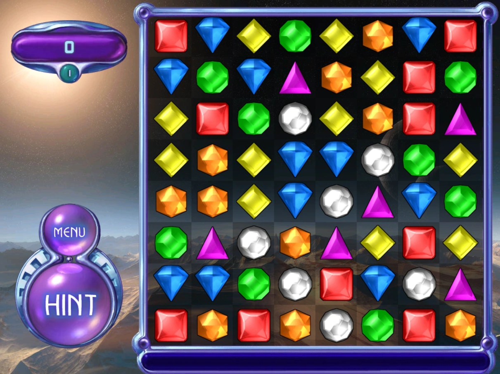
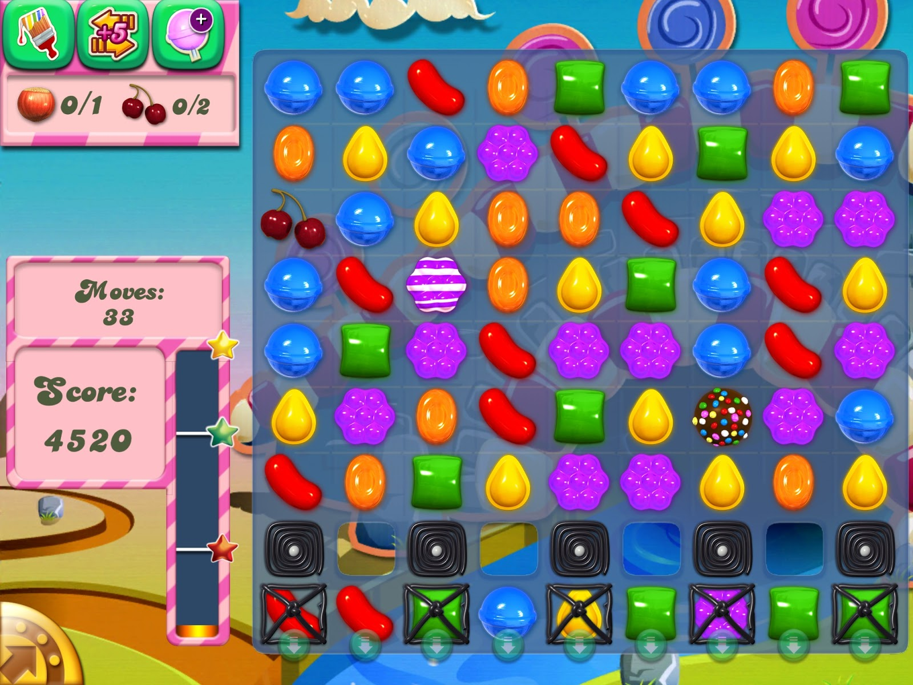
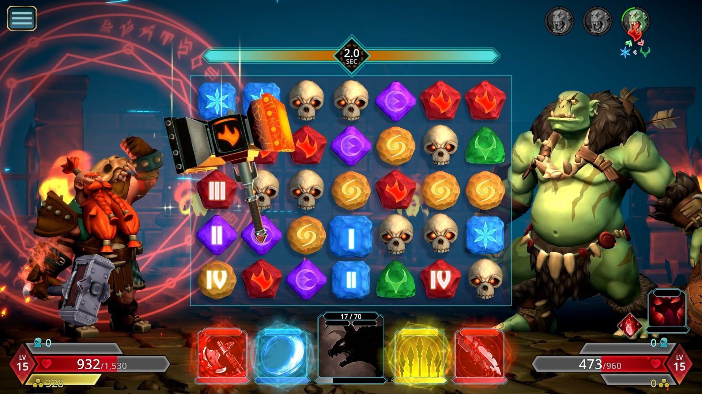

# Aula 03: Match 3 

Nas aulas anteriores, vivemos basicamente no mundo da **física e dos reflexos**: rebatidas, detecção de colisão AABB e movimento contínuo (`x = x + dx * dt`).

Nesta aula, vamos mudar completamente  de direção. Entraremos no incrível mundo dos **Algoritmos e Estruturas de Dados** (Não é pq eu já fui monitor dessa matéria, mas ela é bem legal). Vamos criar um jogo no estilo de _Bejeweled_ ou _Candy Crush_, onde o desafio não é ter reflexos rápidos, mas sim como o computador gerencia lógica, tempo e animação.

### O que é um "Match-3"?

O termo "Match-3" refere-se a um subgênero de jogos de quebra-cabeça (Puzzle) baseados em **combinação de peças** (_Tile-matching_). A premissa é universalmente simples, mas matematicamente rica:

1. **O Grid (A Grade):** O jogo acontece em um tabuleiro, geralmente quadrado (8x8, 10x10), preenchido com peças de diferentes cores ou formatos. Para nós programadores, isso é uma **Matriz Bidimensional**.
    
2. **A Ação (Swap):** O jogador pode manipular o tabuleiro, geralmente trocando a posição de duas peças **adjacentes** (vizinhas).
    
3. **A Regra de Ouro:** Uma troca só é válida (ou só resulta em pontuação) se ela criar uma linha (horizontal ou vertical) de **três ou mais** peças idênticas.
    
4. **A Reação (Clear & Refill):**
    
    - As peças combinadas são removidas do tabuleiro (destruídas).
        
    - As peças que estavam acima sofrem a ação da "gravidade" e caem para preencher os espaços vazios.
        
    - Novas peças são geradas aleatoriamente no topo.
        
    - Isso pode gerar novos matches automaticamente, criando **Combos** (ou _Chain Reactions_).
        

**Alguns Exemplos Clássicos:** os já mencionados _Bejeweled_ (o pai do gênero moderno) e _Candy Crush Saga_ (o famoso joguinho mobile que sua tia certamente joga) e _Puzzle Quest_ (que mistura isso com RPG).


Fonte: Bejeweled. [Classic | Bejeweled Wiki | Fandom](https://bejeweled.fandom.com/wiki/Classic)


Fonte: O jogo amado universalmente por todas as tias do mundo. [Some Thoughts on Candy Crush Saga - Reluctant Habits](https://www.edrants.com/some-thoughts-on-candy-crush-saga/)


Fonte: Puzzle Quest 3. [Puzzle Quest 3 launches March 1 - Gematsu](https://www.gematsu.com/2022/02/puzzle-quest-3-launches-march-1)

E pra quem tiver curioso sobre a história e evolução de Match-3, recomendo dar uma lida nisso!: [A Brief History of Match-Three Games | by The N3TWORK | Medium](https://medium.com/@john_23522/a-brief-history-of-match-three-games-31233dcdfcc5)

### O Que Vamos Aprender?

 Os pilares deste projeto serão:

1. **Do Contínuo para o Discreto (Grades):**
    
    - No Breakout, a bola podia estar na posição X `100.54`.
        
    - No Match 3, trabalharemos com uma **Matriz (Tabela 2D)**. Uma peça estará na `Linha 1, Coluna 2`. Mover uma peça não é apenas somar velocidade; é trocar valores dentro de tabelas na memória.
        
2. **Tweening e Timers (A Mágica da Animação):**
    
    - Em vez de calcular `x + velocidade` a cada frame, aprenderemos a dizer ao computador: _"Mova esta peça da posição A para a B em exatamente 0.3 segundos, usando uma curva suave"_. Isso é essencial para fazer o jogo parecer profissional.
        
3. **Funções Anônimas:**
    
    - Um recurso poderoso de Lua. Vamos passar funções inteiras como argumentos para outras funções (ex: "Execute _isto_ quando o timer acabar").
        
4. **Algoritmos de Busca (Pattern Matching):**
    
    - Como o jogo sabe que você formou uma linha de 3? E se for um L? E se, ao explodir peças, as de cima caírem e formarem outro match (combo)? Vamos escrever a lógica para detectar isso recursivamente.
        
5. **Arte Procedural e Paletas:**
    
    - Como usar uma única imagem em preto e branco para gerar peças de infinitas cores diferentes via código.
        

---

### O Primeiro Passo: Dominando o Tempo

Antes de desenhar qualquer tabuleiro, precisamos resolver um problema fundamental: **Como controlar o tempo?**

Em um jogo de puzzle, tudo é temporizado:

- A peça leva 0.2s para trocar.
    
- O brilho acontece a cada 2s.
    
- O "Game Over" espera 1s antes de aparecer.
    

Se tentarmos fazer isso manualmente no `update` com dezenas de variáveis, ficaremos loucos, lelés da cuca e completamente birutas. Por isso, começamos nossa jornada buscando uma solução para esse problema.

## Aula 03: Conceito de Delta Time (`timer0`)

O objetivo deste código é bem simples: atualizar um número na tela a cada 1 segundo. Em vez de usar um relógio do sistema, nós  iremos construir o tempo acumulando frações de segundo.

### 1. As Variáveis (`love.load`)

No início, criamos duas variáveis:

- `currentSecond`: O contador visual (0, 1, 2, 3...) que queremos mostrar na tela.
    
- `secondTimer`: A variável de "controle". Ela começa em 0 e vai acumular o tempo que passou desde o último frame.
    

``` lua
-- main.lua

function love.load()
    currentSecond = 0
    secondTimer = 0
    -- ... (configuração de vídeo)
end
```

### 2. O Acumulador (`love.update`)

Aqui está a mágica. A função `update` roda a cada frame (ex: 60 vezes por segundo). O parâmetro `dt` diz quantos segundos se passaram desde o último frame (ex: 0.016 segundos).

A lógica é:

1. Somamos `dt` ao nosso balde `secondTimer`.
    
2. Perguntamos: "O balde encheu? Ele já passou de 1 segundo?"
    
3. Se sim, aumentamos o contador visual (`currentSecond`) e esvaziamos o balde para começar a contar o próximo segundo.
    

``` lua
-- main.lua

function love.update(dt)
    -- 1. Acumula o tempo fracionado
    secondTimer = secondTimer + dt

    -- 2. Verifica se passou 1 segundo
    if secondTimer > 1 then
        currentSecond = currentSecond + 1
        
        -- 3. Reseta o temporizador mantendo a precisão (o resto da divisão)
        secondTimer = secondTimer % 1
    end
end
```

> **Nota Técnica sobre `% 1`:** Por que não usar `secondTimer = 0`? Se o frame demorou um pouco mais e `secondTimer` ficou com `1.05`, zerar a variável jogaria fora esses `0.05` segundos extras, atrasando o relógio a longo prazo. Usar o módulo (`% 1`) ou subtrair 1 (`secondTimer = secondTimer - 1`) preserva esse excesso para o próximo ciclo, mantendo o relógio preciso.

### 3. O Problema, ou por que não fazemos assim?

Este método é chamado que acabamos de ver é o jeito simples. Funciona perfeitamente para **uma** coisa e apenas uma.

Mas imagine um jogo Match-3 onde:

- A gema A tem que cair em 0.5 segundos.
    
- A gema B tem que brilhar a cada 2 segundos.
    
- O temporizador da fase conta regressivamente.
    
- Uma animação de "Good!" deve aparecer por 1.5 segundos.
    

Se fizéssemos assim, teríamos que criar dezenas de variáveis (`gemTimer`, `shineTimer`, `textTimer`) e encher o `love.update` de `if`s. Isso vira um espaguete de código impossível, cansativo e extremamente desgastante de se manter. Então, nas próximas etapas, veremos como podemos melhorar isso!

# Aula 03: O Problema da Escala (Timer 1)

Neste código, tentamos fazer a mesma coisa que no anterior, mas agora com **5 contadores diferentes** rodando ao mesmo tempo, com intervalos diferentes (1s, 2s, 3s, 4s).

### 1. A Explosão de Variáveis (`love.load`)

Para ter 5 relógios independentes, tivemos que criar 10 variáveis manualmente!

- 5 variáveis para guardar o tempo acumulado (`secondTimer`, `secondTimer2`...).
    
- 5 variáveis para guardar o número a ser exibido (`currentSecond`, `currentSecond2`...).
    

``` lua
-- main.lua

function love.load()
    currentSecond = 0
    secondTimer = 0
    
    currentSecond2 = 0
    secondTimer2 = 0
    
    -- ... e assim por diante até o 5 ...
end
```

### 2. Código Repetitivo (`love.update`)

O problema real aparece na função de atualização. Tivemos que copiar e colar a lógica do `if` cinco vezes.

- O Timer 1 reseta a cada **1 segundo** (`% 1`).
    
- O Timer 2 reseta a cada **2 segundos** (`% 2`).
    
- O Timer 3 reseta a cada **4 segundos** (`% 4`).
    

``` lua
-- main.lua

function love.update(dt)
    -- Lógica do Timer 1
    secondTimer = secondTimer + dt
    if secondTimer > 1 then
        currentSecond = currentSecond + 1
        secondTimer = secondTimer % 1
    end

    -- Lógica do Timer 2 (Cópia quase idêntica)
    secondTimer2 = secondTimer2 + dt
    if secondTimer2 > 2 then
        currentSecond2 = currentSecond2 + 1
        secondTimer2 = secondTimer2 % 2
    end

    -- ... Repete mais 3 vezes ...
end
```

### 3. Por que isso é inviável para Match-3?

Imagine um tabuleiro de Match-3 padrão, que tem **8x8 peças (64 peças)**. Se cada peça precisar de uma animação de troca, de brilho e de queda, usando esse método você precisaria de:

- **64 variáveis** só para os timers das peças.
    
- **64 blocos `if`** dentro do `love.update` para checar cada peça.
    

O código ficaria gigantesco, impossível de manter, feio demais, ilegível e horroroso.

### A Solução: Bibliotecas de Timer (Knife)

O próximo passo lógico é parar de escrever essa lógica de `timer = timer + dt` manualmente.

Vamos usar uma biblioteca externa chamada **Knife** (módulo `timer`). Com ela, poderemos substituir todo esse código repetitivo por algo elegante como:


``` lua
-- Exemplo bobinho do que faremos a seguir
Timer.every(2, function()
    currentSecond2 = currentSecond2 + 1
end)
```

# Aula 03: O Jeito Limpo (Timer 2)

Sabe o jeito feio do timer1 onde tínhamos que copiar e colar `if timer > 1` cinco vezes? O **timer2**
resolve isso usando a biblioteca **Knife** e dois conceitos de programação fortíssimos: **Tabelas** e **Funções Anônimas**.

### 1. Dados em vez de Variáveis Soltas

Em vez de criar `timer1`, `timer2`, `timer3`...`timer3920392`...nós colocamos tudo em listas (tabelas em Lua).


``` lua
-- main.lua

-- Define os intervalos (1s, 2s, 4s...)
intervals = {1, 2, 4, 3, 2, 8}

-- Define os contadores iniciais (todos zero)
counters = {0, 0, 0, 0, 0, 0}
```

### 2. Automação com `Timer.every`

 Usamos um loop `for` para criar 6 temporizadores de uma vez só.

A função `Timer.every(intervalo, acao)` diz: "A cada X segundos, faça Y".


``` lua
-- main.lua

for i = 1, 6 do
    -- Timer.every(tempo, função)
    Timer.every(intervals[i], function()
        counters[i] = counters[i] + 1
    end)
end
```

### 3. O Conceito de Função Anônima

Note que passamos algo estranho como segundo argumento:


``` lua
function()
    counters[i] = counters[i] + 1
end
```

Isso é uma **Função Anônima** (ou Closure/Lambda). É uma função que não tem nome. Nós a criamos ali mesmo, na hora, e a entregamos para o `Timer`. É como dizer ao Timer: _"Toma este pedaço de código. Guarde ele e execute-o daqui a pouco"_.

### 4. Limpeza no Update

Olhe como o `love.update` ficou pequeninho! Em vez de dezenas de `if`s, temos apenas uma linha:


``` lua
function love.update(dt)
    Timer.update(dt)
end
```

A biblioteca Knife cuida de tudo. Ela pega o `dt`, distribui para todos os temporizadores que criamos e verifica quem precisa disparar, ou seja, conseguimos sair de ter que ficar somando dt manualmente para simplesmente delegar o tempo para uma biblioteca, que é algo bem mais simples e eficaz!
Agora que dominamos e somos senhores do **Tempo**, precisamos dominar também o **Movimento**. No Match-3, as peças não se teletransportam, mas sim deslizam. Para isso, usaremos uma técnica chamada **Tweening** (Interpolação).

# Aula 03: Introdução ao Tweening (Tween 0)

O termo **Tweening** vem de In-betweening, que significa Intercalação. É o processo de gerar os quadros intermediários entre dois estados para criar a ilusão de movimento suave.

No _Breakout_, o movimento era infinito: `x = x + dx * dt`. No _Match-3_, o movimento é finito e preciso, algo como por exemplo: "Mova da Posição 0 para a Posição 100 em exatamente 2 segundos".

### 1. A Lógica Manual (`love.update`)

Neste exemplo, queremos mover o pássaro (`flappyX`) do zero até o final da tela (`endX`) em 2 segundos (`MOVE_DURATION`).

A maneira difícil de fazer isso é calcular uma regrinha de três a cada frame:

1. **Acumulamos o tempo:** `timer = timer + dt`.
    
2. **Calculamos a proporção:** Dividimos o tempo atual pelo tempo total (`timer / MOVE_DURATION`).
    
    - Se passaram 1s de 2s, a proporção é 0.5 (50%).
        
3. **Aplicamos ao destino:** Multiplicamos o destino final (`endX`) por essa proporção.
    

``` lua
-- main.lua

function love.update(dt)
    -- Só move se o tempo não acabou
    if timer < MOVE_DURATION then
        timer = timer + dt

        -- Posição = Destino * (TempoAtual / TempoTotal)
        flappyX = math.min(endX, endX * (timer / MOVE_DURATION))
    end
end
```

> **Nota:** O `math.min` é usado para garantir que o pássaro nunca passe do `endX`, mesmo que o `timer` passe um pouquinho de 2 segundos num frame lento.

### 2. O Problema da Linearidade

Este código funciona, mas ele tem dois defeitos:

1. **É chato pra cacete:** O movimento é **Linear**. O pássaro começa e para na mesma velocidade robótica. Jogos bons usam "Easing" (aceleração no início, frenagem no final).
    
2. **É manual:** Assim como no `timer1`, se tivermos 64 peças no tabuleiro, teremos que criar 64 variáveis `timer` e 64 cálculos de `endX` manualmente.
    

Veremos uma solução para isso nas próximas partes!
# Aula 03: O Caos Controlado Manualmente (tween1)

No `tween0`, movíamos apenas um pássaro. Aqui, queremos simular algo mais próximo de um jogo real (como as partículas de explosão no _Match-3_), movendo **100 pássaros** simultaneamente, cada um com sua própria velocidade.

### 1. A Estrutura de Dados (`birds`)

Para gerenciar múltiplos objetos, não podemos ter variáveis soltas (`bird1X`, `bird2X`...). Precisamos de uma tabela (lista).

No `love.load`, criamos a tabela `birds` e inserimos 100 pássaros nela. Cada pássaro é um objeto com propriedades únicas:

- **`y`**: Posição vertical aleatória.
    
- **`rate`**: É o tempo (em segundos) que _aquele_ pássaro específico levará para cruzar a tela. Alguns são rápidos (0.5s), outros lentos (quase 10s).
    


``` lua
-- main.lua
for i = 1, 100 do
    table.insert(birds, {
        x = 0,
        y = math.random(VIRTUAL_HEIGHT - 24),
        -- Define uma velocidade única para este pássaro
        rate = math.random() + math.random(TIMER_MAX - 1)
    })
end
```

### 2. A Matemática Manual (Regra de Três no Loop)

A lógica de movimento continua sendo aquela regra de três manual que vimos no `tween0`, mas agora aplicada dentro de um loop `for`.

O `love.update` percorre a lista de pássaros frame a frame:

1. Pega o tempo global (`timer`).
    
2. Divide pela velocidade **individual** daquele pássaro (`bird.rate`).
    
3. Calcula onde aquele pássaro deveria estar.
    


``` lua
-- main.lua
for k, bird in pairs(birds) do
    -- A posição X depende do timer global dividido pela velocidade INDIVIDUAL
    bird.x = math.min(endX, endX * (timer / bird.rate))
end
```

### 3. Por que isso é um exemplo ruim (mas necessário)?

Este código funciona, mas ele expõe um problema de arquitetura:

1. **Dependência Global:** Todos os pássaros dependem da variável `timer` global. Se quisermos que um pássaro comece a voar 2 segundos _depois_ do outro, essa matemática fica muito complicada (teríamos que criar `startTime` para cada pássaro).
    
2. **Linearidade Forçada:** O movimento é robótico. Fazer um pássaro acelerar e desacelerar (Easing) usando essa fórmula manual exigiria conhecimentos avançados de cálculo.
    
3. **Código Poluído:** O `love.update` tem que saber _como_ calcular a posição. Em um jogo grande, queremos apenas dizer "vá para lá" e esquecer.


# Aula 03: A Automação em Massa (tween2)

O objetivo deste código é demonstrar como mover **1000 objetos** simultaneamente, cada um com sua própria velocidade, sem transformar o código em um espaguete matemático.

### 1. Preparando o Exército (`birds`)

Primeiro, criamos uma tabela e a preenchemos com 1000 objetos. Note que cada pássaro tem propriedades únicas que definem "quem ele é" e "como ele se comporta".

- **`rate`**:  Alguns pássaros cruzarão a tela em 0.5 segundos, outros levarão 10 segundos. Isso cria variação visual.
    
- **`opacity`**: Começa em 0 (invisível). Vamos fazer os pássaros aparecerem gradualmente.
    

``` lua
-- main.lua
birds = {}

for i = 1, 1000 do
    table.insert(birds, {
        x = 0, -- Começa na esquerda
        y = math.random(VIRTUAL_HEIGHT - 24), -- Altura aleatória
        -- Define uma duração aleatória para este pássaro específico
        rate = math.random() + math.random(TIMER_MAX - 1),
        opacity = 0 -- Começa invisível
    })
end
```

### 2. A Encomenda (`Timer.tween`)

Esta é a parte mais importante. Logo após criar os pássaros, nós percorremos a lista e configuramos as animações.

Não estamos movendo eles _agora_. Estamos dizendo ao Timer: _"Ei, Timer. Para cada pássaro, quero que você gerencie essas mudanças ao longo do tempo definido"_.


``` lua
-- main.lua
for k, bird in pairs(birds) do
    Timer.tween(bird.rate, {
        -- [OBJETO] = { PROPRIEDADES FINAIS }
        [bird] = { x = endX, opacity = 255 }
    })
end
```

**Destaques do Código:**

1. **Múltiplas Propriedades:** O `Timer.tween` consegue animar várias coisas ao mesmo tempo. Aqui, ele está aumentando o `x` (movimento) **E** aumentando a `opacity` (aparecimento) simultaneamente.
    
2. **Sintaxe `[bird]`:** A chave da tabela é o próprio objeto que será modificado.
    

### 3. O Update "Vazio"

A maior vantagem dessa abordagem é a limpeza do Loop de Jogo. O `love.update` não precisa saber _como_ calcular a posição, nem fazer regra de três, nem iterar sobre os 1000 pássaros manualmente para somar valores nem nada do tipo, ele apenas diz: "Timer meu querido, se atualiza ae".


``` lua
-- main.lua
function love.update(dt)
    Timer.update(dt)
end
```

A biblioteca faz todo o trabalho sujo de calcular `x = x + (distancia / tempo * dt)` para cada um dos 1000 pássaros nos bastidores.

### 4. O Desenho (`love.draw`)

No desenho, usamos a propriedade `opacity` que o Timer está atualizando para definir a transparência do sprite.


``` lua
-- main.lua
love.graphics.setColor(255, 255, 255, bird.opacity)
love.graphics.draw(flappySprite, bird.x, bird.y)
```

# Aula 03: Chain 0 - Encadeamento Manual

Este exemplo mostra como programar uma sequência de eventos sem usar bibliotecas externas. É funcional, mas mostra como a lógica pode ficar complexa rapidamente.

### 1. A Lista de Tarefas (`destinations`)

No `love.load`, definimos um "plano de voo". Criamos uma tabela chamada `destinations` que contém as coordenadas dos 4 cantos da tela, em ordem.

Adicionamos também uma flag `reached = false` em cada um, para sabermos quais etapas já foram concluídas.

``` lua
-- main.lua
destinations = {
    -- Ponto 1: Canto Superior Direito
    [1] = {x = VIRTUAL_WIDTH - flappySprite:getWidth(), y = 0},
    -- Ponto 2: Canto Inferior Direito
    [2] = {x = VIRTUAL_WIDTH - flappySprite:getWidth(), y = VIRTUAL_HEIGHT - flappySprite:getHeight()},
    -- ... pontos 3 e 4
}
```

### 2. A Lógica do Loop (`love.update`)

A mágica acontece aqui. O código precisa descobrir: _"Qual é o próximo destino que eu ainda não alcancei?"_.

Para isso, ele percorre a lista de destinos. O primeiro que tiver `reached == false` torna-se o alvo atual.


``` lua
-- main.lua
for i, destination in ipairs(destinations) do
    if not destination.reached then
        -- Lógica de movimento para este destino...
        
        -- O 'break' garante que só moveremos para UM destino por vez.
        -- Se não tivéssemos isso, ele tentaria ir para todos ao mesmo tempo.
        break
    end
end
```

### 3. A Matemática (Interpolação Linear Manual)

Dentro do loop, usamos a fórmula clássica de interpolação linear (Lerp) para mover o objeto gradualmente.

`Posição Atual = Posição Inicial + (Distância Total * Porcentagem do Tempo)`


``` lua
-- main.lua
flappyX = baseX + (destination.x - baseX) * timer / MOVEMENT_TIME
flappyY = baseY + (destination.y - baseY) * timer / MOVEMENT_TIME
```

- `baseX`: De onde saímos nesta etapa.
    
- `destination.x`: Para onde vamos.
    
- `timer / MOVEMENT_TIME`: Um número de 0 a 1 indicando o progresso (ex: 0.5 = metade do caminho).
    

### 4. A Troca de Estado ("Passar o Bastão")

Quando o tempo chega ao fim (`MOVEMENT_TIME` = 2 segundos), precisamos finalizar a etapa atual e preparar a próxima:

1. Marcamos o destino atual como `reached = true`.
    
2. Atualizamos o `baseX/baseY` para ser a posição atual (para o próximo movimento começar daqui).
    
3. Resetamos o `timer` para 0.
    

``` lua
-- main.lua
if timer == MOVEMENT_TIME then
    destination.reached = true
    baseX, baseY = destination.x, destination.y
    timer = 0
end
```

### Por que isso não é ideal?

Embora funcione, imagine fazer uma animação complexa de Match-3 assim (Peça sobe, brilha, explode, outras caem). Você teria que criar tabelas gigantes de "destinos", controlar flags `reached` manualmente e fazer contas de `baseX` o tempo todo.

O ideal seria algo legível como: `Mover(Direita):depois(Mover(Baixo)):depois(Mover(Esquerda))`

# Aula 03: Encadeamento Limpo (Chain 1)

O objetivo ainda é o mesmo: Mover a imagem em um quadrado (Direita → Baixo → Esquerda → Cima). Mas agora vamos evoluir nossa abordagem para um código mais organizado.

## 1. O Problema do "Callback Hell"

No nosso código atual, temos uma situação que os programadores chamam de "Callback Hell" (Inferno de Callbacks):

lua
``` lua
Timer.tween(MOVEMENT_TIME, {
    [flappy] = {x = VIRTUAL_WIDTH - flappySprite:getWidth(), y = 0}
})
:finish(function()
    Timer.tween(MOVEMENT_TIME, {
        [flappy] = {x = VIRTUAL_WIDTH - flappySprite:getWidth(), y = VIRTUAL_HEIGHT - flappySprite:getHeight()}
    })
    :finish(function()
        Timer.tween(MOVEMENT_TIME, {
            [flappy] = {x = 0, y = VIRTUAL_HEIGHT - flappySprite:getHeight()}
        })
        :finish(function()
            Timer.tween(MOVEMENT_TIME, {
                [flappy] = {x = 0, y = 0}
            })
        end)
    end)
end)

### Problemas:

- **Difícil de ler**: Muitos níveis de indentação
    
- **Difícil de modificar**: Adicionar ou remover um passo requer mexer em várias partes
    
- **Propenso a erros**: Fácil esquecer de fechar um `end` ou `})`
    

## 2. Solução: Padrão de Encadeamento Linear

Podemos reorganizar nosso código de forma mais limpa criando uma sequência de movimentos:

### Abordagem 1: Usando uma Tabela de Ações

lua

-- Definir uma sequência de movimentos
local movements = {
    {x = VIRTUAL_WIDTH - flappySprite:getWidth(), y = 0},
    {x = VIRTUAL_WIDTH - flappySprite:getWidth(), y = VIRTUAL_HEIGHT - flappySprite:getHeight()},
    {x = 0, y = VIRTUAL_HEIGHT - flappySprite:getHeight()},
    {x = 0, y = 0}
}

-- Função para executar movimentos em sequência
function executeMovementSequence(index)
    if index > #movements then return end
    
    Timer.tween(MOVEMENT_TIME, {
        [flappy] = movements[index]
    })
    :finish(function()
        executeMovementSequence(index + 1)
    end)
end

-- Iniciar a sequência
executeMovementSequence(1)

### Abordagem 2: Encadeamento Direto mais Limpo

lua

-- Função auxiliar para criar movimentos encadeados
function moveTo(x, y, callback)
    Timer.tween(MOVEMENT_TIME, {
        [flappy] = {x = x, y = y}
    })
    :finish(callback)
end

-- Sequência clara e legível
moveTo(
    VIRTUAL_WIDTH - flappySprite:getWidth(), 
    0,
    function()
        moveTo(
            VIRTUAL_WIDTH - flappySprite:getWidth(),
            VIRTUAL_HEIGHT - flappySprite:getHeight(),
            function()
                moveTo(
                    0,
                    VIRTUAL_HEIGHT - flappySprite:getHeight(),
                    function()
                        moveTo(0, 0, nil)
                    end
                )
            end
        )
    end
)

```

## 3. Conceito: Sequenciamento com Timers

A chave para entender isso é que cada `Timer.tween()` retorna um objeto que tem o método `:finish()`. Esse método permite que você especifique o que acontece **depois** que o tween termina.

lua
``` lua
-- Exemplo básico
Timer.tween(2, {[object] = {x = 100}}) -- Move para x=100 em 2 segundos
:finish(function()                      -- DEPOIS que terminar
    print("Movimento completo!")        -- Executa esta função
end)
```

## 4. Aplicação no Nosso Jogo

Vamos ver como isso se aplica ao movimento do Flappy:

``` lua
-- Versão final limpa do nosso código

local function createMovementSequence()
    -- Primeiro movimento: Direita
    Timer.tween(MOVEMENT_TIME, {
        [flappy] = {x = VIRTUAL_WIDTH - flappySprite:getWidth(), y = 0}
    })
    :finish(function()
        -- Segundo movimento: Baixo
        Timer.tween(MOVEMENT_TIME, {
            [flappy] = {x = VIRTUAL_WIDTH - flappySprite:getWidth(), 
                       y = VIRTUAL_HEIGHT - flappySprite:getHeight()}
        })
        :finish(function()
            -- Terceiro movimento: Esquerda
            Timer.tween(MOVEMENT_TIME, {
                [flappy] = {x = 0, y = VIRTUAL_HEIGHT - flappySprite:getHeight()}
            })
            :finish(function()
                -- Quarto movimento: Cima
                Timer.tween(MOVEMENT_TIME, {
                    [flappy] = {x = 0, y = 0}
                })
            end)
        end)
    end)
end

-- Em love.load()
createMovementSequence()
```
# Aula 03: Swap 0 - A Geração do Tabuleiro

Este é o ponto de partida ("Hello World") do Match-3. O objetivo deste código não é jogar, mas sim **construir a estrutura de dados** (a grade) e desenhá-la na tela usando _Sprite Sheets_.

### 1. A Estrutura de Dados (`generateBoard`)

O coração deste código é a função que cria a matriz do jogo. Diferente do _Breakout_ (que era uma lista simples), aqui usamos uma **Tabela de Tabelas (Matriz 2D)**.

- **Matriz:** `board[y][x]`. O primeiro índice é a linha (y), o segundo é a coluna (x).
    
- **O "Tile" (Peça):** Neste estágio, cada peça é uma tabela muito simples contendo apenas 3 coisas:
    
    1. `x`: A posição visual horizontal (pixels).
        
    2. `y`: A posição visual vertical (pixels).
        
    3. `tile`: O ID do sprite (qual cor/desenho a peça terá).
        

``` lua
-- main.lua
function generateBoard()
    local tiles = {}
    for y = 1, 8 do
        table.insert(tiles, {}) -- Cria a nova linha
        for x = 1, 8 do
            table.insert(tiles[y], {
                -- Converte a posição da grade (1, 2, 3...) para pixels (0, 32, 64...)
                x = (x - 1) * 32,
                y = (y - 1) * 32,
                -- Escolhe uma skin aleatória para a peça
                tile = math.random(#tileQuads)
            })
        end
    end
    return tiles
end
```

### 2. O Desenho (`drawBoard`)

No `love.draw`, percorremos essa matriz para desenhar as peças. O código adiciona um **Offset** (deslocamento) de `128` pixels em X e `16` em Y. Isso serve apenas para centralizar o tabuleiro na tela, já que a posição `x=0, y=0` da peça seria no canto superior esquerdo absoluto.


``` lua
-- main.lua
function drawBoard(offsetX, offsetY)
    for y = 1, 8 do
        for x = 1, 8 do
            local tile = board[y][x]
            -- Desenha o sprite na posição calculada + o deslocamento para centralizar
            love.graphics.draw(tileSprite, tileQuads[tile.tile],
                tile.x + offsetX, tile.y + offsetY)
        end
    end
end
```

# Aula 03: Swap 1 - O Cursor e a Troca Instantânea

 O objetivo aqui é implementar a lógica básica de **selecionar** e **trocar** peças, mas de forma bruta, sem animações e sem regras de distância.

### 1. O Cursor (`selectedTile`)

Agora temos controle. O código introduz a variável `selectedTile`, que guarda a peça que está sob nosso controle no momento.

- **Visual:** Desenhamos um retângulo vermelho ("line") sobre essa peça no `love.draw`.
    
- **Navegação:** No `love.keypressed`, as setas (`up`, `down`, `left`, `right`) atualizam qual peça do tabuleiro é a `selectedTile`, respeitando os limites da grade (1 a 8).
    

### 2. A Mecânica de Seleção (`highlightedTile`)

Para fazer uma troca, precisamos de dois estados: "Navegando" e "Selecionado". Quando apertamos **Enter**:

- **Se nada estiver selecionado (`if not highlightedTile`):** O jogo "trava" a peça atual. Ele salva as coordenadas em `highlightedX/Y` e desenha um retângulo branco semitransparente sobre ela.
    
- **Se já houver uma seleção:** O jogo executa a troca entre a peça atual (`selectedTile`) e a peça guardada (`highlightedTile`).
    

### 3. A Troca Instantânea (Teletransporte)

A parte mais importante para notar neste código é **como** a troca acontece. Ela é feita via atribuição direta de variáveis, ou seja, é **instantânea**.


``` lua
-- main.lua 

-- 1. Troca a Posição na Matriz (Lógica)
local tempTile = tile1
board[tile1.gridY][tile1.gridX] = tile2
board[tile2.gridY][tile2.gridX] = tempTile

-- 2. Troca as Coordenadas Visuais (Teletransporte)
tile2.x, tile2.y = tile1.x, tile1.y
tile1.x, tile1.y = tempX, tempY
```

Como não usamos `Timer.tween`, a peça some"de um lugar e aparece no outro no mesmo milésimo de segundo.

### 4. Ausência de Regras

Uma característica curiosa deste estágio específico (`swap1`) é que **não há verificação de adjacência**. Como não existe um `if` verificando a distância (`math.abs`), você pode selecionar uma peça no canto esquerdo, andar até o canto direito e trocar. O jogo permite o teletransporte global.

# Aula 03: Swap 2 - A Troca Animada (Tweening)

Em vez de as peças se teletransportarem, elas agora deslizam suavemente de uma posição para a outra.

### 1. A Introdução do `Timer.tween`

Esta é a mudança estrela do código. Ao pressionar Enter para confirmar a troca, em vez de definir o `x` e `y` diretamente, "encomendamos" uma animação ao Timer.

``` lua
-- main.lua (Linhas 78-81)
Timer.tween(0.2, {
    [tile2] = {x = tile1.x, y = tile1.y},
    [tile1] = {x = tempX, y = tempY}
})
```

- **0.2:** A duração da troca (200 milissegundos).
    
- **A Tabela:** Dizemos ao Timer: "Pegue o `tile2` e leve o X e Y dele para os valores do `tile1`". E vice-versa.
    

### 2. Separação: Lógica vs. Visual

Este código ensina um conceito fundamental de desenvolvimento de jogos: **O estado lógico nem sempre é igual ao estado visual.**

No exato momento em que você aperta Enter:

1. **Lógica (Instantânea):** O computador troca as referências na matriz `board` e atualiza as variáveis `gridX` e `gridY`. Para a memória do jogo, a troca já acabou em 0 segundos.
    
    ``` lua
    -- Acontece NA HORA
    board[tile1.gridY][tile1.gridX] = tile2
    tile2.gridX, tile2.gridY = tile1.gridX, tile1.gridY
    ```
    
2. **Visual (Demorada):** Os sprites na tela começam a se mover e só chegam ao destino 0.2 segundos depois.
    

# Aula 03: Match-3 (A Estrutura do Jogo)

Este código reúne todas as peças soltas que vimos antes (`Timer`, `Tween`, `Input`) em um sistema coeso usando **Programação Orientada a Objetos** e **Máquina de Estados**.

### 1. O Gerenciador (`StateMachine` & `main.lua`)

O jogo não é mais um loop solto. O `main.lua` inicializa uma `StateMachine` que controla qual "cena" está rodando.

- **`StartState`**: Tela de menu.
    
- **`BeginGameState`**: Prepara o tabuleiro e faz a animação de entrada.
    
- **`PlayState`**: O jogo real.
    
- **`GameOverState`**: Fim de jogo.
    

Isso organiza o código. O `love.update` do `main.lua` apenas repassa a responsabilidade:


``` lua
function love.update(dt)
    gStateMachine:update(dt) -- "Quem estiver no comando agora, atualize-se."
    keysPressed = {} -- Limpa o input do frame anterior
end
```

### 2. O Tabuleiro (`Board.lua`)

É a estrutura de dados principal. Diferente do protótipo simples, agora ele é uma classe robusta.

- **`self.matches`**: Uma tabela que armazena quais peças foram combinadas neste turno.
    
- **`calculateMatches()`**: O algoritmo que varre a matriz (Horizontal e Vertical) procurando 3 ou mais peças da mesma cor.
    
- **`removeMatches()`**: A função que efetiva a destruição.
    
    - _Nota Crítica:_ Neste código, ela define `self.tiles[y][x] = nil`. As peças somem e deixam um espaço vazio.
        

### 3. O Loop de Gameplay (`PlayState.lua`)

Aqui é onde a interação acontece. O `PlayState` gerencia o cursor e o fluxo de turnos:

1. **Input:** O jogador move o cursor (`boardHighlightX/Y`).
    
2. **Seleção:** Ao apertar Enter, ele marca a primeira peça (`highlightedTile`).
    
3. **Troca (Swap):** Ao selecionar a segunda, ele chama `Timer.tween` para animar a troca visual.
    
4. **Resolução:**
    
    - Usa `:finish()` (aquele callback que vimos no chain1) para esperar a animação acabar.
        
    - Chama `board:calculateMatches()`.
        
    - **Se der Match:** Toca som, ganha pontos, chama `board:removeMatches()`.
        
    - **Se NÃO der Match:** Desfaz a troca (joga as peças de volta para a posição original).
        


``` lua
-- PlayState.lua (Simplificado)
Timer.tween(0.1, {
    [tile1] = {x = tile2.x, y = tile2.y},
    [tile2] = {x = tile1.x, y = tile1.y}
}):finish(function()
    -- A troca visual acabou, agora verifica a lógica
    if self.board:calculateMatches() then
        self.board:removeMatches()
        -- Adiciona pontos, sons, etc.
    else
        -- Troca inválida! Desfaz tudo.
        swapTiles(tile1, tile2) -- Função auxiliar que inverte de novo
    end
end)
```

### 4. O Sistema de Peças (`Tile.lua`)

As peças deixaram de ser apenas números numa tabela. Agora `Tile` é uma classe que contém:

- Posição na Grade (`gridX, gridY`).
    
- Posição Visual (`x, y`) para o Tweening.
    
- Skin (`color`, `variety`).
    
- Método `:render(x, y)` para desenhar a si mesma.
