# Aula 05 - The Legend of Zelda

Olá! Bem-vindo a nossa aula 5 do curso de introdução à jogos.

Na aula de hoje iremos aprender diversos conceitos de desenvolvimento de jogos a partir de um dos jogos mais conhecidos e populares da história que é o Zelda, mais especificamente, o primeiro jogo dessa extensa franquia que é o **The Legend of Zelda - 1986.**

A obra que deu origem a uma das maiores franquias da Nintendo, foi muito popularizada pela inovação ao juntar elementos de um jogo top-down com o sistema de “dungeons” na qual o jogador vai explorando salas, derrotando inimigos e buscando tesouros e portanto esses vão ser um dos principais elementos explorados durante essa nossa aula.

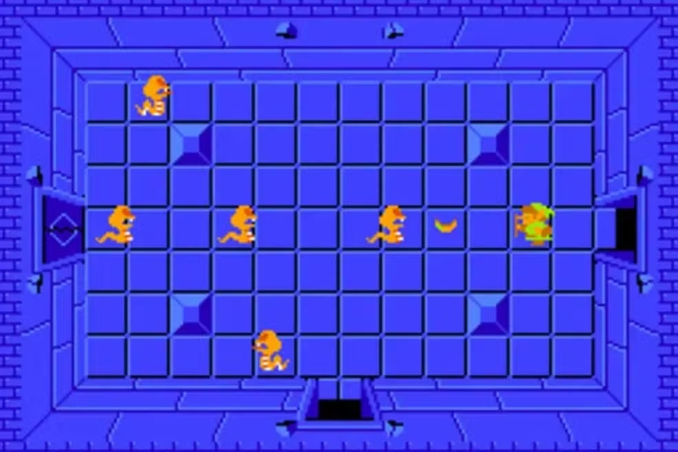

## Tópicos da aula

- Perspectiva top-down
- Geração de dungeons
- Modelagem de elementos por dados
- Eventos
- Hitboxes e Hurtboxes
- Estêncil

## Antes de iniciarmos

Recomendamos que você baixe o material já completo para que possa realizar a leitura da aula e o desenvolvimento do projeto com mais um objeto de consulta. Todo material original presente nessa aula está presente em <https://cs50.harvard.edu/games/2018/weeks/5/> e a versão modificada está nesse mesmo repositório no qual você está lendo essa aula, na pasta "demo".

Assim como outros projetos desenvolvidos no framework Löve, para executar o jogo você deve acessar a pasta que contém o arquivo "main.lua" e executar o comando "love .". Para mais informações você pode acessar a wiki do framework: <https://love2d.org/wiki/Getting_Started_(Portugu%C3%AAs)>

### Sprites

Para a realização desse projeto você pode desenvolver ou utilizar seus próprios sprites, porém você também possui a possibilidade utilizar as sprite sheets disponibilizadas na versão demo presente nesse repositório.

É interessante que os sprites presentes na sprite sheet apresentem um padrão de tamanho para maior facilidade de renderização no nosso jogo, no caso do nosso tile sheet os sprites estão distribuídos em um padrão de tamanho de 16x16 pixels. Porém nem todos os sprites presentes couberam nesse padrão.

#### Portas

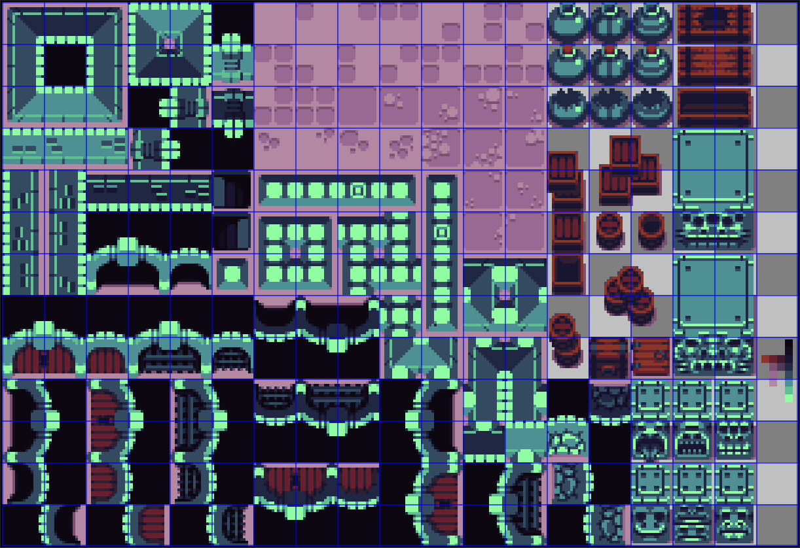

Como as portas ocupam um espaço bem maior do que 16x16 nós devemos renderizar 4 quadrados (ou tiles) de 16x16 de modo que todas as partes de uma porta "caibam" em um mesmo elemento. Além da renderização, outro aspecto importante que devemos nos procupar em relação a esse problema da porta é a questão das hurtboxes, hurtboxes são como caixas de colisões nas quais outras entidades podem colidir:

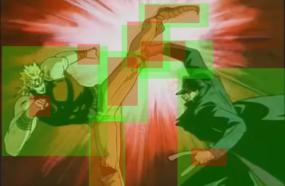

Iremos desenvolver mais sobre esse tema mais adiante, mas da imagem acima podemos destacar que alguns exemplos de hitboxes são os retângulos em vermelho nas mãos e pernas dos personagens, enquanto hurtboxes podem ser representadas como os retângulos em verde no corpo dos personagens. Por enquanto o que podemos destacar em relação ao problema das hurtboxes das portas é sobre como iremos desenvolver essas hurtboxes? Como cada porta ocupa o espaço de 4 tiles, nós podemos criar 4 caixas de colisões (uma para cada tile) ou simplesmente uma única caixa de colisão que abrange todos os 4 tiles. A primeira opção demanda um número maior de elementos a serem monitorados, enquanto a segunda demanda um maior esforço computacional para calcular o deslocamento da hurtbox.

#### Jogador

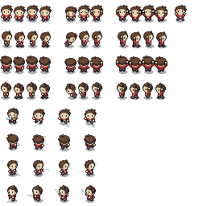

A tilesheet do nosso heróizinho é ainda mais complicada, além dela não possuir um tamanho padronizado (O tile padrão possui um tamanho de 16x32 píxeis, mas alguns possuem um tamanho de 32x32) os sprites presentes nela ainda possuem um certo espaçamento entre si, para esse espaçamento nós damos o nome de "padding" (ou, em português, preenchimento).

Essas questões felizmente são fáceis de serem resolvidas! Precisamos apenas calcular um certo deslocamento entre o espaço que contém o sprite do personagem e o personagem em si:

Como a maior parte dos sprites possuem um tamanho de 16x22 píxeis esse foi o tamanho adotado para o nosso jogador (Essa parte foi declarada em "PlayState.lua") e a partir disso o cálculo do deslocamento dos nossos sprites acaba se tornando simples:

- Para as animações em que o jogador está parado ou andando (que possuem o tamanho padrão de 16x32 píxeis) o nosso deslocamento em x deve ser de 16-16 = 0 e o nosso deslocamento em y deve ser de 32-22 = 10 píxeis.
- Para as outras animações, como a de ataque (que possui tamanho padrão de 32x32 píxeis) o nosso deslocamento em x deve ser de 32-16 = 16 e o nosso deslocamento em y deve ser de 32-22 = 10 píxeis.

Como os nossos sprites estão centralizados ao centro de seus tiles acabamos dividindo todos esses deslocamentos por 2, ou seja, para tiles de 16x32 temos 5 de deslocamento no eixo y. Já para tiles de 32x32 temos, além desse mesmo deslocamento no eixo y, um deslocamento de 8 píxeis no eixo x.

Para definir esses deslocamentos devemos criar alguns scripts que determinam o estado no nosso bonequinho vulgo jogador.
Inicialmente nosso jogador terá 3 estados essenciais: Parado, andando e atacando com a espada:

```lua
-- src/states/entity/player/PlayerIdleState.lua

PlayerIdleState = Class{__includes = EntityIdleState}

-- Função que será executada quando o nosso jogador entrar no seu estado padrão, que é o estado de "Parado", ela realiza os deslocamentos que foram explicados anteriormente
function PlayerIdleState:enter(params)
    self.entity.offsetY = 5
    self.entity.offsetX = 0
end

```

```lua
-- src/states/entity/player/PlayerWalkState.lua

PlayerWalkState = Class{__includes = EntityWalkState}

-- Função que será executada quando o nosso jogador iniciar o estado de "Andando", deslocando o jogador da mesma maneira que o estado explicado anteriormente pois possuem a proporção de 16x32 px
function PlayerWalkState:init(player, dungeon)
    self.entity.offsetY = 5
    self.entity.offsetX = 0
end
```

```lua
-- src/states/entity/player/PlayerSwingSwordState.lua

-- Deslocamento de renderização dos eixos Y e X respectivamente para a animação do jogador atacando (32x32 px)
function PlayerSwingSwordState:init(player, dungeon)
    self.player.offsetY = 5
    self.player.offsetX = 8
end
```

## Perspectiva Top-Down

Ao contrário dos jogos desenvolvidos anteriormente nesse curso, Zelda é um jogo que possui uma perspectiva de câmera que não é vista de frente ou de lado, mas sim de cima para baixo.

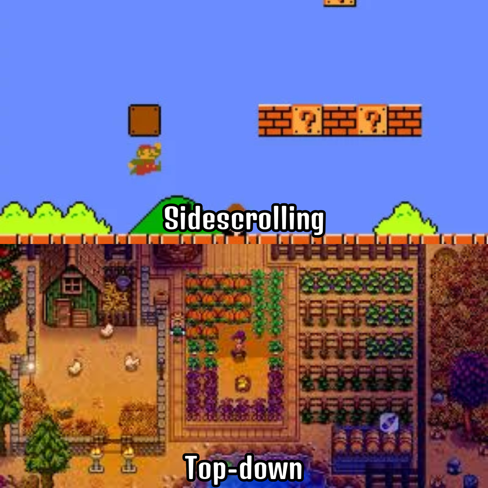

Os principais detalhes nos quais precisamos nos preocupar na hora de elaborar as artes de um jogo que segue a perspectiva top-down estão ligados com a iluminação e o ângulo nos quais os sprites são apresentados na tela:

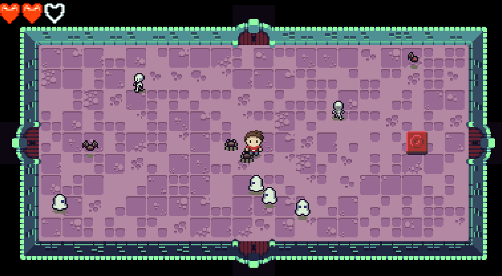

Podemos observar no nosso jogo que todos os sprites foram compostos com uma certa angulação, simulando uma câmera que os observa em uma diagonal de cima para baixo, além disso a presença de sombras nas entidades (boneco do jogador e inimigos) é outro elemento que ajuda no trabalho de convencer o jogador de que ele está observando um jogo que simula um ambiente que possui profundidade, por fim podemos notar nas paredes que cercam a nossa dungeon elementos que simulam uma iluminação que segue o mesmo sentido da câmera, com a parede superior bem iluminada e as paredes mais inferiores com o brilho diminuído.  

## Geração de dungeons

No mundo dos jogos existem 2 formas de desenvolver a geração de dungeons: De forma fixa (como em jogos como Zelda e Binding of Isaac) e de forma infinita (como em Enter the Gungeon e Hades).

### Geração de dungeons fixas

Nesses tipos de jogos as dungeons geralmente são armazenadas em alguma estrutura de dados como uma matriz ou um grafo:

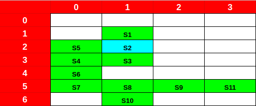

Com cada objeto 'S' representando uma sala de uma dungeon com seus inimigos, tesouros, chaves e equipamentos, bastaria guardar cada um desses objetos em uma certa posição de uma matriz como se fosse um próprio mapa. Perceba que um jogador em S2 (marcado em azul) poderia acessar as salas S1, S5 e S3.
Para guardar em qual sala o jogador está presente um  objeto "gerenciador de jogo" deveria apenas guardar os índices da matriz da sala em que o jogador está, somando ou diminuindo 1 em um dos índices caso houvesse uma mudança de sala, exemplo: O jogador está na sala S2 com os índices x = 2 e y = 1, caso ele vá para a sala S5 seu índice x permanecerá sendo 2, porém seu índice y agora será igual a 0.

Existem alguns cuidados que devem ser tomados ao gerar dungeons por este meio para garantir que todas as dungeons presentes dentro de um jogo possam ser acessadas pelo jogador:

- A primeira preocupação é a de que cada uma das salas deve possui ao menos uma outra sala em uma posição adjacente. No exemplo abaixo, podemos observar que o jogador não consegue chegar em S11, uma vez que não há nenhuma sala adjacente a ela.

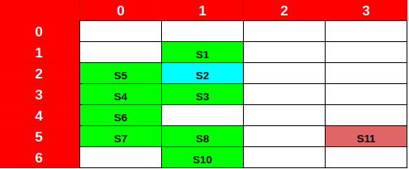

- A segunda se restringe a jogos que possuem o mecanismo de fechadura entre salas e se refere ao fato de que não podemos colocar uma chave de uma sala na própria sala ou em um lugar que só pode ser acessado caminhando pela própria sala. No exemplo abaixo temos uma sala em S6 que só pode ser aberta pela chave presente em S7, porém como o jogador que está em S2 só pode chegar em S7 passando por S6 ele nunca conseguirá chegar em nenhuma dessas salas.

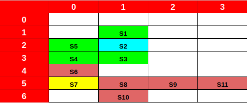

### Geração de dungeons infinitas

Diferentemente da versão original do Zelda, nós iremos implementar esse método na nossa versão do jogo.

O algoritmo para geração de dungeons infinitas segue os seguintes passos:

1. É detectada uma colisão entre o jogador e alguma porta;
2. É criada uma NOVA_SALA na posição da SALA_ATUAL + algum deslocamento (por exemplo, caso o jogador acesse a porta da direita esse deslocamento será de um valor positivo no eixo x);
3. De forma gradual as posições da câmera e do jogador são alteradas para que eles fiquem na nova sala;
4. A NOVA_SALA é definida como a SALA_ATUAL;
5. Todos os elementos presentes na cena são deslocados pelo valor contrário do qual foi deslocado na etapa 2.

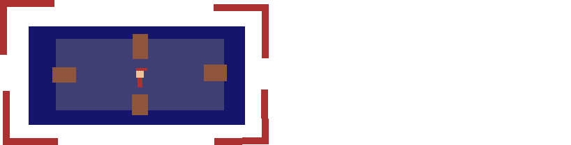

### Classes do jogo relacionadas com a geração de dungeons infinitas

Ao todo temos 3 classes relacionadas a ambientação do jogo e todas elas estão presentes na pasta demo/src/world:

#### Doorway.lua

É a classe que representa as portas presentes em uma sala, por si só ela possui apenas 2 funções:

- A primeira é a função de inicialização na qual são declaradas as variáveis que verificam a direção que essa porta aponta(direction), definem se a porta está aberta ou trancada(open) e guardam a que sala essa porta pertence(room):
- A segunda é uma função de renderização que renderiza as portas a partir das variáveis direction e open:

#### Room.lua

Essa classe representa uma única sala. Em jogos de plataforma como Super Mario uma fase teria uma funcionalidade parecida com a implementada nessa classe pois cada sala é responsável por gerar suas entidades e objetos, porém diferente de uma fase essa geração não é feita de forma pré-determinada mas sim de maneira aleatória por meio de algoritmos pertencentes a essa classe:

- A sua função de inicialização é responsável por inicializar todos os componentes de uma sala como sua dimensão(width e height) e deslocamento de renderização (renderOffsetX e renderOffsetY) que fazem com que a sala não ocupe todo o espaço da tela, além disso ela inicializa os arranjos responsáveis por amazenar os tiles que compõe a parede e o chão da própria sala(tiles), entidades que interagem com o ambiente(entities) e objetos que pertencem à sala(objects). Esses arranjos são apenas inicializados nessa função, porém são preenchidos em outras como forma de organizar melhor o código do jogo! Por último essa função inicializa os valores de adjacentOffsetX e adjacentOffsetY como 0, essas variáveis são utilizadas quando a sala é uma nova sala ainda e possui um deslocamento em relação à sala atual.

- A função generateEntities gera aleatoriamente 10 inimigos, inserindo cada um dos inimigos gerados no arranjo entities, as animações e velocidade dos diferentes tipos de inimigos são adquiridas pela representação de cada tipo de entidade por conta da modelagem de entidades em dados (tópico que será abordado mais adiante), além disso essa função garante que todos os inimigos sejam gerados dentro da sala e definem o tamanho dessas entidades como 16x16 e sua vida como 1hp.

- A função generateObjects é reponsável pela geração do único objeto presente no jogo que é o botão utilizado para abrir as portas da sala. Além de gerar esse objeto essa função define a função de colisão para o botão gerado e adiciona o botão ao arranjo objects.

- A função generateWallsAndFloors adiciona ao arranjo bidimensional tiles o "id" que representa o sprite de cada chão e parede da sala da seguinte maneira:

    Uma representação do "id" de cada sprite presente no nosso tileset pode ser visto na imagem abaixo em números rosas:

    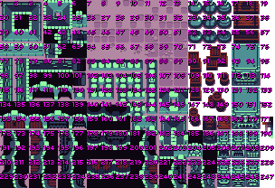

    1. Todas as posições da sala são percorridas em um laço de 1 à altura da sala (no eixo y) e 1 à largura da sala (no eixo x);
    2. Para as posições (1,1) , (1,ALTURA), (LARGURA,1) e (LARGURA,ALTURA) são adicionados "id" de sprites que representam cantos da sala (id = 4, 5, 23 ou 24);
    3. Para outras posições que tenham x = 1, x = LARGURA, y = 1 ou y = ALTURA são adicionados "id" de sprites que representam paredes de salas (id = 58 a 60, 79 a 81, 77, 78, 96, 97, 115 ou 116);
    4. Para quaisquer outras posições são inseridos "id" de sprites que representam o chão da sala (id = 7 a 13, 26 a 32, 45 a 51, 64 a 70, 88, 89, 107 ou 108).

    Note que são apenas valores numéricos que são guardados no arranjo, uma outra função que será responsável por "traduzir" os ids de cada elemento do arranjo no sprite que será renderizado em nossa sala.

- A função update é talvez uma das mais importantes pois ela é aquela que:
  - Gerencia o comportamento das entidades, removendo os inimigos que foram mortos pelo jogador e atualizando o comportamento dos inimigos vivos;
  - Gerencia a colisão entre as entidades e o jogador, diminuindo a vida do  jogador caso aja colisão, dando um período de invulnerabilidade e mudando o estado de jogo para "fim de jogo" caso a vida do jogador acabe;
  - Chama a função de colisão do objeto (no nosso caso, o botão) que colide com o jogador caso ocorra uma colisão.

  Essas verificações são feitas percorrendo os arranjos que possuem os inimigos (entities) e objetos (objects) e não são realizadas caso a sala atual esteja em processo de transição para uma nova sala.

- Por último mas não menos importante, a função render é a responsável por renderizar todos os elementos da sala como as portas, entidades, objetos, paredes e chão, além do próprio jogador. Para realizar essa renderização são utilizados os arranjos criados na inicialização da classe. Além dos elementos da sala há também a renderização de um "molde", também chamado de stencil, que é responsável por causar a ilusão do jogador estar passando por trás da porta, esse conceito será explicado melhor mais adiante nessa aula.

#### Dungeon.lua

Essa classe é a maior responsável por gerenciar o algoritmo de geração de dungeons infinitas possuindo como responsabilidades instanciar e armazenar a sala atual e a nova sala, armazenar a posição da câmera e controlar o deslocamento dos elementos pertencentes à dungeon durante a transição de uma sala para outra.

- A função de inicialização instancializa uma sala atual (currentRoom) e define a nova sala (nextRoom) com um valor nulo, uma vez que o personagem ainda não passou por nenhuma porta. Além disso ela declara a posição deslocada da câmera como 0,0 (cameraX e cameraY) uma vez que inicialmente a câmera fica na origem e uma variável de booleana (shifting) para controlar se está ocorrendo uma troca de salas. Por último essa função define alguns eventos para a troca de sala em cada uma das direções disponíveis, o conceito de eventos será explicada no decorrer da aula.

- A função beginShifting é a responsável por preparar o deslocamento da câmera de uma sala para outra da seguinte maneira:
  1. Define como valor true a variável de controle (shifting) e instancia a nova sala como valor da variável que guarda a próxima sala (nextRoom);
  2. Deixa todas as portas abertas na nova sala;
  3. Define quanto a nova sala se desloca em relação à sala atual nos dois eixos;
  4. Define onde o jogador irá parar na próxima sala a partir de qual porta ele entrou;
  5. Gradativamente desloca a câmera e o jogador para as suas novas posições
  6. Chama a função finishShifting que reseta as posições de deslocamento da câmera e da sala, define a sala atual(currentRoom) como sendo a nova sala e a nova sala(nextRoom) como um valor vazio, define como valor false a variável de controle (shifting)
  7. Redefine a posição do jogador
  8. Fecha as portas da nova sala

## Modelagem de elementos por dados

Quando desenvolvemos jogos e temos muitos elementos que podem causar redundância nós podemos representá-los por meio de dados, a técnica de modelar elementos por meio de dados é recomendada principalmente quando queremos representar algo que não envolve necessariamente uma lógica de programação, mas sim uma descrição de dados, evitando a criação de diversas classes semelhantes, facilitando a adição e modificação de elementos no jogo.

No nosso projeto podemos observar essa técnica em 2 scripts: entity_defs.lua e game_objects.lua (ambos presentes na pasta demo/src). Assim como script que contém as constantes (constants.lua), temos como costume de boas práticas nomear esses tipos de arquivos com letras minúsculas.

Na linguagem Lua a modelagem por dados é feita por meio da estruturas de dados de ***tabelas***. As tabelas são arranjos associativos, que associam um valor a uma chave, normalmente um arranjo costuma armazenar valores do mesmo tipo ***ou*** que estão inseridos em um mesmo contexto.

``` lua
GAME_OBJECT_DEFS = {
    ['switch'] = {
        type = 'switch',
        texture = 'switches',
        frame = 2,
        width = 16,
        height = 16,
        solid = false,
        defaultState = 'unpressed',
        states = {
            ['unpressed'] = {
                frame = 2
            },
            ['pressed'] = {
                frame = 1
            }
        }
    },
    ['pot'] = {
        -- TODO
    }
}
```

Nessa representação temos o arranjo GAME_OBJECT_DEFS que armazena os dados dos diferentes tipos de objetos. "switch" e "pot" são chaves que estão associadas aos dados de cada objeto individual. Podemos ter tabelas como valores de uma outra tabela, essa situação está exemplificada na tabela "states" que é um dado da própria tabela "switch".

## Hitboxes e Hurtboxes

Como foi dito na introdução, hitboxes e hurtboxes são dois tipos de caixas de colisão com conceitos parecidos:

- Hitboxes são as caixas de colisões que uma entidade causa em outra entidade (por exemplo, caixa de colisão da espada que causa um dano nos inimigos)
- Hurtboxes são as caixas de colisões que recebem uma ação de uma outra entidade (por exemplo, a caixa de colisão do jogador que recebe dano ao interagir com os inimigos)

Em muitas aplicações de desenvolvimento de jogos existe uma unificação desses dois conceitos (no qual tudo é considerado uma hitbox) então não considere esquisito você não observar o conceito de hurtbox em outros lugares.

Além disso existem caixas de colisões que podem ser tratadas como hitboxes e hurtboxes ao mesmo tempo, um exemplo é a caixa de colisão dos inimigos presentes nesse jogo. Elas agem como hitboxes ao causar dano ao jogador e hurtboxes ao receber dano da espada do mesmo jogador.

Vamos observar a imagem presente na seção introdutória novamente:


Podemos notar os seguintes exemplos de Hurtbox e Hitbox:

- Hurtboxes (Em verde):
  - Personagem da esquerda: Várias caixas retangulares que cercam todo seu corpo
  - Personagem da direita: Várias caixas retangulares que cercam todo seu corpo
  Ou seja, toda a área que envolvem o corpo dos personagens estão suscetíveis a receber dano. Existem algumas pequenas áreas que não fazem parte do corpo dos personagens que também estão suscetíveis a receber dano.
- Hitboxes (Em vermelho):
  - Personagem da esquerda: Várias caixas retangulares que cercam suas pernas e seus punhos.
  - Personagem da direita: Várias caixas retangulares que cercam seus punhos.
  Ou seja, embora o personagem da esquerda possa atacar com socos e chutes, o da direita só consegue causar dano com socos (note que assim como nas hurtboxes, existem certas áreas que fazem parte da hitbox mas que não fazem parte do corpo do personagem).

De forma prática a criação de uma hitbox envolve apenas a criação de um retângulo, podemos observar o quão simples é ao abrir o código em src/Hitbox.lua:

``` lua
Hitbox = Class{}

function Hitbox:init(x, y, width, height)
    self.x = x
    self.y = y
    self.width = width
    self.height = height
end
```

A hitbox da espada do jogador é gerenciada pelo seu estado de ataque, chamado de "PlayerSwingSwordState.lua". Esse estado ao ser iniciado define as dimensões e a posição da hitbox baseado na orientação do jogador:

``` lua
function PlayerSwingSwordState:init(player, dungeon)
    ...
    local direction = self.player.direction
    local hitboxX, hitboxY, hitboxWidth, hitboxHeight

    if direction == 'left' then
        hitboxWidth = 8
        hitboxHeight = 16
        hitboxX = self.player.x - hitboxWidth
        hitboxY = self.player.y + 2
    elseif direction == 'right' then
        hitboxWidth = 8
        hitboxHeight = 16
        hitboxX = self.player.x + self.player.width
        hitboxY = self.player.y + 2
    elseif direction == 'up' then
        hitboxWidth = 16
        hitboxHeight = 8
        hitboxX = self.player.x
        hitboxY = self.player.y - hitboxHeight
    else
        hitboxWidth = 16
        hitboxHeight = 8
        hitboxX = self.player.x
        hitboxY = self.player.y + self.player.height
    end
    ...
end
```

Depois disso essa mesma função instancia a hitbox da espada:

``` lua
function PlayerSwingSwordState:init(player, dungeon)
    ...
    self.swordHitbox = Hitbox(hitboxX, hitboxY, hitboxWidth, hitboxHeight)
    ...
end
```

Por último a função de atualização (update) verifica para todas as entidades presentes na cena quais colidiram com a hitbox, causando dano em todas aquelas que colidiram:

``` lua
function PlayerSwingSwordState:update(dt)
    for k, entity in pairs(self.dungeon.currentRoom.entities) do
        if entity:collides(self.swordHitbox) then
            entity:damage(1)
            gSounds['hit-enemy']:play()
        end
    end
    ...
end
```

No código original há uma seção comentada de debug que ao ser "descomentada" desenha a hitbox da espada, fique livre para experimentar!:

``` lua
function PlayerSwingSwordState:update(dt)
    ...
    love.graphics.setColor(255, 0, 255, 255)
    love.graphics.rectangle('line', self.player.x, self.player.y, self.player.width, self.player.height)
    love.graphics.rectangle('line', self.swordHitbox.x, self.swordHitbox.y,
        self.swordHitbox.width, self.swordHitbox.height)
    love.graphics.setColor(255, 255, 255, 255)
end
```

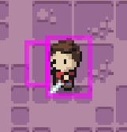

## Eventos

O conceito de eventos pode ser visto de uma maneira muito simples, nada mais é do que uma maneira de fazer com que diferentes componentes do seu jogo se comuniquem sem manterem referências diretas entre si! Essa comunicação ocorre com um componente anunciando algo e um (ou mais) componentes realizando alguma ação ao ouvir esse anúncio. Essa prática acaba causando um código "mais limpo" e menos confuso, uma vez que é mais simples anunciar um evento do que guardar inúmeros endereços de diversos componentes.

Na linguagem Lua, um evento  é composto por 2 tipos de funções importadas da biblioteca knife.event:

- Funções de despacho: Essas são as funções que "anunciam" que um evento ocorreu, na linguagem Lua a sintaxe é desse tipo de função é a seguinte:

    ``` lua
    Event.dispatch(nomeDoEvento,[parametros])
    ```

- Funções de escuta: Essas são as funções que "escutam" quando um evento é anunciado e chamam uma outra função quando o evento é anunciado, na linguagem Lua a sintaxe desse tipo de função é a seguinte:

    ``` lua
    Event.on(nomeDoEvento, funcaoChamada)
    ```

(Caso haja maior interesse na biblioteca knife.event, você pode observar a documentação pelo link <https://github.com/airstruck/knife/blob/master/readme/event.md>)

Além de evitar o registro de referências de outros objetos, eventos evitam que certas condições sejam verificadas a todo momento. Um exemplo simples é uma conquista, imagine que você queira que uma conquista seja anunciada quando o jogador derrota o chefe final:

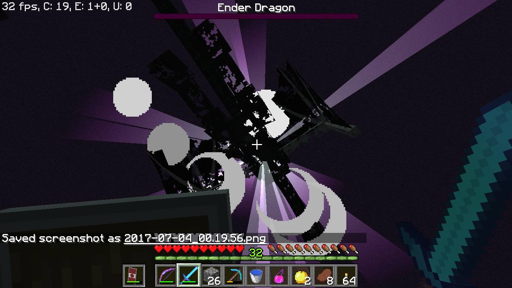

Temos 2 formas de verificar se a conquista foi alcançada:

1. Verificar frame a frame se o chefe foi derrotado (pouco eficiente, apenas no final do jogo essa verificação será verdadeira)
2. Criando uma função de despache para o chefe que será despachada quando ele for derrotado (mais eficiente, evita verificações desnecessárias).

No nosso jogo nós utilizamos eventos no objeto que controla o estado do jogador andando (PlayerWalkState.lua). Podemos observar que quando o jogador colide com uma porta aberta o evento "shift+<direção>" é despachado:

``` lua
function PlayerWalkState:update(dt)
    ...
    if self.bumped then
        if self.entity.direction == 'left' then
            ...
            for k, doorway in pairs(self.dungeon.currentRoom.doorways) do
                if self.entity:collides(doorway) and doorway.open then
                    ...
                    Event.dispatch('shift-left')
                end
            end
        elseif self.entity.direction == 'right' then
            ...
            for k, doorway in pairs(self.dungeon.currentRoom.doorways) do
                if self.entity:collides(doorway) and doorway.open then
                    ...
                    Event.dispatch('shift-right')
                end
            end
        elseif self.entity.direction == 'up' then
            ...
            for k, doorway in pairs(self.dungeon.currentRoom.doorways) do
                if self.entity:collides(doorway) and doorway.open then
                    ...
                    Event.dispatch('shift-up')
                end
            end
        else
            ...
            for k, doorway in pairs(self.dungeon.currentRoom.doorways) do
                if self.entity:collides(doorway) and doorway.open then
                    ...
                    Event.dispatch('shift-down')
                end
            end
        end
    end
end
```

Como já vimos anteriormente, esses eventos são escutados pelo objeto responsável por gerenciar a dungeon (Dungeon.lua), que ao "escutar" o anúncio desses eventos chama a função beginShifiting:

``` lua
function Dungeon:init(player)
    ...
    Event.on('shift-left', function()
        self:beginShifting(-VIRTUAL_WIDTH, 0)
    end)

    Event.on('shift-right', function()
        self:beginShifting(VIRTUAL_WIDTH, 0)
    end)

    Event.on('shift-up', function()
        self:beginShifting(0, -VIRTUAL_HEIGHT)
    end)

    Event.on('shift-down', function()
        self:beginShifting(0, VIRTUAL_HEIGHT)
    end)
end
```

## Estêncil

Para uma melhor explicação sobre o que é e para que serve um estêncil, iremos pensar em um problema que ocorre na ausência dessa parte tão importante no desenvolvimento do jogo:

Em qual ordem nós renderizamos os elementos do jogador e da porta? Essa pergunta que parece ser extramamente simples acaba sendo difícil de ser resolvida. Considerando apenas esses dois elementos nós temos apenas duas possibilidades de ordenar essa renderização:

1. Jogador e depois porta:

    ``` lua
    function Room:render()
        ...
        if self.player then
            self.player:render()
        end

        for k, doorway in pairs(self.doorways) do
            doorway:render(self.adjacentOffsetX, self.adjacentOffsetY)
        end
        ...
    end
    ```

    O problema dessa abordagem é que as portas, por serem renderizadas depois do jogador, acabam aparecendo por cima dele:

    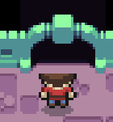

2. Porta e depois jogador:

    ``` lua
    function Room:render()
        ...
        for k, doorway in pairs(self.doorways) do
            doorway:render(self.adjacentOffsetX, self.adjacentOffsetY)
        end

        if self.player then
            self.player:render()
        end
        ...
    end
    ```

    O problema dessa abordagem é que no momento em que o jogador está transicionando entre os quartos a impressão causada é de que ele está passando por cima das portas ao invés de entre as portas:

    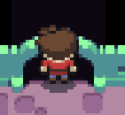

Para resolver essa situação criamos um estêncil, que nada mais é do que uma máscara utilizada para separar elementos que serão renderizados ou não em uma área. Na biblioteca LOVE existem 2 comandos básicos para utilização de estêncils:

- love.graphics.stencil(função, [ação], [valor])
  - Função: Função passada como parâmetro que "desenhará" o estêncil
  - Ação: Define como cada pixel se comportará ao entrar em contato com o estêncil.
  - Valor: Valor que será utilizado como parâmetro da ação.
  - Exemplo: love.graphics.stencil (funcao1, "replace", 1) -> Um pixel que entrar em contato com esse estêncil de formato gerado pela função funcao1 terá o "valor estenciado" igual a 1.

- love.graphics.setStencilTest(modo de comparação, valor comparado)
  - Permite a renderização de pixels cujo "valor estenciado" esteja de acorco com o modo de comparação, o valor é utilizado como referência da comparação
  - Exemplo: love.graphics.setStencilTest ("greater", 0) -> Apenas pixels que possuem "valor estenciado" maior que 0 são renderizados.

 Para causar a ilusão do jogador estar passando pela porta iremos utilizar a segunda opção do problema proposto anteriormente (renderizar a porta e depois o jogador) com o auxílio de um estêncil. Para isso primeiro renderizamos as portas como fizemos anteriormente:

 ``` lua
function Room:render()
    ...
    for k, doorway in pairs(self.doorways) do
        doorway:render(self.adjacentOffsetX, self.adjacentOffsetY)
    end
    ...
end
```

Depois disso criamos um estêncil acima dos arcos das portas:

``` lua
function Room:render()
...
-- renderização da porta
...
love.graphics.stencil(function()
        
        -- left
        love.graphics.rectangle('fill', -TILE_SIZE - 6, MAP_RENDER_OFFSET_Y + (MAP_HEIGHT / 2) * TILE_SIZE - TILE_SIZE,
            TILE_SIZE * 2 + 6, TILE_SIZE * 2)
        
        -- right
        love.graphics.rectangle('fill', MAP_RENDER_OFFSET_X + (MAP_WIDTH * TILE_SIZE),
            MAP_RENDER_OFFSET_Y + (MAP_HEIGHT / 2) * TILE_SIZE - TILE_SIZE, TILE_SIZE * 2 + 6, TILE_SIZE * 2)
        
        -- top
        love.graphics.rectangle('fill', MAP_RENDER_OFFSET_X + (MAP_WIDTH / 2) * TILE_SIZE - TILE_SIZE,
            -TILE_SIZE - 6, TILE_SIZE * 2, TILE_SIZE * 2 + 12)
        
        --bottom
        love.graphics.rectangle('fill', MAP_RENDER_OFFSET_X + (MAP_WIDTH / 2) * TILE_SIZE - TILE_SIZE,
            VIRTUAL_HEIGHT - TILE_SIZE - 6, TILE_SIZE * 2, TILE_SIZE * 2 + 12)
    end, 'replace', 1)
...
end
```

O deslocamento de 12 píxeis para as portas de cima e baixo / 6 píxeis para as portas da esquerda e direita foram o suficiente para marcar o ponto acima dos arcos. Esse estêncil substitui o "valor estenciado" de cada píxel que entra em contato com ele por 1.

Após a criação do estêncil, criamos um teste no qual só é renderizado píxel menores que 1, após esse teste renderizamos o jogador e por último criamos mais um teste que renderiza todos os píxels independente de seus valores:

``` lua
function Room:render()
...
-- renderização da porta
-- criação do estêncil
...
love.graphics.setStencilTest('less', 1)
    
if self.player then
    self.player:render()
end

love.graphics.setStencilTest()
...
end
```

No final temos um jogador que não é renderizado ao entrar em contato com o estêncil, enquanto outros objetos que entram em contato são renderizados normalmente.

Caso você possua interesse em visualizar melhor os estêncils, assim como as hitboxes, eles também possuem uma parte do código que ao ser "descomentada" pode ser observada de outra forma:

``` lua
function Room:render()
...
-- love.graphics.setColor(255, 0, 0, 100)
    
-- -- left
-- love.graphics.rectangle('fill', -TILE_SIZE - 6, MAP_RENDER_OFFSET_Y + (MAP_HEIGHT / 2) * TILE_SIZE - TILE_SIZE,
-- TILE_SIZE * 2 + 6, TILE_SIZE * 2)

-- -- right
-- love.graphics.rectangle('fill', MAP_RENDER_OFFSET_X + (MAP_WIDTH * TILE_SIZE),
--     MAP_RENDER_OFFSET_Y + (MAP_HEIGHT / 2) * TILE_SIZE - TILE_SIZE, TILE_SIZE * 2 + 6, TILE_SIZE * 2)

-- -- top
-- love.graphics.rectangle('fill', MAP_RENDER_OFFSET_X + (MAP_WIDTH / 2) * TILE_SIZE - TILE_SIZE,
--     -TILE_SIZE - 6, TILE_SIZE * 2, TILE_SIZE * 2 + 12)

-- --bottom
-- love.graphics.rectangle('fill', MAP_RENDER_OFFSET_X + (MAP_WIDTH / 2) * TILE_SIZE - TILE_SIZE,
--     VIRTUAL_HEIGHT - TILE_SIZE - 6, TILE_SIZE * 2, TILE_SIZE * 2 + 12)

-- love.graphics.setColor(255, 255, 255, 255)
...
end
```

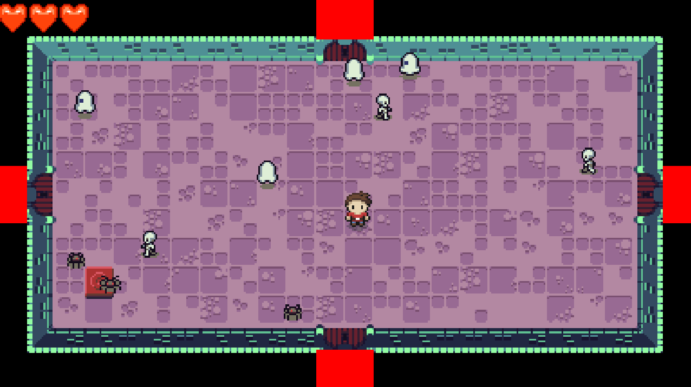

## Conclusão

Durante essa aula passamos por diversos conceitos que:

- Englobam diverentes gêneros de jogos como top-down e geração de dungeons;
- São úteis para diversos jogos que você pode desenvolver não importa qual o tipo, como hitboxes/hurtboxes e estêncils;
- Te ajudarão a desenvolver jogos de uma forma mais organizada como modelagem de elementos por dados e eventos.

No mais, esperamos que você tenha curtido a aula e aproveitado o conteúdo!
