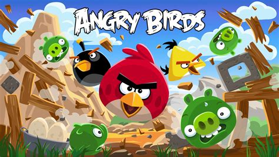

# Aula 06: Angry Birds

Voltamos mais uma vez para uma nova aula de *GameDev*! Na aula de hoje vamos criar o *famoso*, *lendário* e *popular*: **Angry Birds**!

Angry Birds é um jogo *mobile* muito famoso dos anos *2010* (sinta-se velho), feito pela *Rovio*. O jogo conquistou espaço dos jogos mobile, dando origem a uma franquia de jogos, séries e até filme! Ele consiste de arremessar pássaros de forma a matar porcos, cada fase pode contar com obstáculos e quebra-cabeças a serem superados.[^1]



Angry Birds. Fonte: Angry Birds Wiki

## Conteúdos

Nesta aula veremos os seguintes tópicos:
- Como usar um motor de **simulação física**
- **Entrada do *Mouse***. Como detectar e tratar esse tipo de entrada

## Código Fonte

O código do projeto está na pasta `scr6`, use-o para acompanhar o desenvolvimento do projeto ou como referência para a implementação de alguma etapa.

### Sprites

Usaremos três *Sprite Sheets* para este projeto:
1. Os pássaros e porcos que no nosso caso serão *aliens* (por razões de copyright).
2. Objetos do nosso cenário, ex.: o céu, as nuvens, o chão, etc
3. Os obstáculos, ex.: as paredes e plataformas.

Nas aulas anteriores, temos utilizado Quads para separar as sprites, acontece que os obstáculos ocupam um tamanho variado. Para contornar esse problema, vamos simplesmente criar os Quads de modo "*hardcoded*", ou seja, definir manualmente o x e y de cada Quad, de acordo com a sprite. Essa prática é um pouco trabalhosa, mas é algo que será necessário somente uma vez.

### Bibliotecas

Nessa aula vamos introduzir algumas bibliotecas do Lua para melhorar nossa vida, você já conhece a `push` desde a Aula 0, bem como a `class`, agora conheça: `knife`. [Knife](https://github.com/airstruck/knife) é uma coleção de micro-módulos com funcionalidades úteis para o Lua, veja a página oficial para ver todos os módulos. Hoje, vamos só nos interessar no módulo `knife.timer` para criar um *temporizador* e outras funções de tempo.

Essas bibliotecas se encontram na pasta `lib` do projeto. Caso você queira descobrir mais sobre bibliotecas do Lua ou do LÖVE, veja o site oficial do LÖVE, que conta com uma lista de links para todo tipo de biblioteca: https://love2d.org/wiki/Category:Libraries.

## Explorando a `love.physics` 

Para criar esse jogo vamos precisar de um pouco mais que mover objetos pela tela e calcular colisões. Precisamos de propriedades físicas como, gravidade, arrasto, aceleração e muitos outros. Acontece que programar essas condições manualmente é bem trabalhoso. Desse modo, o LÖVE expõe um módulo inteiro dedicado à **simulação física 2D**, a `love.physics`.

A [documentação oficial](https://love2d.org/wiki/love.physics) diz que `love.physics` é um módulo para simulação de corpos rígidos 2D e essencialmente uma *binding* (ligamento/exportação) da biblioteca [Body2D](https://box2d.org/documentation/) de mesmo propósito, mas feita na linguagem C. Com isso em mente, vamos explorar algumas funções desse módulo e os conceitos por trás deles.

### Mundo 2D

Hora de Criar um *Admirável Novo Mundo*. Assim como o mundo real, precisamos de um sistema **fechado** onde vamos simular a interação dos nossos objetos. Mundos possuem um valor de gravidade que afeta todos os corpos nele inseridos. 

No LÖVE, usamos a função `love.physics.newWorld(gravX, gravY, [sleep])`. 

Seus primeiros dois parâmetros são a gravidade em ambos os eixos, o terceiro é um parâmetro opcional, que diz se podemos ignorar o cálculo de corpos parados, o que pode melhorar o desempenho do jogo se houver muitos cálculos em um único *frame*. A função retorna um `World` que vamos usar para incluir nossos corpos.

### Corpo Rígido

Um Corpo Rígido &mdash; também só chamado de Corpo &mdash; é um corpo *sólido* com massa uniforme. No LÖVE, tratamos isso na classe `Body`, um corpo com *posição* e *velocidade*.

Para criar um corpo temos a função `love.physics.newBody(world, x, y, type)`. 

Como parâmetros temos o mundo que queremos inserir o corpo, a posição onde o corpo vai estar nesse mundo e o seu tipo. Um corpo pode ser de três tipos:

1. `BodyType.static`: estáticos, não podem ser movidos, possuem massa infinita. Podem ser usados como limites de um nível, o chão por exemplo.
2. `BodyType.dynamic`: dinâmicos, eles são os "atores" principais, se movem e interagem com outros corpos, muito próximos de corpos da vida real.
3. `BodyType.kinematic`: Podem se mover mas não são influenciados por outros corpos. Podem ser usados para plataformas móveis e objetos que desafiam a gravidade.

### Shapes e Fixtures

Acontece que corpos são criados sem forma nenhuma, para definir sua forma e propriedades, precisamos definir uma **forma** (shape) para esse corpo e conectar ambos. O LÖVE tem um conjunto de funções para cada forma que você possa querer:

- `love.physics.newCircleShape(radius)`.
- `love.physics.newRectangleShape(width, height)`
- `love.physics.newEdgeShape(x, y, width, height)`
- `love.physics.newChainShape(loop, x1, y1, x2, y2, ...)`
- `love.physics.newPolygonShape(x1, y1, x2, y2, ...)`

Formas e corpos podem ser combinados através de **fixtures**. Fixtures (ou instalações) combinam corpos e formas e definem outras propriedades físicas, como densidade, fricção, restituição, etc. A função `love.physics.newFixture(body, shape, [density])`, combina corpo e forma em um único objeto `Fixture`, também é possível alterar a densidade do objeto e definir outras propriedades usando métodos.

### Recursos Adicionais

Caso queira ver mais sobre as funções, métodos e objetos disponíveis no módulo `love.physics` e como funciona a simulação física veja estes links:

- https://love2d.org/wiki/love.physics. Documentação do módulo
- https://love2d.org/wiki/Tutorial:Physics. Tutorial oficial do LÖVE
- http://www.iforce2d.net/b2dtut/introduction. Documentação da Biblioteca Body2D.

Veja também essa imagem abaixo, esquematizando conceitos, terminologias e a arquitetura geral do módulo de simulação física.


Arquitetura, conceitos e terminologias. Fonte: https://love2d.org/wiki/love.physics

## Entradas do Mouse

Nesta aula vamos utilizar o mouse para mirar e atirar nos inimigos, para isso precisaremos de duas funções *callback*:

- `love.mousepressed(x, y, button, istouch, presses)`. A função recebe a posição, o botão apertado (`1` para esquerdo, `2` para direito, `3` para o do meio), se o clique veio de uma *touchscreen* e indica o número de cliques (para simular um *doubleclick*, etc).
- `love.mousereleased( x, y, button, istouch, presses)` funciona de maneira similar mas indica que o mouse foi liberado.

Como menção honrosa, existem outras duas funções para entradas do mouse que você possa querer usar em seus jogos:

- `love.mousemoved(x, y, dx, dy, istouch)` detecta movimentos do mouse e inclui a nova posição do mouse, a diferença entre a posição anterior e se o sinal veio de uma *touchscreen*.
- `love.wheelmoved(x, y)` detecta quando a roda do mouse se moveu e a quantidade de movimento relativo a tela.

## Angrybirds

Tendo os conceitos teóricos memorizados, vamos partir para a ação! 

Crie um novo projeto em uma pasta, coloque os assets e bibliotecas que vamos usar (as pastas `fonts`, `graphics`, `lib` e `sounds` que estão em `src6/angrybirds`).

Crie um arquivo `main.lua` e declare as funções iniciais de sempre. Com atenção especial a `love.load()`

```lua
push = require("lib/push")

VIRTUAL_WIDTH = 640
VIRTUAL_HEIGHT = 360

WINDOW_WIDTH = 1280
WINDOW_HEIGHT = 720

function love.load()
    math.randomseed(os.time())
    love.window.setTitle('Angry Aliens')

    love.window.setMode(WINDOW_WIDTH, WINDOW_HEIGHT, {
        fullscreen = false,
        vsync = true,
        resizable = true
    })

    push.setupScreen(VIRTUAL_WIDTH, VIRTUAL_HEIGHT, { upscale = 'normal' })

    love.keyboard.keysPressed = {}
    love.mouse.keysPressed = {}
    love.mouse.keysReleased = {}

    paused = false
end

function love.keypressed(key)
    if key == 'p' then
        paused = not paused
    end

    love.keyboard.keysPressed[key] = true
end

function love.mousepressed(x, y, key)
    love.mouse.keysPressed[key] = true
end

function love.mousereleased(x, y, key)
    love.mouse.keysReleased[key] = true
end

function push.resize(w, h)
	push.resize(w, h)
end

function love.update(dt)
	if not paused then
	    love.keyboard.keysPressed = {}
        love.mouse.keysPressed = {}
        love.mouse.keysReleased = {}
	end
end

function love.draw()
	push.start()
	push.end()
end
```

Na função `love.load()` estamos iniciando nossa janela, bem como criando três novas variáveis dentro de `love.mouse` e `love.keyboard`, para detectar essas entradas do sistema. Também implementamos um botão de pausa (`p` para pausar). As outras linhas são puramente *boilerplate* para as próximas etapas.

### Dependências e Constantes

Antes de continuar vamos deixar o jogo bem organizado, crie uma pasta chamada `src` e dois arquivos `constantes.lua` e `Dependecies.lua`. Vamos colocar nossas constantes globais, bibliotecas e *assets*.

```lua
-- constants.lua

VIRTUAL_WIDTH = 640
VIRTUAL_HEIGHT = 360

WINDOW_WIDTH = 1280
WINDOW_HEIGHT = 720

MAP_SCROLL_X_SPEED = 100
BACKGROUND_SCROLL_X_SPEED = MAP_SCROLL_X_SPEED / 2

TILE_SIZE = 35
ALIEN_SIZE = TILE_SIZE

DEGREES_TO_RADIANS = 0.0174532925199432957
RADIANS_TO_DEGREES = 57.295779513082320876
```

Declaramos algumas constantes que serão muito úteis ao longo do jogo, além do tamanho da tela, temos a velocidade do *scroll* do mouse, o tamanho do personagem, etc.

```lua
-- Dependecies.lua
Class = require 'lib/class'
push = require 'lib/push'
Timer = require 'lib/knife.timer'

require 'src/constants'

gTextures = {
    -- backgrounds
    ['blue-desert'] = love.graphics.newImage('graphics/blue_desert.png'),
    ['blue-grass'] = love.graphics.newImage('graphics/blue_grass.png'),
    ['blue-land'] = love.graphics.newImage('graphics/blue_land.png'),
    ['blue-shroom'] = love.graphics.newImage('graphics/blue_shroom.png'),
    ['colored-land'] = love.graphics.newImage('graphics/colored_land.png'),
    ['colored-desert'] = love.graphics.newImage('graphics/colored_desert.png'),
    ['colored-grass'] = love.graphics.newImage('graphics/colored_grass.png'),
    ['colored-shroom'] = love.graphics.newImage('graphics/colored_shroom.png'),

    -- aliens
    ['aliens'] = love.graphics.newImage('graphics/aliens.png'),

    -- tiles
    ['tiles'] = love.graphics.newImage('graphics/tiles.png'),

    -- wooden obstacles
    ['wood'] = love.graphics.newImage('graphics/wood.png'),

    -- arrow for trajectory
    ['arrow'] = love.graphics.newImage('graphics/arrow.png')
}

gFrames = {
    ['aliens'] = GenerateQuads(gTextures['aliens'], 35, 35),
    ['tiles'] = GenerateQuads(gTextures['tiles'], 35, 35),

    ['wood'] = {
        love.graphics.newQuad(0, 0, 110, 35, gTextures['wood']:getDimensions()),
        love.graphics.newQuad(0, 35, 110, 35, gTextures['wood']:getDimensions()),
        love.graphics.newQuad(320, 180, 35, 110, gTextures['wood']:getDimensions()),
        love.graphics.newQuad(355, 355, 35, 110, gTextures['wood']:getDimensions())
    }
}

gSounds = {
    ['break1'] = love.audio.newSource('sounds/break1.wav', 'static'),
    ['break2'] = love.audio.newSource('sounds/break2.wav', 'static'),
    ['break3'] = love.audio.newSource('sounds/break3.mp3', 'static'),
    ['break4'] = love.audio.newSource('sounds/break4.wav', 'static'),
    ['break5'] = love.audio.newSource('sounds/break5.wav', 'static'),
    ['bounce'] = love.audio.newSource('sounds/bounce.wav', 'static'),
    ['kill'] = love.audio.newSource('sounds/kill.wav', 'static'),

    ['music'] = love.audio.newSource('sounds/music.wav', 'static')
}

gFonts = {
    ['small'] = love.graphics.newFont('fonts/font.ttf', 8),
    ['medium'] = love.graphics.newFont('fonts/font.ttf', 16),
    ['large'] = love.graphics.newFont('fonts/font.ttf', 32),
    ['huge'] = love.graphics.newFont('fonts/font.ttf', 64)
}

-- tweak circular alien quad
gFrames['aliens'][9]:setViewport(105.5, 35.5, 35, 34.2)
```

Aqui importamos nossas bibliotecas e constantes, bem como carregamos todos os *assets* e efeitos sonoros em tabelas que podemos reutilizar posteriormente. Se você tiver olhos atentos verá uma função `GenerateQuads()`, criaremos ela dentro de um arquivo `Util.lua` (que vai guardar nossas funções utilitárias). Veja o código abaixo:

```lua
-- Util.lua
function GenerateQuads(atlas, tilewidth, tileheight)
    local sheetWidth = atlas:getWidth() / tilewidth
    local sheetHeight = atlas:getHeight() / tileheight

    local sheetCounter = 1
    local spritesheet = {}

    for y = 0, sheetHeight - 1 do
        for x = 0, sheetWidth - 1 do
            spritesheet[sheetCounter] =
                love.graphics.newQuad(x * tilewidth, y * tileheight, tilewidth,
                tileheight, atlas:getDimensions())
            sheetCounter = sheetCounter + 1
        end
    end

    return spritesheet
end
```

 A função `GenerateQuads(atlas, tileWidth, tileHeight)` gera recortes de tamanho variado dado um *atlas* de *sprites* e devolve uma lista dessas sprites. Não esqueça de incluir um `require 'src/Util'` no topo das suas dependências para usar essa função!

Dito isso, podemos voltar para a função principal, substituir `push = require('libs/push')` por  `require('src.Dependencies')`.  Além disso podemos incluir nossa música de fundo para tocar durante o jogo. Apenas inclua as seguintes duas linhas dentro de  `love.load()`:

```lua
gSounds['music']:setLooping(true)
gSounds['music']:play()
```

Isso tocará a música de fundo em um loop infinito.

### Aliens e outras Classes

Nessa seção vamos criar as classes necessárias para nosso jogo, o alien, o plano de fundo, etc.

#### Classe `Alien`

Crie um novo arquivo chamado `Alien.lua`. Crie uma nova classe de mesmo nome com `Alien = Class{}`. Em seguida, crie um método `init()` onde vamos inicializar o corpo do nosso alien.

```lua
-- Alien.lua

Alien = Class{}

function Alien:init(world, type, x, y, userData)
    self.world = world
    self.type = type or 'square'

    self.body = love.physics.newBody(self.world, 
        x or math.random(VIRTUAL_WIDTH), y or math.random(VIRTUAL_HEIGHT - 35),
        'dynamic')

    if self.type == 'square' then
        self.shape = love.physics.newRectangleShape(35, 35)
        self.sprite = math.random(5)
    else
        self.shape = love.physics.newCircleShape(17.5)
        self.sprite = 9
    end

    self.fixture = love.physics.newFixture(self.body, self.shape)

    self.fixture:setUserData(userData)

    self.launched = false -- se o alien foi "lançado"
end
```

O método `init(world, type, x, y, userData)` recebe um *mundo* para criar um novo corpo *dinâmico*, dependendo do tipo de alien teremos um formato e *sprites* diferentes, o esférico é reservado ao nosso jogador, enquanto os inimigos serão quadrados. Além disso, usamos o método `setUserData(value)` para guardar informações referentes ao nosso jogador no objeto `Fixture`. Em seguida, criaremos um método `Alien:render()`.

```lua
-- Alien.lua
function Alien:render()
    love.graphics.draw(gTextures['aliens'], gFrames['aliens'][self.sprite],
        math.floor(self.body:getX()), math.floor(self.body:getY()), self.body:getAngle(),
        1, 1, 17.5, 17.5)
end
```

A função de `Alien:render()` é ainda mais simples, apenas pegamos nossa sprite, o formato do nosso corpo (incluído seu ângulo) para desenhar na tela.

#### Classe `Obstacle`

A próxima classe que vamos lidar são os obstáculos. No Angry Birds original é cheio de estruturas e obstáculos que protegem os inimigos.


Cena do Angrybirds. Fonte: https://www.angrybirdsnest.com/angry-birds-poached-eggs-3-star-walkthrough-level-3-5/

Temos sprites para recriar parte desses obstáculos. Crie um arquivo `Obstacle.lua` e declare as funções: `Obstacle:init()`, `Obstacle:update(dt)`, `Obstacle:render()`..

```lua
function Obstacle:init(world, shape, x, y)
    self.shape = shape or 'horizontal'

    if self.shape == 'horizontal' then
        self.frame = 2
    elseif self.shape == 'vertical' then
        self.frame = 4
    end

    self.startX = x
    self.startY = y

    self.world = world

    self.body = love.physics.newBody(self.world, 
        self.startX or math.random(VIRTUAL_WIDTH), self.startY or math.random(VIRTUAL_HEIGHT - 35), 'dynamic')

    -- altura e largura definidos com base em shape.
    if self.shape == 'horizontal' then
        self.width = 110
        self.height = 35
    elseif self.shape == 'vertical' then
        self.width = 35
        self.height = 110
    end

    self.shape = love.physics.newRectangleShape(self.width, self.height)

    self.fixture = love.physics.newFixture(self.body, self.shape)

    self.fixture:setUserData('Obstacle')
end
```

Essa é a função mais complicada dessa classe, vamos construir um novo corpo retangular e dependendo do argumento `shape` ele será uma barra vertical ou horizontal, e colocamos apenas o valor `'Obstacle'` dentro de *fixture*. As próximas funções serão mais simples:

```lua
function Obstacle:update(dt)

end

function Obstacle:render()
    love.graphics.draw(gTextures['wood'], gFrames['wood'][self.frame],
        self.body:getX(), self.body:getY(), self.body:getAngle(), 1, 1,
        self.width / 2, self.height / 2)
end
```

Como eu disse, `Obstacle:update(dt)` é tão simples que está vazia! Declaramos ela apenas por questões de compatibilidade. Já `Obstacle:render()` também só renderiza nossa sprite usando as informações dentro do corpo rígido.

#### Classe `Background`

Passando para o plano de fundo &mdash; crie um novo arquivo &mdash; temos 8 (oito) imagens diferentes para usar, então vamos aleatoriamente escolher um, veja o código abaixo.

```lua
-- Background.lua
BACKGROUND_TYPES = {
    'colored-land', 'blue-desert', 'blue-grass', 'blue-land', 
    'blue-shroom', 'colored-desert', 'colored-grass', 'colored-shroom'
}

Background = Class{}

function Background:init()
    self.background = BACKGROUND_TYPES[math.random(#BACKGROUND_TYPES)]
    self.width = gTextures[self.background]:getWidth()
    self.xOffset = 0
end
```

Além disso, queremos permitir que o jogador mova o plano

```lua
function Background:update(dt)
    if love.keyboard.isDown('left') then
        self.xOffset = self.xOffset + BACKGROUND_SCROLL_X_SPEED * dt
    elseif love.keyboard.isDown('right') then
        self.xOffset = self.xOffset - BACKGROUND_SCROLL_X_SPEED * dt
    end

    self.xOffset = self.xOffset % self.width
end

function Background:render()
    love.graphics.draw(gTextures[self.background], self.xOffset, -128)
    love.graphics.draw(gTextures[self.background], self.xOffset + self.width, -128)
    love.graphics.draw(gTextures[self.background], self.xOffset - self.width, -128)
end
```

Em `Background:update(dt)` estamos movendo o cenário caso o usuário tenha pressionado as setas da esquerda ou direita, isso pode ser útil ao montar cenários maiores que não caibam na tela. Enquanto isso, em `Background:draw` desenhamos o plano de fundo três vezes, de modo que ao mover o plano de fundo nunca fiquemos com um espaço vazio. Agora, temos mais um componente pronto!

#### Classe `AlienLauncherMarker`

Nessa classe vamos recriar a marcação de trajetória do nosso alien amigo, assim como no jogo original. Faremos isso através de uma classe chamada `AlienLaucherMarker`. Inicialmente posicionaremos uma sprite do nosso alien, depois calcularemos a sua trajetória de lançamento e colocaremos círculos para cada fração até uma certa distância.


Angry Birds Trace-line. Fonte: https://angrybirds.fandom.com/wiki/Slingshot

```lua
-- AlienLauchMarker.lua
AlienLaunchMarker = Class {}

function AlienLaunchMarker:init(world)
    self.world = world

    -- coordenadas iniciais
    self.baseX = 90
    self.baseY = VIRTUAL_HEIGHT - 100
    self.shiftedX = self.baseX
    self.shiftedY = self.baseY
    
    self.aiming = false
    self.launched = false

    self.alien = nil
end
```

Na função `AlienLauncherMarker:init(world)` inicializamos a classe com variáveis que vamos nos ajudar a acompanhar as coordenadas de lançamento do nosso alien, bem como *flags* (variáveis booleanas) para dizer se mostramos para onde estamos mirando e se lançamos nosso alvo.

```lua
function AlienLaunchMarker:update(dt)
    if not self.launched then
        local x, y = push.toGame(love.mouse.getPosition())
        if love.mouse.wasPressed(1) and not self.launched then
            self.aiming = true
        elseif love.mouse.wasReleased(1) and self.aiming then
            self.launched = true
            self.alien = Alien(self.world, 'round', self.shiftedX, self.shiftedY, 'Player')
            self.alien.body:setLinearVelocity((self.baseX - self.shiftedX) * 10, (self.baseY - self.shiftedY) * 10)
            self.alien.fixture:setRestitution(0.4)
            self.alien.body:setAngularDamping(1)
            self.aiming = false
        elseif self.aiming then
            self.shiftedX = math.min(self.baseX + 30, math.max(x, self.baseX - 30))
            self.shiftedY = math.min(self.baseY + 30, math.max(y, self.baseY - 30))
        end
    end
end
```

Em seguida, em `:update(dt)` nós pegamos a posição do mouse &mdash; perceba que precisamos de uma função do `push` para pegar as coordenadas corretas, uma vez que a resolução da tela foi alterada &mdash; e quando disparamos, criamos um novo alien e configuramos sua velocidade e parâmetros físicos, mas caso estejamos apenas mirando, definimos as variáveis `shiftedX` e `shiftedY` para "puxar" nossa sprite do alien na direção do nosso mouse. Assim criando um efeito similar ao do estilingue.

```lua
function AlienLaunchMarker:render()
    if not self.launched then
        love.graphics.draw(gTextures['aliens'], gFrames['aliens'][9],
            self.shiftedX - 17.5, self.shiftedY - 17.5)

        if self.aiming then
            local impulseX = (self.baseX - self.shiftedX) * 10
            local impulseY = (self.baseY - self.shiftedY) * 10
            local trajX, trajY = self.shiftedX, self.shiftedY
            local gravX, gravY = self.world:getGravity()

            -- 
            for i = 1, 90 do
                love.graphics.setColor(255 / 255, 80 / 255, 255 / 255, ((255 / 24) * i) / 255)
                trajX = self.shiftedX + i * 1 / 60 * impulseX
                trajY = self.shiftedY + i * 1 / 60 * impulseY + 0.5 * (i * i + i) * gravY * 1 / 60 * 1 / 60
                if i % 5 == 0 then
                    love.graphics.circle('fill', trajX, trajY, 3)
                end
            end
        end

        love.graphics.setColor(1, 1, 1, 1)
    else
        self.alien:render()
    end
end
```

Por fim, na função `:draw()` desenhamos ambos o alien como o vetor de direção de lançamento. Note que não desenhamos o alien real, mas sim sua sprite. Apenas desenhamos o corpo rígido, caso ele tenha sido arremessado. Ademais, usamos o código de outro tutorial para calcular o arco de trajetória. Se quiser entender melhor como ele funciona veja o seguinte link: http://www.iforce2d.net/b2dtut/projected-trajectory. Feito isso, nosso lançador de aliens está pronto!

#### Classe `Level`

Dando continuidade, vamos criar nosso primeiro nível. Esse nível será bem simples, um inimigo e alguns obstáculos, mas serão as bases para você criar desafios mais complexos. Repetindo as etapas anteriores, crie um arquivo `Level.lua`.

Dessa vez o código de inicialização será um pouco longo, então vamos por partes. Crie uma nova classe `Level` e inicie-a com um novo mundo, queremos que a gravidade puxe em direção ao chão, então zere a gravidade no eixo x e defina um valor para o eixo y. Além disso, vamos guardar todos os corpos destruídos em uma lista chamada `destroyedBodies`, para que sejam destruídos somente quando nosso mundo terminar de ser atualizado. Fazemos isso pois tentar destruí-los no momento de uma colisão pode causar erros e fazer o jogo *crashar*.

```lua
-- Level.lua
Level = Class{}

function Level:init()
	self.world = love.physics.newWorld(0, 300)
	
	self.drestroyedBodies = {}
end
```

Em seguida, precisamos dizer ao nosso mundo o que fazer em caso de colisão ou de interação entre corpos. Isto é feito através de funções *callback*, hoje nos preocuparemos somente com a função `beginContact`, que é chamada sempre que corpos começam a se sobrepor.

```lua
-- Level.lua

function Level:init()
	...
	
	function beginContact(a, b, coll)
        local types = {}
        types[a:getUserData()] = true
        types[b:getUserData()] = true

		-- colisao Player X Obstaculo
        if types['Obstacle'] and types['Player'] then
			-- Acha o jogador entre os dois objetos
            local playerFixture = a:getUserData() == 'Player' and a or b
            local obstacleFixture = a:getUserData() == 'Obstacle' and a or b
            
            local velX, velY = playerFixture:getBody():getLinearVelocity()
            local sumVel = math.abs(velX) + math.abs(velY)

            if sumVel > 20 then
                table.insert(self.destroyedBodies, obstacleFixture:getBody())
            end
        end

        -- Obstaculo X Alien
        if types['Obstacle'] and types['Alien'] then

            local obstacleFixture = a:getUserData() == 'Obstacle' and a or b
            local alienFixture = a:getUserData() == 'Alien' and a or b

            local velX, velY = obstacleFixture:getBody():getLinearVelocity()
            local sumVel = math.abs(velX) + math.abs(velY)

            if sumVel > 20 then
                table.insert(self.destroyedBodies, alienFixture:getBody())
            end
        end

		-- Player X Alien
        if types['Player'] and types['Alien'] then
            local playerFixture = a:getUserData() == 'Player' and a or b
            local alienFixture = a:getUserData() == 'Alien' and a or b

            local velX, velY = playerFixture:getBody():getLinearVelocity()
            local sumVel = math.abs(velX) + math.abs(velY)

            if sumVel > 20 then
                table.insert(self.destroyedBodies, alienFixture:getBody())
            end
        end

        if types['Player'] and types['Ground'] then
            gSounds['bounce']:stop()
            gSounds['bounce']:play()
        end
    end
end
```

A função `beginContact(a, b, coll)` recebe os dois corpos colidindo e um objeto do tipo `Collision` que contém informações sobre essa sobreposição. Já no corpo da função realizamos as seguintes etapas:
- Definimos qual corpo é qual &mdash; Player, Alien ou obstáculo &mdash; usando a propriedade `UserData`;
- Se o jogador está colidindo com um obstáculo rápido o bastante, ele (o jogador) o destrói;
- Se o alien inimigo é acertado por um obstáculo rápido o bastante ele (o alien) é destruído;
- Se o jogador acerta um alien rápido o bastante, ele mata o alien.
- Por fim, se o jogador bate no chão, tocamos um som.

Com estas condições definidas, temos a lógica básica do jogo. O resto fica a cargo do módulo de simulação física. Apenas temos que acoplar essa função ao nosso mundo.

```lua
-- Level.lua

function Level:init()
	...
	
	function endContact(a, b, coll) end
    function preSolve(a, b, coll) end
    function postSolve(a, b, coll, normalImpulse, tangentImpulse) end

    self.world:setCallbacks(beginContact, endContact, preSolve, postSolve)
end
```

A função `:setCallbacks` aceita quatro funções que descrevem estados de uma colisão, cada uma faz o seguinte:
- `beginContact`: quando dois corpos começam a se sobrepor
- `endContact`: quando dois corpos param de se sobrepor
- `preSolve`: chamada um frame antes da colisão atua ser resolvida
- `postSolve`: chamada um frame depois da colisão ser resolvida.

Nesse tutorial não vamos precisar das outras três, mas se você quer ver um exemplo delas em funcionamento, veja esse outro tutorial: https://love2d.org/wiki/Tutorial:PhysicsCollisionCallbacks.

```lua
-- Level.lua
function Leve:init()
	...
	
    self.launchMarker = AlienLaunchMarker(self.world)
    self.aliens = {}
    self.obstacles = {}
    self.edgeShape = love.physics.newEdgeShape(0, 0, VIRTUAL_WIDTH * 3, 0)

    table.insert(self.aliens, Alien(self.world, 'square', VIRTUAL_WIDTH - 80, VIRTUAL_HEIGHT - TILE_SIZE - ALIEN_SIZE / 2, 'Alien'))
    table.insert(self.obstacles, Obstacle(self.world, 'vertical',
        VIRTUAL_WIDTH - 120, VIRTUAL_HEIGHT - 35 - 110 / 2))
    table.insert(self.obstacles, Obstacle(self.world, 'vertical',
        VIRTUAL_WIDTH - 35, VIRTUAL_HEIGHT - 35 - 110 / 2))
    table.insert(self.obstacles, Obstacle(self.world, 'horizontal',
        VIRTUAL_WIDTH - 80, VIRTUAL_HEIGHT - 35 - 110 - 35 / 2))

    self.groundBody = love.physics.newBody(self.world, -VIRTUAL_WIDTH, VIRTUAL_HEIGHT - 35, 'static')
    self.groundFixture = love.physics.newFixture(self.groundBody, self.edgeShape)
    self.groundFixture:setFriction(0.5)
    self.groundFixture:setUserData('Ground')

    self.background = Background()
end
```

Nessa última parte, apenas criamos estruturas para o nosso lançador, o jogador, o plano de fundo, o chão e a estrutura do nosso nível, a posição dos  obstáculos e do alien. Feito isso, o construtor do nível está pronto, hora de implementar as função renderização e atualização.

```lua
local FIXED_DT = 1 / 60
local accumulator = 0

function Level:update(dt)
    accumulator = accumulator + dt
    self.launchMarker:update(dt)

    while accumulator >= FIXED_DT do
        self.world:update(FIXED_DT)
        accumulator = accumulator - FIXED_DT
    end

    for k, body in pairs(self.destroyedBodies) do
        if not body:isDestroyed() then 
            body:destroy()
        end
    end

    self.destroyedBodies = {}

    for i = #self.obstacles, 1, -1 do
        if self.obstacles[i].body:isDestroyed() then
            table.remove(self.obstacles, i)
            local soundNum = math.random(5)
            gSounds['break' .. tostring(soundNum)]:stop()
            gSounds['break' .. tostring(soundNum)]:play()
        end
    end
    for i = #self.aliens, 1, -1 do
        if self.aliens[i].body:isDestroyed() then
            table.remove(self.aliens, i)
            gSounds['kill']:stop()
            gSounds['kill']:play()
        end
    end

    if self.launchMarker.launched then
        local xPos, yPos = self.launchMarker.alien.body:getPosition()
        local xVel, yVel = self.launchMarker.alien.body:getLinearVelocity()
        
        if xPos < 0 or (math.abs(xVel) + math.abs(yVel) < 1.5) then
            self.launchMarker.alien.body:destroy()
            self.launchMarker = AlienLaunchMarker(self.world)

            if #self.aliens == 0 then
                -- gStateMachine:change('start')
            end
        end
    end
end
```

Note que, na função `:update(dt)` utilizamos uma variável acumuladora para atualizar nosso mundo, ao invés de usar a variável `dt`. Isso ocorre porque computadores melhores, conseguem processar mais *frames*, portanto, caso usássemos `dt` ao invés de `accumulator`, nosso jogo atualizaria muito mais rápido em um computador do que em outro, o que poderia tornar o jogo, *não jogável*. Desse jeito, para *normalizar* a atualização física, usamos o `accumulator` para restringir a atualização do mundo para 60 quadros por segundo. Essa é uma prática normal em jogos, para evitar que mecânicas do jogo dependam do processador as executando. Geralmente ignoramos essa regra, quando vamos lidar com animações e efeitos visuais.

Em seguida, iteramos sobre a lista de corpos destruídos e realmente destruímos eles, com o método `:destroy()`, bem como limpamos a `destroyedBody`. Adiante, limpamos os aliens e obstáculos de suas respectivas listas, tocando um som específico para essa ação.

Depois, caso tenhamos lançado o jogador para fora da tela, o recriamos na sua posição original. Ou pelo contrário, se tivermos destruídos todos os aliens, voltamos a tela inicial. Contudo essa tela e nem a variável `gStateMachine` existem (**ainda**), então deixe essa parte comentada até a próxima seção.

```lua
-- Level.lua
function Level:render()
    for x = -VIRTUAL_WIDTH, VIRTUAL_WIDTH * 2, 35 do
        love.graphics.draw(gTextures['tiles'], gFrames['tiles'][12], x, VIRTUAL_HEIGHT - 35)
    end

    self.launchMarker:render()

    for k, alien in pairs(self.aliens) do
        alien:render()
    end

    for k, obstacle in pairs(self.obstacles) do
        obstacle:render()
    end

    -- mostra instruções
    if not self.launchMarker.launched then
        love.graphics.setFont(gFonts['medium'])
        love.graphics.setColor(0, 0, 0, 1)
        love.graphics.printf('Click and drag circular alien to shoot!',
            0, 64, VIRTUAL_WIDTH, 'center')
        love.graphics.setColor(1, 1, 1, 1)
    end

	-- escreve vitória se todos os aliens morreram
    if #self.aliens == 0 then
        love.graphics.setFont(gFonts['huge'])
        love.graphics.setColor(0, 0, 0, 1)
        love.graphics.printf('VICTORY', 0, VIRTUAL_HEIGHT / 2 - 32, VIRTUAL_WIDTH, 'center')
        love.graphics.setColor(1, 1, 1, 1)
    end
end
```

Por fim, a função `:render()` desenha nossos objetos na tela e mostra dois textos de acordo com algumas condicionais:

- Se o lançador está parado, então mostra as instruções do jogo
- Se todos os aliens morreram, então mostra uma mensagem de vitória.

Com o nosso primeiro nível pronto, podemos partir para os estados que nosso jogo vai assumir.

> **Aviso**: inclua todos esses arquivos em `Dependencies.lua` através do `require()` ou então o projeto não vai funcionar.

### Máquina de Estados

Muito bem caro aluno, estamos quase acabando! Você montou os blocos básicos para o jogo. Mas agora, vem a parte mais importante: os **estados**.

Você já sabe como isso funciona, vamos ter um estado para cada tela do nosso jogo, neste especificamente, teremos um estado para a tela inicial outra para a tela de jogo. Para começar crie um novo arquivo chamado `StateMachine.lua`. Crie uma classe `StateMachine` similar a classe usada em aulas passadas.

```lua
StateMachine = Class{}

function StateMachine:init(states)
	self.empty = {
		render = function() end,
		update = function() end,
		enter = function() end,
		exit = function() end
	}
	self.states = states or {}
	self.current = self.empty
end

function StateMachine:change(stateName, enterParams)
	assert(self.states[stateName])
	self.current:exit()
	self.current = self.states[stateName]()
	self.current:enter(enterParams)
end

function StateMachine:update(dt)
	self.current:update(dt)
end

function StateMachine:render()
	self.current:render()
end
```

Além disso, crie uma pasta chamada `states` e inclua o arquivo `BaseState.lua` &mdash; copie de alguma aula anterior ou do código fonte deste projeto.

#### Classe `StartState`

Nossa tela de início será um pouco diferente, teremos um texto clicável para começar o jogo e vários aliens caindo em um plano de fundo. Para isso, a função de inicialização vai criar um novo mundo e criar vários aliens, e deixar a simulação física lidar com a colisão entre eles.

```lua
StartState = Class{__includes = BaseState}

function StartState:init()
    self.background = Background()
    self.world = love.physics.newWorld(0, 300)

    -- ground
    self.groundBody = love.physics.newBody(self.world, 0, VIRTUAL_HEIGHT, 'static')
    self.groundShape = love.physics.newEdgeShape(0, 0, VIRTUAL_WIDTH, 0)
    self.groundFixture = love.physics.newFixture(self.groundBody, self.groundShape)

    -- walls
    self.leftWallBody = love.physics.newBody(self.world, 0, 0, 'static')
    self.rightWallBody = love.physics.newBody(self.world, VIRTUAL_WIDTH, 0, 'static')
    self.wallShape = love.physics.newEdgeShape(0, 0, 0, VIRTUAL_HEIGHT)
    self.leftWallFixture = love.physics.newFixture(self.leftWallBody, self.wallShape)
    self.rightWallFixture = love.physics.newFixture(self.rightWallBody, self.wallShape)

    -- lots of aliens
    self.aliens = {}

    for i = 1, 100 do
        table.insert(self.aliens, Alien(self.world))
    end
end
```

Já para a área clicável, teremos apenas uma condicional simples para trocar de estado dentro da função `:update(dt)`.

```lua
function StartState:update(dt)
    self.world:update(dt)

    if love.mouse.wasPressed(1) then
        gStateMachine:change('play')
    end

    if love.keyboard.wasPressed('escape') then
        love.event.quit()
    end
end
```

> **Nota**: perceba que não estamos usando um acumulador dessa vez. Isso é porque não importa o quão rápido nossa mundo atualiza, já que isso é só um efeito animado para a tela inicial.


Para `:render()` simplesmente, desenhamos todos os aliens, o plano de fundo e os textos informativos.

```lua
function StartState:render()
    self.background:render()

    for k, alien in pairs(self.aliens) do
        alien:render()
    end

    love.graphics.setColor(64/255, 64/255, 64/255, 200/255)
    love.graphics.rectangle('fill', VIRTUAL_WIDTH / 2 - 164, VIRTUAL_HEIGHT / 2 - 40,
        328, 108, 3)
    
    love.graphics.setColor(200/255, 200/255, 200/255, 1)
    love.graphics.setFont(gFonts['huge'])
    love.graphics.printf('Angry 50', 0, VIRTUAL_HEIGHT / 2 - 40, VIRTUAL_WIDTH, 'center')
    
    love.graphics.setColor(200/255, 200/255, 200/255, 1)
    love.graphics.setFont(gFonts['medium'])
    love.graphics.printf('Click to start!', 0, VIRTUAL_HEIGHT / 2 + 40, VIRTUAL_WIDTH, 'center')
end
```

#### Classe `PlayState`

O estado de jogo é ainda mais simples. Criamos um novo arquivo, com uma classe para inicializar nosso nível e uma variável para navegar no eixo x.

```lua
-- PlayState.lua
PlayState = Class{__includes = BaseState}

function PlayState:init()
    self.level = Level()
    self.levelTranslateX = 0
end
```

Enquanto que na função de `:update(dt)` apenas chamamos a função `level:update(dt)` e caso o jogador esteja pressionando as teclas direita ou esquerda, atualizamos o plano de fundo para acompanhar esse movimento.

```lua
function PlayState:update(dt)
    if love.keyboard.wasPressed('escape') then
        love.event.quit()
    end

    -- update camera
    if love.keyboard.isDown('left') then
        self.levelTranslateX = self.levelTranslateX + MAP_SCROLL_X_SPEED * dt

        if self.levelTranslateX > VIRTUAL_WIDTH then
            self.levelTranslateX = VIRTUAL_WIDTH
        else
            -- only update background if we were able to scroll the level
            self.level.background:update(dt)
        end
    elseif love.keyboard.isDown('right') then
        self.levelTranslateX = self.levelTranslateX - MAP_SCROLL_X_SPEED * dt

        if self.levelTranslateX < -VIRTUAL_WIDTH then
            self.levelTranslateX = -VIRTUAL_WIDTH
        else

            -- only update background if we were able to scroll the level
            self.level.background:update(dt)
        end
    end

    self.level:update(dt)
end
```

Por conseguinte, desenhamos nossos objetos na tela, separando o plano de fundo do nível para que o último não acompanhe o movimento do primeiro, assim permanecendo estático.

```lua
function PlayState:render()
    love.graphics.setColor(1, 1, 1, 1)
    love.graphics.print('FPS: ' .. tostring(love.timer.getFPS()))
    love.graphics.setColor(1, 1, 1, 1)

    self.level.background:render()

    love.graphics.translate(math.floor(self.levelTranslateX), 0)
    self.level:render()
end
```


Tela de início. Fonte: Autoral

### Finalizando

Para concluir de uma vez por todas, volte a função `main` e inclua o seguinte trecho em `love.load()` para inicializar nossa máquina de estados.

```lua
gStateMachine = StateMachine {
	['start'] = function() return StartState() end,
	['play'] = function() return PlayState() end
}
gStateMachine:change('start')
```

Com tudo isso pronto, rode o jogo, veja como ele ficou!


Tela de início. Fonte: autoral


Mirando no inimigo. Fonte: Autoral


Vitório. Fonte: Autoral.

## Conclusão

Ufa, mais uma aula completada! Sinta-se orgulhoso, Angry Birds parece um jogo simples mas tem uma certa complexidade oculta. Enfim, te vejo na próxima aula!

Como atividade para esta aula, experimente criar mais de um nível no jogo. Modifique o arquivo `Level.lua` e `PlayState.lua` para ter diferentes níveis e desafios. 

[^1]: https://pt.wikipedia.org/wiki/Angry_Birds
