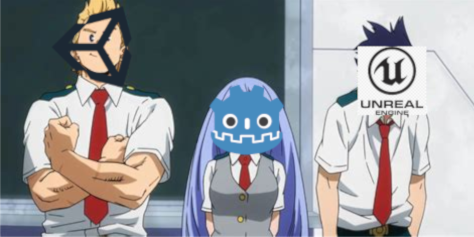
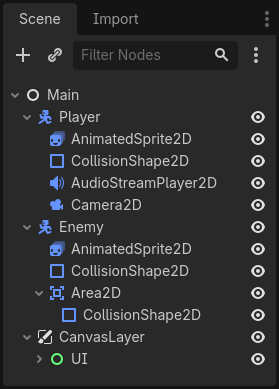
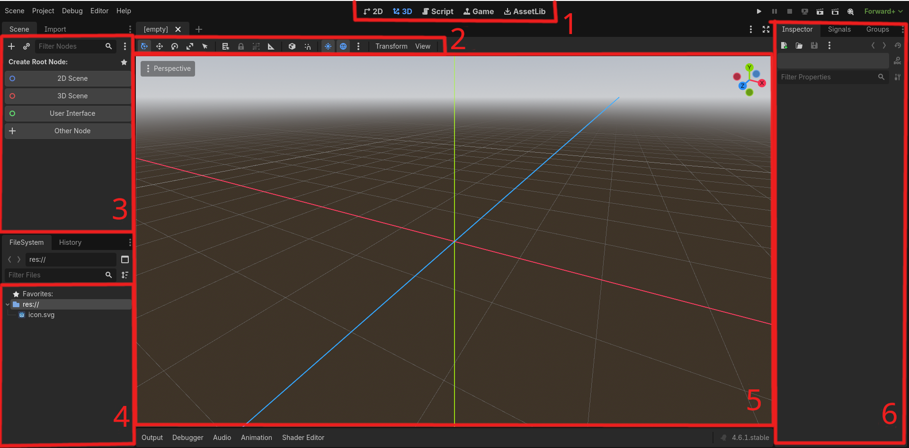

# Aula 08: Helicopter Game 3D

Olá, novamente, querido aluno! Você retornou mais uma vez para seguir para a próxima etapa deste curso. Espero que tenha aprendido sobre todos os fundamentos e dominado o LÖVE, porque agora vamos começar uma nova jornada no desenvolvimento de jogos: **Jogos 3D**!

Jogos 3D são provavelmente tão populares (senão mais) que os jogos 2D, e eles trazem uma mudança de paradigmas e apresentam diversos outros desafios, por isso, o resto desse curso vai desbravar a terceira dimensão enquanto te torna um programador mais qualificado.

## O Godot Game Engine

Uma pedra no meio do nosso caminho é que a biblioteca LÖVE **não** possui ferramentas para criar jogos 3D :cry:. Então para continuar nosso aprendizado vamos ter que migrar para uma outra ferramentas e caso você já tenha lida a introdução desse curso você sabe qual é: **Godot Game Engine**.

> [!Info]
> **O que é um *Game Engine***?
> Uma *Engine* é um conjunto de ferramentas que atua como base para a criação de jogos, oferecendo funcionalidades pré-construídas que agilizam o trabalho do desenvolvedor, geralmente, acompanham um software de teste e visualização.

O [Godot](https://godotengine.org/) é uma *Engine* criada em 2006, de código-aberto e gratuita[^1], que evoluiu para ser um dos *Big Three* das *Engine* de jogos (opinião baseada totalmente em 
opiniões do Reddit). Ele inclui ferramentas para criação de jogos 2D e 3D, efeitos sonoros, animações e outros recursos visuais. Inclusive, oferece suporte para desktop, mobile e web!



Vamos primeiro entender como o Godot funciona e como usá-lo para depois partir para o jogo em si.
### Instalação

O Godot pode ser baixado através do seu site oficial, na [página de downloads](https://godotengine.org/download/linux/), tanto para Linux, Windows e Mac. Baixe em seu computador. Curiosamente, ele também está disponível na *Steam*!

### Nós e Cenas: o blocos básicos do Godot

Com o Godot instalado vamos explicar um pouco da sua teoria. O Godot é fundamentalmente construído em cima de dois componentes: **Nós** (Nodes) e **Cenas** (Scenes).

#### Nós/Nodes

Eles são blocos de LEGO para formar o seu jogo. Existem dezenas e dezenas de tipos diferentes, cada um representando um elemento do jogo, ex.: uma imagem, um som, câmera, objeto. Você pode combinar essas peças colocando uma dentro da outra formando uma espécie de árvore.



Exemplo de nós do Godot. Fonte: https://docs.godotengine.org/pt-br/4.x/getting_started/step_by_step/nodes_and_scenes.html

Os nós possuem algumas características &mdash; como o nome &mdash; que você pode editar através da interface gráfica (UI) ou por meio de código. Nós vamos explicar o que cada tipo de nó faz, como utilizá-los e mais durante o curso, o mais importante é que você entenda o conceito!

#### Cenas e Árvore de Nós

Uma Cena é nada mais que essa árvore de nós que você viu na imagem acima, chamamos o nó mais externo de **raiz** e os outros são **filhos** (que também possuem **filhos**). A Cena também pode ser vista como um *arquivo*, marcado com a extensão `.tscn`, esse arquivo descreve os nós contidos neles, as alterações feitas em cada um, e a hierarquia entre os mesmos. Através desse arquivo de cena podemos **instanciar** uma cena para dentro de outra. Isso é semelhante a importar um arquivo no Lua. Com isso, podemos reutilizar código através do nosso projeto &mdash; e de outros jogos &mdash; bem como algumas coisas a mais que farão sentindo em aulas futuras.

Se você quer beber o conhecimento direto da fonte, [aqui](https://docs.godotengine.org/pt-br/4.x/getting_started/step_by_step/nodes_and_scenes.html) vai a explicação oficial do Godot sobre o assunto.

### Apresentando o GDScript

Todo *Game Engine* tem uma linguagem de programação nativa para estender as funcionalidades dos componentes. O Godot suporta uma variedade de linguagens, porém nesse curso vamos dar atenção a sua linguagem nativa: **GDScript**. O GDScript é uma linguagem de programação criada para prototipação e rápido desenvolvimento para jogos feitos em Godot. Portanto, ela é uma linguagem orientada-a-objetos, de tipagem gradual e se assemelha muito a sintaxe do Python.

### Sintaxe do GDScript

Todo arquivo do GDScript é marcado pela extensão `.gd`. Vamos passar rapidamente por cima da sintaxe do GDScript, adaptado diretamente da [documentação](https://docs.godotengine.org/en/stable/tutorials/scripting/gdscript/gdscript_basics.html) oficial do Godot.

```gdscript
# 1º Isso é um comentário
# No GDScript TODO arquivo é uma CLASSE

class_name MinhaClasse # Opcional

# Herdamos as propriedades de outra class (geralmente outros nodes)
extends BaseClass

# Tipos e variáveis
var a = 5
var string = "Olá, mundo"
var b = true
var arr = [1, 2, 3] # umas lista
var dict = {"key": "value", 2: 3} # dicionário
var vec = Vector3(1, 2, 3) # criando um vetor
var num: int = 5 # marcando o tipo da variável

# constantes (não podem ser alteradas)
const ANSWER = 42
# um tipo enumerado, util para máquinas de estado!
enum Cores {VERMELHO, AZUL, AMARELO}

func funcao(arg1, arg2, arg3, arg4):
	# condicionais
	if arg1 < arg2:
		print(arg1)
	elif arg1 == arg2:
		print(arg2)
	else:
		print(arg3)

	# loops
	for a in arr:
		print(a)
	
	while arg2 > 0:
		arg2 = arg2 - 1
	
	# Match (parece um if mas é mais bonito)
	match arg4:
		Cores.VERMELHO: print("a")
		Cores.AZUL: print("b")
		Cores.AMARELO: print("c")
	
	print(add(1, 2))

func add(a: int, b: int) -> int:
	return a + b
```

Esse foi apenas uma revisão rápida da linguagem, vamos ensinar mais durante as aulas, mas se você quer dominar a linguagem por completo veja esse [artigo](https://docs.godotengine.org/pt-br/4.x/tutorials/scripting/gdscript/gdscript_advanced.html).

### Navegando pelo Editor

Uma última coisa antes de começar a trabalhar é falar um pouco sobre o **Editor** do Godot. Considerando que você vai passar algumas boas horas da sua vida olhando para ele é ideal conhecê-lo bem.



A imagem acima mostra a tela principal do editor e os componentes principais foram marcados e enumerados de vermelho, segue uma explicação de cada um:

1. **Troca de Área de Trabalho**: permite você mudar de área de trabalho, para um aba 2D, 3D, scripts e para rodar o seu jogo. Bem como uma página de plugins
2. **Barra de Ferramentas**: permite você mover, rotacionar e ajustar componentes na área de visualização
3. **Árvore de Nós**: te dá uma visão da hierarquia de nós da sua cena, bem como permite adicionar mais nós, movê-los e instanciar cenas
4. **Arquivo do Sistema**: uma visão da pasta do projeto, permite adicionar arquivos e pastas, é assim que o projeto aparece no seu computador
5. **Viewport**: permite ver a cena, posicionar objetos e entre outros
6. **Inspetor**: permite editar as propriedades de um nó/cena, você vai usar ela muito nesse curso.

Uma menção honrosa ao canto superior direito que permite rodar e gravar o seu jogo, e ao esquerdo que contém configurações do projeto, como teclas de entrada. Caso queira ler sobre esse assunto por completo, clique [aqui](https://docs.godotengine.org/pt-br/4.x/getting_started/introduction/first_look_at_the_editor.html).

## Helicóptero 3D

### Criando o projeto

## Conclusão

[^1]: https://pt.wikipedia.org/wiki/Godot
