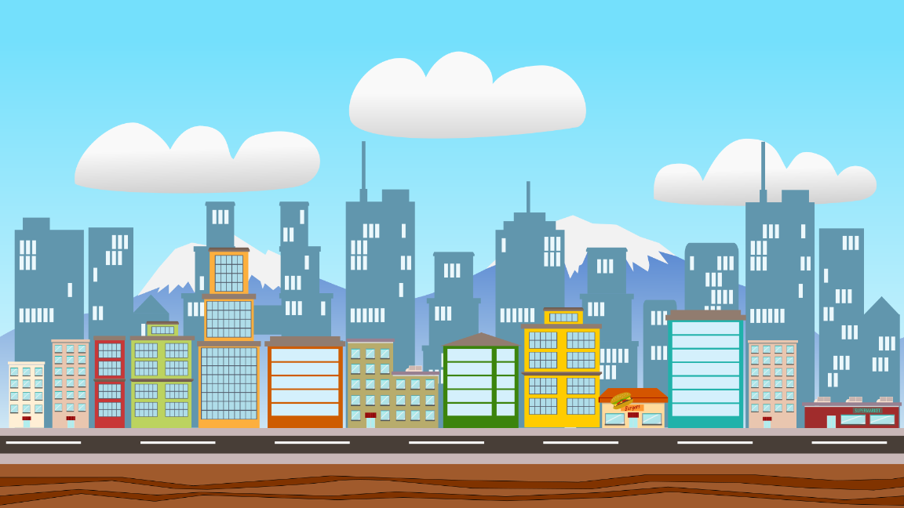

# Aula 08: Helicopter Game 3D

Olá, novamente, querido aluno! Você retornou mais uma vez para seguir para a próxima etapa deste curso. Espero que tenha aprendido sobre todos os fundamentos e dominado o LÖVE, porque agora vamos começar uma nova jornada no desenvolvimento de jogos: **Jogos 3D**!

Jogos 3D são provavelmente tão populares (senão mais) que os jogos 2D, e eles trazem uma mudança de paradigmas e apresentam diversos outros desafios, por isso, o resto desse curso vai desbravar a terceira dimensão enquanto te torna um programador mais qualificado.

## O Godot Game Engine

Uma pedra no meio do nosso caminho é que a biblioteca LÖVE **não** possui ferramentas para criar jogos 3D :cry:. Então para continuar nosso aprendizado vamos ter que migrar para uma outra ferramentas e caso você já tenha lida a introdução desse curso você sabe qual é: **Godot Game Engine**.

> [!Info]
> **O que é um *Game Engine***?
> Uma *Engine* é um conjunto de ferramentas que atua como base para a criação de jogos, oferecendo funcionalidades pré-construídas que agilizam o trabalho do desenvolvedor, geralmente, acompanham um software de teste e visualização.

O [Godot](https://godotengine.org/) é uma *Engine* criada em 2006, de código-aberto e gratuita[^1], que evoluiu para ser um dos *Big Three* das *Engine* de jogos (opinião baseada totalmente em 
opiniões do Reddit). Ele inclui ferramentas para criação de jogos 2D e 3D, efeitos sonoros, animações e outros recursos visuais. Inclusive, oferece suporte para desktop, mobile e web!


Vamos primeiro entender como o Godot funciona e como usá-lo para depois partir para o jogo em si.

### Instalação

O Godot pode ser baixado através do seu site oficial, na [página de downloads](https://godotengine.org/download/linux/), tanto para Linux, Windows e Mac. Baixe em seu computador. Curiosamente, ele também está disponível na *Steam*!

### Nós e Cenas: o blocos básicos do Godot

Com o Godot instalado vamos explicar um pouco da sua teoria. O Godot é fundamentalmente construído em cima de dois componentes: **Nós** (Nodes) e **Cenas** (Scenes).

#### Nós/Nodes

Eles são blocos de LEGO para formar o seu jogo. Existem dezenas e dezenas de tipos diferentes, cada um representando um elemento do jogo, ex.: uma imagem, um som, câmera, objeto. Você pode combinar essas peças colocando uma dentro da outra formando uma espécie de árvore.


Exemplo de nós do Godot. Fonte: https://docs.godotengine.org/pt-br/4.x/getting_started/step_by_step/nodes_and_scenes.html

Os nós possuem algumas características &mdash; como o nome &mdash; que você pode editar através da interface gráfica (UI) ou por meio de código. Nós vamos explicar o que cada tipo de nó faz, como utilizá-los e mais durante o curso, o mais importante é que você entenda o conceito!

#### Cenas e Árvore de Nós

Uma Cena é nada mais que essa árvore de nós que você viu na imagem acima, chamamos o nó mais externo de **raiz** e os outros são **filhos** (que também possuem **filhos**). A Cena também pode ser vista como um *arquivo*, marcado com a extensão `.tscn`, esse arquivo descreve os nós contidos neles, as alterações feitas em cada um, e a hierarquia entre os mesmos. Através desse arquivo de cena podemos **instanciar** uma cena para dentro de outra. Isso é semelhante a importar um arquivo no Lua. Com isso, podemos reutilizar código através do nosso projeto &mdash; e de outros jogos &mdash; bem como algumas coisas a mais que farão sentindo em aulas futuras.

Se você quer beber o conhecimento direto da fonte, [aqui](https://docs.godotengine.org/pt-br/4.x/getting_started/step_by_step/nodes_and_scenes.html) vai a explicação oficial do Godot sobre o assunto.

### Apresentando o GDScript

Todo *Game Engine* tem uma linguagem de programação nativa para estender as funcionalidades dos componentes. O Godot suporta uma variedade de linguagens, porém nesse curso vamos dar atenção a sua linguagem nativa: **GDScript**. O GDScript é uma linguagem de programação criada para prototipação e rápido desenvolvimento para jogos feitos em Godot. Portanto, ela é uma linguagem orientada-a-objetos, de tipagem gradual e se assemelha muito a sintaxe do Python.

### Sintaxe do GDScript

Todo arquivo do GDScript é marcado pela extensão `.gd`. Vamos passar rapidamente por cima da sintaxe do GDScript, adaptado diretamente da [documentação](https://docs.godotengine.org/en/stable/tutorials/scripting/gdscript/gdscript_basics.html) oficial do Godot.

```gdscript
# 1º Isso é um comentário
# No GDScript TODO arquivo é uma CLASSE

class_name MinhaClasse # Opcional

# Herdamos as propriedades de outra class (geralmente outros nodes)
extends BaseClass

# Tipos e variáveis
var a = 5
var string = "Olá, mundo"
var b = true
var arr = [1, 2, 3] # umas lista
var dict = {"key": "value", 2: 3} # dicionário
var vec = Vector3(1, 2, 3) # criando um vetor
var num: int = 5 # marcando o tipo da variável

# constantes (não podem ser alteradas)
const ANSWER = 42
# um tipo enumerado, util para máquinas de estado!
enum Cores {VERMELHO, AZUL, AMARELO}

func funcao(arg1, arg2, arg3, arg4):
	# condicionais
	if arg1 < arg2:
		print(arg1)
	elif arg1 == arg2:
		print(arg2)
	else:
		print(arg3)

	# loops
	for a in arr:
		print(a)
	
	while arg2 > 0:
		arg2 = arg2 - 1
	
	# Match (parece um if mas é mais bonito)
	match arg4:
		Cores.VERMELHO: print("a")
		Cores.AZUL: print("b")
		Cores.AMARELO: print("c")
	
	print(add(1, 2))

func add(a: int, b: int) -> int:
	return a + b
```

Esse foi apenas uma revisão rápida da linguagem, vamos ensinar mais durante as aulas, mas se você quer dominar a linguagem por completo veja esse [artigo](https://docs.godotengine.org/pt-br/4.x/tutorials/scripting/gdscript/gdscript_advanced.html).

### Navegando pelo Editor

Uma última coisa antes de começar a trabalhar é falar um pouco sobre o **Editor** do Godot. Considerando que você vai passar algumas boas horas da sua vida olhando para ele é ideal conhecê-lo bem.


A imagem acima mostra a tela principal do editor e os componentes principais foram marcados e enumerados de vermelho, segue uma explicação de cada um:

1. **Troca de Área de Trabalho**: permite você mudar de área de trabalho, para um aba 2D, 3D, scripts e para rodar o seu jogo. Bem como uma página de plugins
2. **Barra de Ferramentas**: permite você mover, rotacionar e ajustar componentes na área de visualização
3. **Árvore de Nós**: te dá uma visão da hierarquia de nós da sua cena, bem como permite adicionar mais nós, movê-los e instanciar cenas
4. **Arquivo do Sistema**: uma visão da pasta do projeto, permite adicionar arquivos e pastas, é assim que o projeto aparece no seu computador
5. **Viewport**: permite ver a cena, posicionar objetos e entre outros
6. **Inspetor**: permite editar as propriedades de um nó/cena, você vai usar ela muito nesse curso.

Uma menção honrosa ao canto superior direito que permite rodar e gravar o seu jogo, e ao esquerdo que contém configurações do projeto, como teclas de entrada. Caso queira ler sobre esse assunto por completo, clique [aqui](https://docs.godotengine.org/pt-br/4.x/getting_started/introduction/first_look_at_the_editor.html).

## Helicóptero 3D

A melhor forma de aprender é botando a mão na massa. O jogo que iremos implementar se chama **Helicóptero 3D**, um jogo de navegador e precursor so *Flappy Bird*. Na verdade, ele está mais para 2.5D, isso é porque ainda vamos nos movimentar em apenas duas dimensões (cima, baixo, direita, esquerda), mas os modelos ainda vão ser em 3D.

### Criando o projeto

Primeiro de tudo, vamos iniciar o projeto. Abra o aplicativo do Godot, você verá o **Gerenciador de Projetos** com tela, clique em `Create +`. Dê um nome ao projeto, como "helicopter" e defina em qual pasta ele vai estar. Depois disso, clique em `Create`. Você verá o Editor como uma tela em branco, pronto para começar a pintar!

> [!Attention]
> Antes de começar o projeto, dê uma olhada na pasta `src8` com o código dessa aula, abra-o com o Godot e veja como tudo foi feito. Em seguida, ==pegue os assests  (todas as pastas) e leve para a sua implementação==.

### Cena Principal

Vamos começar com a tela principal, ela será uma imagem de fundo que se move para a esquerda infinitamente. Bem como, haverá um componente de UI mostrando quantas moedas o jogador adquiriu. Como na imagem abaixo:


#### Câmera

Para fazer isso, vá na Árvore de Nós, clique em `Node 3D` para criar uma cena 3D, renomeie-o &mdash; apertando `F2` ou clicando com botão direito no nó e depois em `Rename` &mdash; para `Main`. Depois disso, clique no `+` ou aperte `Ctrl-A` para adicionar um novo nó à cena. Isso abrirá um *popup* com uma barra de pesquisa, procure por `Camera3D` e aperte em `Create`.

O nó `Camera3D` mostra na tela tudo aquilo que é visível de acordo com sua posição &mdash; visível no editor por um contorno branco e uma seta. Selecione esse nó e vá para o *Inspetor*, procure pela propriedade `Positon`, modifique o componente `z` para `10`, isso colocará a câmera na posição `(0, 0, 10)`. Criamos essa distância pois nosso jogador estará no centro do mundo e não queremos a câmera em cima dele.

#### Plano de Fundo

Agora para o plano de fundo: crie um novo nó do tipo `CanvasLayer` e renomeie para `Background`, a seguir vá nas propriedades, modifique `Layer` para `-1`, desse modo, o plano de fundo vai estar realmente atrás de todos os objetos do jogo.

Feito isso, selecione esse nó e adicione como filho dele um nó do tipo `TextureRect`. Nas propriedades, procure por `Texture`, selecione e clique na opção `Load`, isso vai abrir um popup com uma visão da pasta do projeto, escolha a imagem na pasta `textures` de nome `City1.png`. Em seguida, vá na propriedade `Stretch Mode` e selecione `Tile` (vai servir para animação), após isso, procure nas propriedades de `Layout`, `Anchors Preset` e selecione `Full Rect`. A imagem deve agora estar centralizada na tela, mesmo que transbordando do quadrado central.

Em outras palavras, o que fizemos aqui foi:
- Criar uma tela 2D para desenharmos sobre ([CanvasLayer](https://docs.godotengine.org/en/4.3/classes/class_canvaslayer.html));
- Adicionar uma imagem rectangular ([TextureRect](https://docs.godotengine.org/en/stable/classes/class_texturerect.html)); e
- Ajustar a imagem para preencher a tela por completo.

> [!info]
> `CanvasLayer`faz o que o nome sugere, é uma tela que permite "desenhar" ou colocar componentes sobre. Permitindo posicioná-los uns sobre os outros com a propriedade `Layer`.

Se você salvar a cena com o nome `main.tscn` e apertar `F5`, você verá justamente a nossa imagem como plano de fundo.



Plano de fundo do jogo. Fonte: CS50G Games

Agora para o efeito de movimentação, vá nas propriedades de *TextureRect* e procure por `Material` (encontra-se na aba de mesmo nome), clique e selecione `ShaderMaterial`, isso vai abrir uma nova sub-lista de propriedades (caso contrário, clique na bola branca ao lado de *Material*), na propriedade `Shader` clique em `Quick Load` &mdash; para mostrar apenas arquivos permitidos por essa propriedade &mdash; e selecione `background.gdshader`. Imediatamente após fazer isso, o plano de fundo vai começar a se mover.

O que acabamos de fazer? Para não entrar em detalhes do que vai ser **explicado nas próximas aulas**. Alteramos as propriedades da nossa imagem com um script especial (uma *Shader*), o que vai fazer ela (a imagem) se mover infinitamente para a esquerda, e como ativamos a propriedade `Tile` anteriormente, ela entra em *loop* de repetição.

> [!Tip]
> Se você não aguenta esperar e está morrendo de curiosidade, recomendo olhar a aula 10 deste curso. Onde explicamos melhor o que são e como funcionam as shaders.


Criando um novo `ShaderMaterial`  no Godot. Fonte: Autoral.

#### HUD

Com nosso plano de fundo, partiremos para a *HUD* (Heads Up Display) que vai informar sobre o número de moedas adquiridos pelo jogador, bem como mostrar uma mensagem no centro da tela, durante o começo e final do jogo.


HUD inicial. Fonte: Autoral

Para fazer isso, crie outro `CanvasLayer` e nomeio-o de `HUD`, dessa vez coloque a propriedade `Layer` para `1`. Crie um nó filho do tipo `Control` (serve para posicionar elementos de [GUI](https://pt.wikipedia.org/wiki/Interface_gr%C3%A1fica_do_utilizador)), dentro dele, coloque dois nós filhos, ambos do tipo `Label` &mdash; esse tipo é uma caixa de texto. Nomeie-os `StartMessage` e `RestartMessage`, então inclua na propriedade `Text` as respectivas sentenças: `Press [Enter]\nto Start` e `Game Over!\nPress [Enter] to Restart.` (entenda o `\n` como quebra de linha).

Selecione novamente `Control`, na barra de ferramentas procure pelo seguinte ícone verde: . Clique nele para abrir os *Presets de Âncora*, ou seja posições padrão da tela (centro, esquerda, canto superior direito, etc), selecione `Full Rect`, faça o mesmo para os dois *labels*, de forma a centralizá-los na tela.

Agora para a configuração de texto. Nas propriedades de cada *label*:
- Marque `Horizontal Alignment` e `Vertical Alignment` para `Center`;
- Abra a ba `Theme Overrides`;
- Dentro de `Colors`, configure `Font Color` para preto (`#000000`);
- Em `Fonts`, clique no indicador para baixo, selecione `Quick Load` e use a fonte que está na pasta `fonts`; e
- Em `Font Sizes`, modifique `Font Size` para `48px`.

Agora temos ambos os textos no tamanho e fonte corretos, centralizados na tela. Porém, um texto está em cima do outro. Para resolver isso por enquanto, vá na Árvore de Nós e clique no ícone de *olho* de um dos *labels* para ocultá-lo.

A próxima coisa é a pontuação de moedas. Em `Control`, crie um nó-filho, `MarginContainer` (ele é um caixa que tem margens modificáveis), coloque o seu *Anchor Preset* para `Top-Right`. Modifique, dentro de `Theme Overrides`, as propriedades `Margin Right` e `Margin Top`, ambas para `20` unidades. Depois, dentro desse container, crie outro container, agora do tipo `HBoxContainer` (um container cujos elementos são ordenados horizontalmente), e coloque dois novos `Label`s, o `CoinLabel` e `CoinCount`. O primeiro deve ter em `Text`: `COINTS:`, o segundo: `0`. Em seguida, faça as mesmas alterações de fonte, cor e tamanho.

Caso tudo tenha dado certo, sua tela se parecerá com algo assim:


HUD completa. Fonte: Autoral.

E sua Árvore de Nós terá o seguinte formato:


Árvore de Nós da Cena Principal. Fonte: Autoral
### Helicóptero

Vamos para a próxima etapa, montar o nosso jogador, o **helicóptero**. Para fazer isso, criaremos outra cena, aperte `Ctrl-N`, selecione `Other Node` na Árvore de Cenas e busque por `CharacterBody3D`. Esse tipo é feito para ser controlado pelo usuário, ele não é afetado pela física, mas afeta outros corpos. Renomeie-o para `Player`.

#### Modelo 3D

Felizmente, temos um modelo 3D do helicóptero, feito no Blender e pronto para ser usado, tudo que precisamos é carregá-lo na nossa cena. No *File System*, abra a pasta `models`, procure por `lameheli.glb` e arraste o arquivo para nossa cena. Assim, `Player` deve ter ganhado um novo filho e o modelo deve estar no centro da cena.


Cena do modelo do helicóptero. Fonte: Autoral.

Perfeito, temos um modelo 3D, que inclusive conta com uma animação na hélice! Mostraremos como rodá-la mais tarde.

#### Caixas de Colisão

Nosso trabalho não acabou, precisamos detectar caso um objeto colida com nosso helicóptero e para fazer isso no Godot, temos que criar uma **Caixa de Colisão**. No Godot, essas caixas podem ser criadas com o nó `CollisionShape3D`. Adicione um como filho de `Player`. Vá no Inspetor e escolha dentro da propriedade `Shape` a forma `BoxShape3D` (um cubo), depois clique nesse valor para abrir mais propriedades. Configure `Size` para os seguintes valores `x: 2, y: 2, z: 5`. Em seguida, volte para as propriedades do nó e procure por `Transform`, abra essa aba e modifique o componente `z` de `Position` para `-0.8`, para arrastar a caixa um pouco para trás, de forma que ela cubra a maior parte do modelo.


Caixa de colisão inferior. Fonte: Autoral.

E simples assim temos nossa primeira caixa de colisão &mdash; não se preocupe, esse contorno azul não aparece quando o jogo roda. A próxima será ao redor da hélice. Crie um novo nó de colisão, mas dessa vez escolha o *shape* do tipo `CylinderShape3D`, modifique `Height` para `0.2` e `Radius` para `5.0`. Também mude `Position` para `y: 2.3` e `z: -1`. Desse jeito, criamos um disco ao redor da nossa hélice que também vai detectar colisões.


Caixa de colisão da hélice. Fonte: Autoral.

#### Criando o Script

Como última modificação da nossa cena, vamos adicionar um *script* que permita controlar o jogador e rodar a animação. Com o botão direito, clique sobre o nó `Player`, depois selecione `Attach Script`, ou aperte no ícone de Script do lado da barra de pesquisa escrito `Filter Nodes`. Desmarque a opção `Template` pois dessa vez não usaremos o template padrão que acompanha `CharacterBody3D`, use o nome `player.gd` e clique em `Create`.


Popup de criação de script. Fonte: Autoral

Feito isso, o Godot abrirá o editor de scripts com nosso script aberto e pronto para editar. Você verá uma única linha dizendo:

```gdscript
extends CharacterBody3D
```

Ou seja, esse script herda os atributos e propriedades do nó `CharacterBody3D`, veremos alguns desses atributos daqui a pouco. A primeira coisa que faremos será incluir duas variáveis para nosso script.

```gdscript
const SPEED: float = 10.0
@onready var animation: AnimationPlayer = $lameheli/AnimationPlayer
```

`SPEED` é uma constante que representa a velocidade em que o helicóptero se mexe, já `animation` é um pouco mais complexo. Ela é uma variável do tipo `AnimationPlayer` (um nó que executa uma animação) e não só isso, `$` é uma abreviação para a função `get_node()` que recebe o caminho de um nó e devolve esse nó (caso ele exista). Então o que estamos fazendo é "pegue o nó *AnimationPlayer* dentro do nó *lameheli* (nosso modelo)". Acontece que o Godot só tem acesso a árvore de nós quando uma cena é carregada. É aí que entra o `@onready`, ele é uma **anotação** que modifica como o Godot vai tratar esse script, nesse caso, estamos dizendo "carregue essa variável quando a cena estiver pronta/ativada na memória".

```gdscript
func _ready():
	animation.play("Cube_001Action")
```

A próxima coisa que faremos será declarar a função `_ready()`, ela é equivalente a função `love.load()`, mas que só funciona dentro do escopo do nó que a chama. Dentro dela estamos usando nossa variável `animation` e iniciando a animação da hélice &mdash; de nome `Cube_001Action` &mdash; com o método `play()`. Voltando novamente à anotação `@onready`, o que ela faz é carregar o valor da variável no mesmo momento que `_ready`.

```gdscript
func _physics_process(delta: float) -> void:
	var direction = Vector3(0, 0, 0)
	
	if Input.is_action_pressed("move_up"):
		direction.y += 1
	if Input.is_action_pressed("move_down"):
		direction.y -= 1

	velocity = direction * SPEED

	move_and_slide()	
	clamp_position()
```

A próxima função que vamos declarar no script é `_physics_process()`, ela é equivalente à `love.update()`, mas, novamente, ela só tem acesso aos atributos do nó que a chamou. O que fazemos é bem simples, checamos se as ações `move_up` ou `move_down` estão sendo pressionadas. Caso sim, adicionamos um valor no componente `y` da variável `direction` para indicar que aquela é a direção que vamos tomar. Depois modificamos `velocity`, que é um dos atributos de `CharacterBody3D` que herdamos, para ser nossa direção vezes a velocidade (`SPEED`). Em seguida, chamamos `move_and_slide()` que é uma função do Godot que utiliza `velocity` e multiplica por `delta` para atualizar a posição do objeto, levando em conta possíveis colisões ou um terreno inclinado por exemplo. 

```gdscript
func clamp_position():
	var camera = get_viewport().get_camera_3d()
	
	var position_relative_to_camera = camera.global_transform.inverse() * global_position
	var z_depth = -position_relative_to_camera.z
	
	var upper_left = camera.project_position(Vector2(0, 0), z_depth)
	var bottom_right = camera.project_position(get_viewport().get_visible_rect().size, z_depth)
	
	position.y = clamp(position.y, bottom_right.y, upper_left.y)
```

Ao final da função também chamamos `clamp_position()`, essa é uma função definida por nós que restringe o movimento do jogador para que ele fique dentro da tela. Essa operação deveria ser fácil para jogos 2D, só precisaríamos pegar os limites da tela. Contudo, estamos lidando com um mundo 3D que não tem noção da existência das bordas da tela, então precisamos fazer algumas operações com matrizes utilizando nossa câmera, para então restringir a posição com base nos valores calculados.

#### Configurando Eventos de Entrada (InputEvents)

No script acima, não usamos uma função que identifica o tipo de tecla pressionada. Isso é porque o Godot busca abstrair esse conceito para que você possa criar um código que funcione para diferentes dispositivos, ex.: teclado,*joystick*, etc. Ele faz isso através de uma classe chamada `InputEvent` e uma `Action` é um grupo de zero ou mais eventos marcados com um título, por exemplo: `move_up` ou `move_down`. O que temos que fazer agora é criar essa ação nas configurações do nosso projeto.

Para fazer isso, vá no canto superior esquerdo e clique em `Project` e depois em `Project Settings`. No popup que se abrir, busque pela aba `Input Map` onde você pode criar suas próprias ações. Crie um chamado `move_up` e outro `move_down`, ambos vão aparecer na lista de ações. Clique no ícone de `+` em cada uma das ações. Um novo popup vai abrir onde você pode selecionar uma tecla ou evento ou digitar uma tecla para ser detectada automaticamente. Adicione as teclas `W`, `Up` (seta para cima) e `S` e `Down` (seta para baixo) para os seus respectivos eventos.


Input Map. Fonte: Autoral.

Você pode ver todas as ações que o Godot define por padrão, movendo o *slider* de `Show Built-in Actions`. Caso queira saber mais sobre como o Godot gerencia *inputs* clique [aqui](https://docs.godotengine.org/pt-br/4.x/tutorials/inputs/inputevent.html).
#### Adicionando à Cena Principal

Agora que tudo está pronto, vamos instanciar nossa cena do jogador para a cena principal. Clique no ícone de cadeado na cena principal , e selecione `player.tscn` (espero que você tenha salvado-a assim). Então rode a cena, se você seguiu tudo passo a passo, você verá absolutamente nada! Ou melhor só o mesmo plano de fundo.

Acontece que os `CanvasLayer`s estão se sobrepondo em cima da nossa câmera e ocultando o modelo. Para resolver isso, vamos ter alterar a renderização da cena. Acontece que não podemos fazer isso em um nó do tipo `Node3D` (a raiz da cena). Vamos solucionar o problema mudando o tipo do nó raiz. Sendo assim, clique com o botão direito nele e selecione `Change Type`, procure pelo tipo `WorldEnvironment`.

O tipo `WorldEnvironment` permite criar um `Environment`, um recurso que especifica formas de renderização, como céu, neblina, cor, etc. No *Inspetor* procure pela propriedade `Environment` e clique em `Environment`, dentro desse atributo procure por `Background` e `Mode`, modifique-o para `Canvas`. Desse modo, teremos a sobreposição das nossas telas com o mundo 3D. Tudo pronto para jogar!


Cena principal, modelo escuro. Fonte: Autoral

Só que não :sad:. Acontece que cenas 3D precisam de algo a mais para serem visíveis: **Luz**. Para ver os nossos modelos precisamos de uma fonte de luz que ilumine o ambiente. Para conseguir isso, adicione à `Main` um nó do tipo `DirectionalLight3D`. Esse tipo é como um *sol*, ele emite infinitos feixes de luz em paralelo. Vamos posicioná-lo de forma a criar um ângulo com nossa câmera, experimente movimentá-lo dentro do editor de cenas, com ajuda da barra de ferramentas: . Dica o ícone de imã te ajuda a movimentar em números inteiros. Posicionei a minha fonte de luz na posição: `(0, 12, 20)` com um ângulo de `-30º`. 


Cena Principal Iluminada. Fonte: Autoral

Feito esses ajustes, tudo está pronto para as próximas etapas.

> [!Warning]+ Troubleshooting
> Caso a animação esteja rodando só uma vez ou nenhuma vez, o problema está no arquivo do modelo. 
> 
> Abra o File System e clique duas vezes no arquivo `lameheli.glb`. Isso abrirá uma nova tela com uma árvore de nós à esquerda, procure e clique em `Cube_001Action`. Isso deve mostrar as configurações da animação à direita. Procure por `Loop Mode` e garanta que o modo está em `Linear`. Caso tenha feito, qualquer alteração, clique no botão `Reimport` para salvar as alterações.

### Carregando outros Modelos

### Finalizando

#### Script Principal

#### Efeitos Sonoros

## Conclusão

Meus parabéns, você está evoluindo cada vez mais! Continue aprendendo sobre Godot e jogos 3D seguindo para a próxima aula. Te vejo lá!

[^1]: https://pt.wikipedia.org/wiki/Godot
