# Aula 09: Dreadhalls

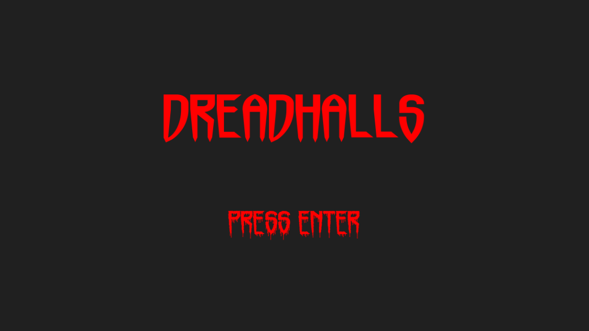

Fonte: autoral

Na nossa última aula, apresentamos o *Godot Game Engine*, como criar jogos 3D (tava mais para 2.5D) e a linguagem GDScript. Na aula de hoje vamos realmente entrar no mundo 3D utilizando todas as coordenadas disponíveis (x, y, z). Para fazer isso vamos implementar o jogo **Dreadhalls**.

[Dreadhalls](https://www.dreadhalls.com/) é um *VR Game* (Jogo de Realidade Virtual), infelizmente não vamos explorar o aspecto da realidade virtual do jogo, ~~já que não eu não tenho um óculos VR~~, mas o jogo ainda pode ser jogado normalmente. Para nosso azar somos protagonistas de um jogo de terror, vamos explorar masmorras escuras e nojentas (~~como o quarto de um adolescente~~) enquanto somos perseguidos por criaturas sinistras. Por fim, se você tem arritmia cardíaca (assim como eu) então **cuidado** nesta aula!

Com esta aula, buscamos aprender os seguintes conceitos: criar uma **First Person Camera** (câmera em primeira pessoa); adicionar **Texturas** no Godot (chega de blocos coloridos); implementar um **Gerar um Labirinto 3D** (3D Maze); usar múltiplas cenas, como a máquina de estados do LÖVE; incluir uma **névoa** para deixar o jogo bem *trevoso*; e, **Componentes de UI** do Godot.

## Demo e Código de Exemplo

O projeto desta aula está implementado na pasta `src9`. Rode-o, jogue um pouco e pense como você implementaria essas funcionalidades antes de olhar o código-fonte. Seguiremos um passo a passo de como chegar no mesmo resultado. 

Caso fique com dúvida, não exite em dar uma espiada no resultado final.

## Iniciando o Projeto

Abra o seu editor do Godot, crie um novo projeto chamado `Dreadhalls`.

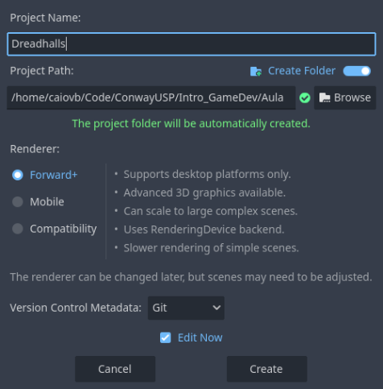

Fonte: autoral.

Para os próximos capítulos, consideraremos que você tem conhecimento sobre a UI do Godot, Cenas, Nós e como criar seus scripts.

## Tela de Entrada

Começaremos pelo mais fácil, criar a tela de apresentação do jogo. Ela terá o título 'Dreadhalls' e um subtítulo escrito '*Press Enter*' que irá iniciar o jogo. Desse modo, apresentamos os seguintes tipos de *Node* (Nó):

- `Control`: Class base para todos os nó relacionados a interface de usuário (UI). Define um retângulo delimitador e permite posicionar os nós filhos em posições relativas como *center*, *top-left*, *bottom-right*, etc. S
- `Panel`: Componente GUI que possui um `StyleBox` (uma classe abstrata para customizar componentes, ex.: cor, borda, etc).
- `GridContainer`: Container para organizar elementos em uma grade. Por padrão, cria uma grade com uma coluna e cada nó-filho é uma linha.

### Cor de fundo

No ambiente de criação de cenas. Crie um nó raiz do tipo `Control`. Acrescente dois nós filhos. Um do tipo `Panel` outro do tipo `GridContainer`. Feito isso, vamos colorir o nosso fundo. Acesse as propriedades de `Panel` e vá para `Theme Overrides > Styles > Panel`, clique na seta para baixo e selecione `StyleBoxFlat`. Com isso, clique na propriedade `BG Color` e configure para `#202020` (ou `32, 32, 32` no RGB).

Seguindo, em `GridContainer` crie dois novos nós do tipo `Label`. Apertando `F2` ou clicando duas vezes no nó, renomeie um para 'Title' e o outro para 'Subtitle'. Sua árvore de nós deve estar da seguinte forma:

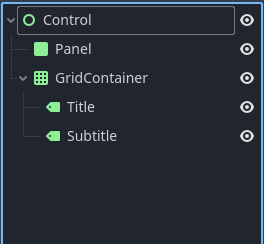

Fonte: autoral

### Título e Subtítulo

Algo que torna cada jogo único é a fonte que eles utilizam a fonte que eles usam, você quer ser conhecido como o cara que faz jogos com a fonte *Arial 12* (experiência própria). Portanto gue do nosso projeto a pasta `fonts` e inclua no seu, a pasta contém dois arquivos de fontes que usaremos daqui para frente `Horrormaster` e `Horrorfind`. 

Agora, adicione para o título o texto 'Dreadhalls' em suas propriedades. Então em `Theme Overrides` configure a cor da fonte para vermelho (`255, 0, 0` em RGB ou `#ff0000` em hexa). O tamanho da fonte para `120 px`. Por fim, defina a fonte para o arquivo `Horrormaster.ttf`.

Repita o processo para o subtítulo, porém altere o texto para 'Press Enter', a fonte para `64 px` e dessa vez use o arquivo `Horrorfind.ttf`.

Temos nosso texto, agora temos que centralizá-lo na tela. Selecione `GridContainer`, na barra de ferramentas clique no botão `Anchor preset` e selecione a opção `Center`. Desse modo, nosso container está centralizado na tela. Para adicionar um espaçamento entre as linhas da coluna vá para `Theme Overrides > Constants > V Separation`, ajuste para `100`.

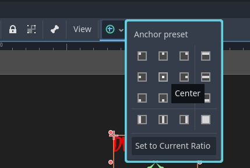

Fonte: autoral

Com isso, finalizamos nossa primeira cena, salve-a com o nome de `title`. Rode a cena atual e veja aparecer na tela.


Fonte: autoral

Já estou me borrando de medo...

## Materiais, Texturas e Iluminação

Antes de mais nada, aqui vai um pouco da teoria. Na aula passada aplicamos uma **Textura** (imagem) para o fundo do nosso jogo. Agora, iremos aplicar texturas em objetos 3D, é como embrulhar uma caixa com um papel de presente. Contudo, isto traz algumas ressalvas, por exemplo, o que acontece quando um objeto 3D é maior que a nossa imagem? Ou colocar uma imagem muito grande em um objeto pequeno. 

Resolver esses problemas envolve diversas técnicas, como repetir a imagem varias vezes, esticá-las, mapear os pixels da imagem para o objeto 'mesclando' as cores e aplicando filtros para melhorar a qualidade. 

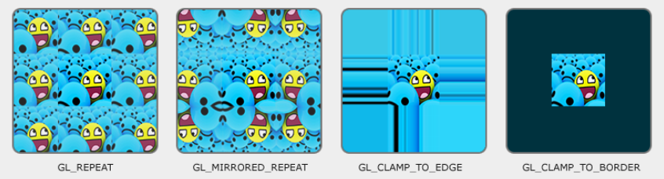

Fonte: Texturas. *LearnOpenGl*. https://learnopengl.com/Getting-started/Textures

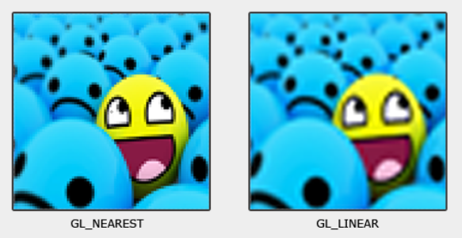

Fonte: Texturas. *LearnOpenGl*. https://learnopengl.com/Getting-started/Textures

Ademais, para formas mais complicadas temos técnicas como *UV Mapping*, em que decompomos o objeto 3D em uma superfície e aplicamos a textura. Como se estivéssemos montando um *origami*.

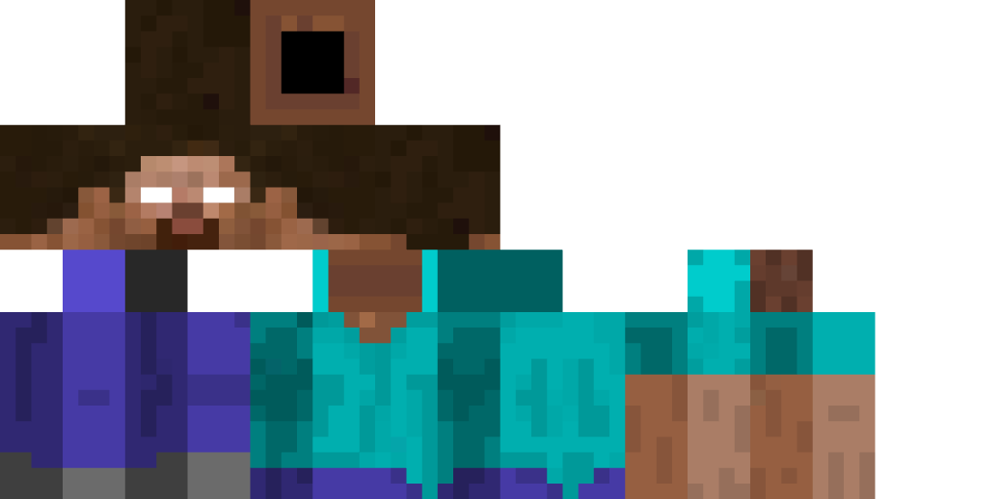

Fonte: Textura desmontada do ~~Steve~~ do Minecraft. https://www.pinterest.fr/pin/672514156827988563/

Felizmente, o Godot cuida da maioria destes casos e das técnicas, tudo que precisamos saber é como configurar a cena para termos o resultado desejado. 

> Se quiser saber mais sobre Texturas a um nível mais afundo, recomendo ver essa aula do curso *LearnOpenGL*. https://learnopengl.com/Getting-started/Textures.

### Materiais

Enquanto texturas são apenas imagens 2D, **Materiais** possuem mais informações atreladas, que permitem descrever como um objeto **reflete a luz**. Por exemplo, queremos que objetos metálicos reflitam mais a luz que o objetos opacos, dando uma sensação mais *verossímil* da realidade. Isso é feito modificando a cor do objeto em pontos específicos conforme a técnica de iluminação utilizada. Se quer saber sobre isso veja esse link [aqui](https://learnopengl.com/Lighting/Materials). 

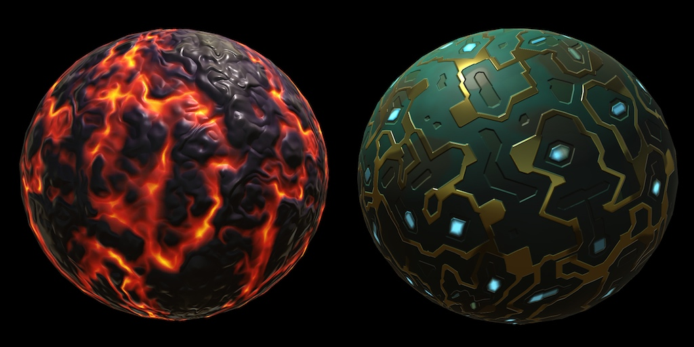

Fonte: CatlikeCoding Tutorial de Materiais. https://catlikecoding.com/unity/tutorials/rendering/part-9/

Contudo, uma textura pode ser feita de diferentes materiais, um quadro pode ter uma moldura de madeira com detalhes de bronze e o interior de tecido ou papel. Temos pelo menos três materiais diferentes em uma única textura. Como podemos aplicar essa técnica para cada material?

A resposta está em usar diferentes camadas de **mapas**, que são nada mais que imagens descrevendo uma característica do objeto: cor, rugosidade, reflexão, brilho, etc. Com todas essas informações conseguimos renderizar os objetos de forma mais realista, você vai quer como isso é feito quando botarmos a mão na massa.

### Mapeamento Normal (Normal Mapping)

Por último, todos sabemos que a maioria das superfícies no mundo (incluindo a Terra) **não** são **planas**. Elas são cheias de rugas, fraturas, pontas e imperfeições, se queremos renderizar formas mais realistas precisamos incluir estes aspectos. Porém, sabemos bem que quanto mais detalhes tentamos desenhar mais computacionalmente trabalhoso nosso jogo fica (portanto mais lento). O mapeamento normal ou **Normal mapping** é uma técnica para enganar a luz e fazer parecer que uma superfície é mais imperfeita do que parece. Isto é feito aplicando uma camada/mapa que descreve as imperfeições da superfície. Veja o exemplo a baixo para entender do que estou falando.

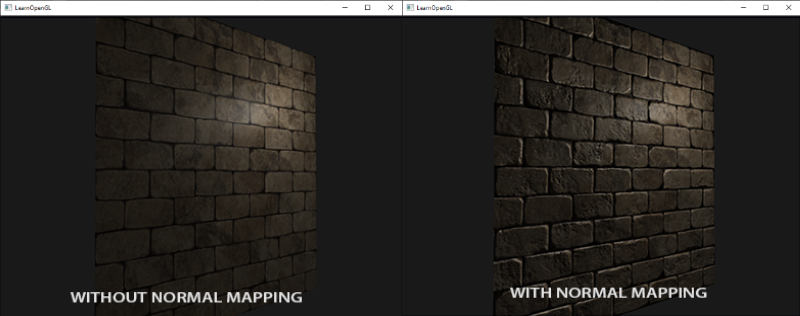

Fonte: Normal Mapping. Learn OpenGL. https://learnopengl.com/Advanced-Lighting/Normal-Mapping

A diferença é clara, detalhe, estamos renderizando a mesma superfície plana! Dito isso, não vamos entrar em muitos detalhes sobre a matemática da coisa (é um pouco extenso). Nessa aula, trataremos cada mapa como apenas uma imagem que nos ajudará a ter o resultado esperado. Caso também queira saber mais sobre isso, recomendamos este link: https://learnopengl.com/Advanced-Lighting/Normal-Mapping.

### Iluminação

Conversamos bastante sobre materiais, mas nada disso importa se você estiver num quarto escuro. Precisamos de *luz* para fazer a magia toda acontecer. Podemos produzir luz no Godot de várias maneiras: através de materiais (objetos que emitem luz); *nodes* (como tudo no Godot, temos nodes para luz); e, ambiente. 

Nesta aula, focaremos em nodes que emitem luz, mais especificamente no tipo `SpotLight3D` que produz um feixe de luz em uma direção específica em formato de cone. Criando um efeito similar ao de uma lanterna. Essa técnica é muito usada em jogos de terror para limitar e focar a visão do jogador.

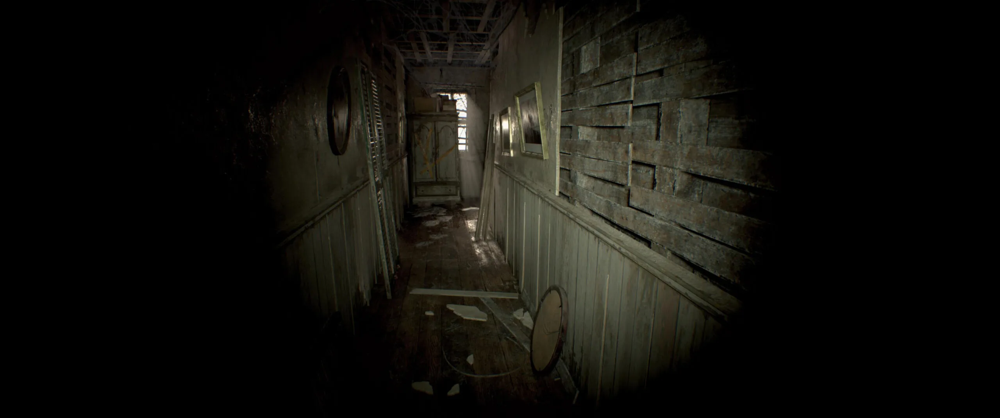

Fonte: Resident Evil 7. https://babeltechreviews.com/resident-evil-7-biohazard-pc-game-review-iq-performance-analysis/.

## Mão na massa

Agora chega de papo, hora de trabalhar!

### Laje e Paredes

Nosso labirinto é um grande caixote, composto de paredes que formam entradas e corredores de modo aleatório, gerando uma estrutura um tanto quanto complicada para se pensar. Porém podemos simplificar a sua representação, digamos que o labirinto é composto de paredes, um chão e um teto (que nada mais é que uma superfície acima do jogador). Dessa forma, criaremos dois componentes, um bloco que podemos combinar para criar corredores e muros e uma superfície plana que sirva de chão e teto.

Crie uma nova cena, seu nó raiz é um `StaticBody3D`, suas instâncias não são afetadas por forças externas, apenas código pode movê-las. Renomeie este nó para `Floor` (chão, mas também vai funcionar como telhado). Acrescente como filho, um nó do tipo `MeshInstance3D`. Ele cria um **Mesh** (um objeto 3D) dentro do cenário. Vá na propriedade `Mesh` e selecione a opção `BoxMesh`, isso nos dará um cubo. Clique nesse cubo para revelar mais propriedades. Altere a propriedade `size` para $(2.0, 0.1, 2.0)$, o objeto vai atualizar imediatamente para uma laje.

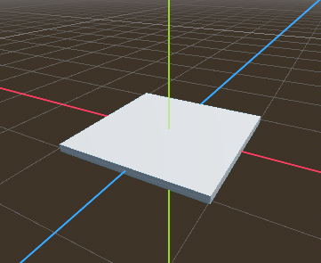

Fonte: autoral.

Um mesh apenas renderiza o objeto, precisamos de suas propriedades físicas, senão o jogador vai cair das plataformas! Adicione um node `CollisionShape3D` a `Floor`. Configure `Shape` para a opção `BoxShape`, abra suas propriedades e configure `Size` para o mesmo tamanho da mesh. A laje está pronta! Save-a como `floor.tscn`, voltaremos mais tarde para adicionar o material.

Para a parede faça uma cópia dessa cena. Altere o tamanho da mesh e da caixa de colisão para $(2.0, 5.0, 2.0)$. Essencialmente, você terá uma paralelepípedo como o da imagem abaixo:

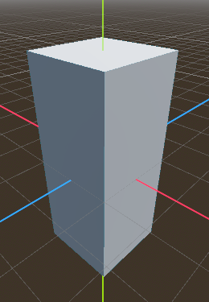

Fonte: autoral.

### Criando nossos Materiais

Acontece que paredes e lajes brancas fazem parecer que estamos em um hospício e não em um labirinto. O Dreadhalls original se baseava em masmorras e queremos a mesma vibe. Para isso, precisaremos de alguns *assets*, escolhi [este](https://polyhaven.com/a/worn_tile_floor) para a laje e [este](https://polyhaven.com/a/medieval_blocks_03) para a parede. Mas se desejar procure (ou faça) seus próprios assets, o site de onde tirei essas imagens tem uma grande quantidade de materiais gratuitos para usar. Caso você vá usar outro assets ou vai baixar diretamente dos links selecione as imagens marcadas como 'Diffuse'/'AO', 'Normal' e 'Rough', no final você deve ter três imagens, uma colorida e outras duas em escalas monocromáticas. Se preferir não ter esse trabalho, deixei-as separadas na pasta `assets` do projeto.

Com as imagens prontas, vamos criar um material usando o `StandardMaterial3D`, no coluna de sistema de arquivos clique com o botão direito e selecione `Create New`, escolha a opção `Resource`, uma nova janela irá se abrir. Busque por `StandardMaterial3D`, salve o arquivo como `floor_material.tres` na raiz do projeto. 

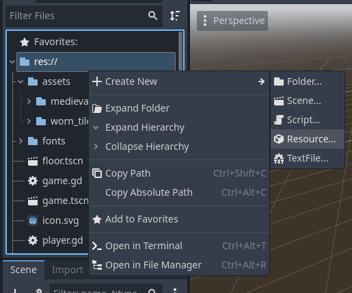

Como criar um recurso. Fonte: autoral.

> `StandardMaterial3D` é um `Resource`, uma estrutura do Godot para conter dados. Ele armazena texturas separadas para mapear materiais e oferece funcionalidades básicas para descrever materiais.

Selecione o novo material criado, nas propriedades selecione `Albedo`, em `Texture` selecione a opção `Load` e escolha a imagem com sufixo `diff` na pasta `assets/worn_tile_floor`.  Repita o mesmo processo para a propriedade `Roughness` usando a imagem de sufixo `rough`. Por fim, ative a propriedade `Normal Map` e adicione a imagem com prefixo `nor`. Seu material está pronto e pode ser visualizado no inspetor de propriedades.

Agora volte para a cena `floor` e abra `Mesh` em `Material` carregue o arquivo que você acabou de criar. Repita o processo para a sua parede. 

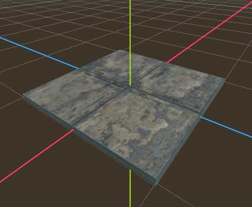

Laje texturizada. Fonte: autoral

Você verá que o resultado da parede não ficou tão bonito como esperado, isso é por que a parede é bem grande, então o Godot estica a imagem para caber, causando perda de qualidade. Para resolver isso, voltamos ao material da parede e entramos na aba `UV1`, ativamos a propriedade `triplanar` e modificamos a escala para $(0.5, 0.5, 0.5)$. Em outras palavras, estamos dizendo ao Godot para colocar a textura sobre cada uma das superfícies e mesclá-las, diminuir a escala aumenta o tamanho dos tijolos, sendo uma decisão mais artística.

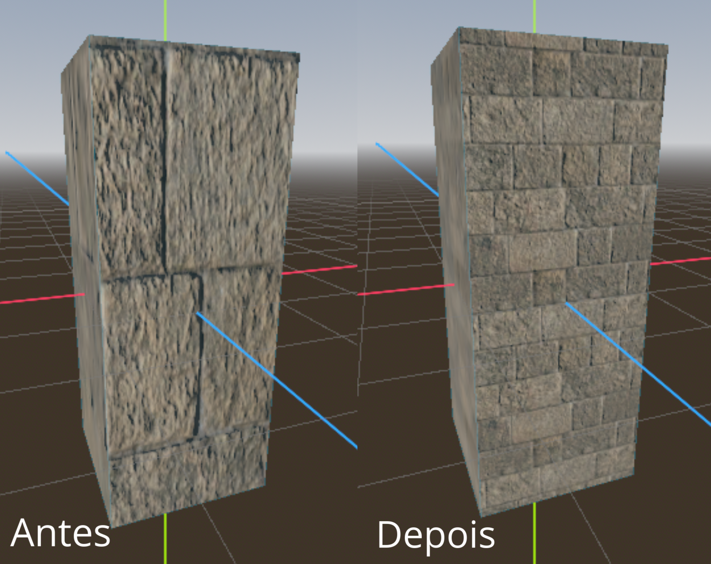

Parede antes e depois de aplicar *triplanar*. Fonte: autoral.

## Mundo em Primeira Pessoa

Com nossos blocos de construção criados, vamos nos voltar a peça mais importante de um jogo: o *jogador*. Crie uma nova cena nomeada `player.tscn`, cujo nó raiz deve ser do tipo `CharacterBody3D`. Renomeie o nó para `Player`. Acrescente um nó filho do tipo `CollisionShape3D` no formato de uma capsula. Depois, acrescente um nó `Node3D` nomeado como `Head` (cabeça). 

> O nó `CharacterBody3D` é uma classe utilizada para corpos físicos, que não é afetada pela física, mas afeta outros corpos. Feita para ser controlada pelo usuário. Uma classe perfeita para ser feita de jogador.

A cabeça terá um filho do tipo `Camera3D`, que funciona como uma câmera em primeira pessoa. Essa câmera terá um filho do tipo `SpotLight3D`, nossa lanterna ou fonte de luz. Nas propriedades da luz, em `Light > Color` configure a cor para um tom amarelado, se quiser ser específico use o valor `#ffecb1`.

Feito isso, volte para `Head`, vá para a propriedade `Transform > Position`, altere o componente *y* para `1.5`. Isso elevará a cabeça do jogador para longe do centro. Agora temos um belo jogador, não exatamente visível, mas fica tarefa de casa criar uma skin ou corpo para ele.

Antes de seguir em frente, temos que configurar o controle do usuário, como movimento do mouse e o pressionar das teclas. Faremos isso através de um script. Selecione o nó raiz, pressione o botão direito e clique em `Attach Script`. Um *popup* abrirá, tenha a opção `Template` marcada e selecione `CharacterBody3D: Basic Movement` se já não estiver selecionado. Desse modo, o Godot nos dará uma base com os botões e o efeito de gravidade configurados. Crie o script.

Graças ao template do Godot, não precisamos fazer nada além de configurar o movimento do mouse para mexer a câmera. Adicione o seguinte trecho no final do script:

```gdscript
func _unhandled_input(event: InputEvent) -> void:
	if event is InputEventMouseMotion:
		rotate_y(-event.relative.x * 0.01)
		$Head.rotate_x(-event.relative.y * 0.01)
		$Head.rotation.x = clamp($Head.rotation.x, -PI/2, PI/2)
```

No geral, esse código rotaciona o jogador no eixo x e a cabeça no eixo y. Utilizamos uma constante para suavizar o movimento (experimente números maiores). Por fim, restringimos o movimento da cabeça no eixo y em 90º para que o jogador não possa virar a cabeça em ângulos esquisitos.

Ao testar essa cena, você não vai ver absolutamente nada, pois o mundo em que o jogador se encontra, está vazio. Essa é nossa deixa para criar **O Mundo**.

## O Mundo

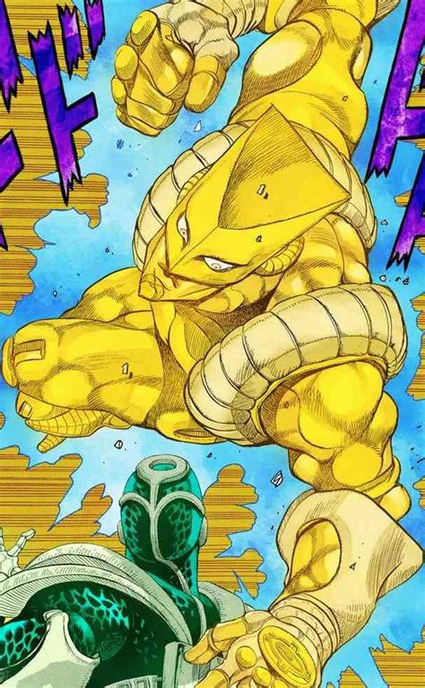

Achou que a referências de Jojo tinham acabado? Fonte: Pinterest

Nosso jogador e nosso labirinto precisam de existir em cima de um cenário. Criaremos um cenário para posicionar o jogador, criar um labirinto dinamicamente e criar uma névoa, para deixar tudo mais sinistro. Primeiro, crie uma cena `world.tscn` com a raiz `Node3D` (renomeie para `World`). Instancie nossa cena `Player` para dentro do nosso mundo, altere sua propriedade `Node3D > Transform > position` para `(2.0, 2.0, 2.0)`. Já que vamos gerar o labirinto no nível 0, não queremos que o jogador fique preso no meio de alguns blocos, por isso estamos movendo a instância do seu jogador para uma coordenada longe do centro.

Em seguida, vamos adicionar um *Ambiente* (`Environment`) à cena. Um `Environment` é uma classe do Godot que permite definir o *céu*, luz ambiente, plano de fundo, efeitos e outros ajustes visuais. Ambientes podem ser definidos na câmera ou pelo mundo, o comum é definir um ambiente global e apenas usar o da câmera - que tem prioridade sobre o global - em situações específicas. Dito tudo isso, crie um nó-filho de `World` do tipo `WorldEnvironment`. Abra suas propriedades e clique para criar um novo `Environment` na propriedade de mesmo nome. Por fim, tudo que você precisa fazer é abrir as novas propriedades do ambiente e ativar a opção `Fog` (neblina). Isso criará um efeito de neblina no mundo.

Se você tentar rodar a cena, ainda não verá nada de útil, além de uma escala diferente de cinza. Nossa próxima seção envolve criar o script que construirá o labirinto.

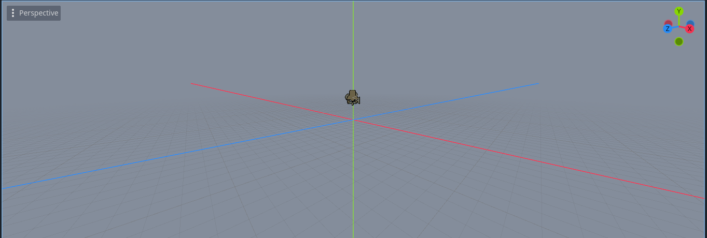

*World Scene* (Cena Global). Fonte: Autoral.

## Gerando um Labirinto 3D

Gerar um labirinto é relativamente simples no nosso caso. Não vamos utilizar algoritmos complexos, o que torna nossos labirintos mais simples, porém será uma boa aula prática. Uma vez que nosso labirinto não tem desníveis, podemos ter uma visão "*de cima*" através de uma matriz. Temos que definir uma posição inicial -  a do jogador por razões óbvias - e "cavar" um caminhos por essa matriz, mas sem passar das paredes externas.

> Como podemos garantir que todo labirinto é solucionável? Simples, devemos sempre fazer movimentos **ortogonais**, ou seja, na horizontal ou vertical da nossa posição atual. Desse modo, sempre criaremos tuneis e corredores e nunca bolsões isolados.

Anexe um script a cena `World` chamado `world.gd` que estenda `Node3D`. Vamos exportar duas variáveis, o que permite editá-las no Inspetor e salvar essa informação no disco:

```gdscript
extends Node3D

@export var wall_scene: PackedScene
@export var floor_scene: PackedScene
```

Declaramos duas variáveis que vão representar nossas cenas. Salve o script, volte ao inspector e veja duas novas propriedades na cena global, para cada uma selecione a cena correspondente. Agora nosso script pode criar instâncias dessas cenas pelo código.

Para a próxima etapa, criaremos variáveis para guardar o tamanho do nosso labirinto e a largura dos corredores. Bem como, a função de inicialização da cena:

```gdscript
var width = 15
var height = 15
var spacing = 2.0

func _ready():
	if not wall_scene:
		print("Error: Configure a `Wall Scene` no Inspetor")
		return
		
	if not floor_scene:
		print("Error: Configure a `Floor Scene` no Inspetor")
		return
		
	generate_maze()
```

Como explicado anteriormente, a função `_ready()` é chamada na hora de criar a nossa cena. Tudo que fazemos é conferir se nossos componentes podem ser usados e criar o labirinto com a função `generate_maze()`, cuja a implementação, discutiremos agora.

```gdscript
func generate_maze():
	# Cria matriz de booleanos
	var grid = []
	for x in range(width):
		grid.append([])
		for y in range(height):
			grid[x].append(true) # True significa parede

	# "Escavamos" um caminho
	carve_path(1, 1, grid)

	# Instanciamos fisicamente as paredes, o chao e o teto
	for x in range(width):
		for z in range(height):
			# Chão
			var f = floor_scene.instantiate()
			add_child(f)
			f.position = Vector3(x * spacing, 0, z * spacing)

			# Teto
			var c = floor_scene.instantiate()
			add_child(c)
			c.position = Vector3(x * spacing, 4.0, z * spacing)

			# Parede
			if grid[x][z]:
				var w = wall_scene.instantiate()
				add_child(w)
				w.position = Vector3(x * spacing, 1.5, z * spacing)
```

A implementação de `generate_maze()` é relativamente simples. Veja bem:

1. Criamos um *array* para representar nossa matriz, `grid`, e populamos ela com *array* de booleanos com o valor `true`, representando todas as paredes. Essencialmente, temos um retângulo (*width* X *height*) composto das nossas paredes.
2. Rodamos a função `carve_path` (veja a seguir), que vai escavar caminhos aleatórios por essa matriz, seguindo algumas restrições.
3. Por fim, preenchemos a matriz com um chão e um teto, instanciando a cena `floor_scene` na nossa cena atual. Dito isso, caso exista uma parede na matriz, instanciamos uma na mesma posição.

> O método `instantiate()` e `add_child()` fazem o mesmo utilizar o botão 📎 da interface.

Para finalizar a função `carve_path()` foi implementada com um algoritmo de *Backtracking*[^1], em outras palavras, ele experimenta abrir tuneis em diversos pontos diferentes, o que traz resultados satisfatórios para essa aula.

```gdscript
func carve_path(x, z, grid):
	grid[x][z] = false # 
	
	# [Direita, Esquerda, Cima, Baixo]
	var directions = [Vector2(0, 2), Vector2(0, -2), Vector2(2, 0), Vector2(-2, 0)]
	directions.shuffle() # Embaralha o array

	for dir in directions:
		var nx = x + dir.x
		var nz = z + dir.y
		
		# Se há espaco/não chegou nas bordas
		if nx > 0 and nx < width-1 and nz > 0 and nz < height-1:
			if grid[nx][nz]:
				# Remove a parede entre a célula atual e o vizinho
				grid[x + dir.x/2][z + dir.y/2] = false
				carve_path(nx, nz, grid)
```

`carve_path()` recebe uma posição inicial através de `x` e `y` e uma matriz. Primeiro, marcamos a posição atual como livre (ar). Depois disso, dado um conjunto aleatório de direções, para cada uma delas, tentamos avançar nesta direção, se conseguirmos, liberamos espaço na grade e vamos para a próxima posição.

Desse modo, criamos um labirinto até que não haja mais espaços disponíveis para seguir.

> O algoritmo utilizado nessa aula é bem simples e pode deixar o jogo bem chato depois de um tempo. Se quer aprender mais sobre Algoritmos Gerados de Labirinto, eu recomendo esse artigo sobre o assunto: https://en.wikipedia.org/wiki/Maze_generation_algorithm.

Com isso, concluímos a geração de mundo! Rode a cena e veja tudo que construímos até agora. Dica: Se quer ver o formato do labirinto substitua a altura final das paredes por algo um pouco mais embaixo.

## Resolvendo o Labirinto

Se você tentar rodar nossa cena global, vai poder explorar o labirinto, o que é muito legal! Porém, depois de alguns minutos explorando você perceberá que não tem nada de interessante para fazer. Outro fator essencial para os jogos, são os **objetivos**, que incentivam os jogadores a continuarem jogando. Por isso, vamos criar um objetivo para nosso jogo: **escapar do labirinto**.

Para escapar do labirinto, o jogador vai precisar navegá-lo por completo e encontrar um item especial, uma moeda dourada que vai teletransportá-lo para a saída... Mentira! Ele será teletransportado para um labirinto ainda maior até o PC dele exploda *muahahahaha*.

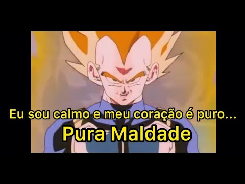

Foto do Vegeta. Fonte: https://www.youtube.com/watch?v=aDFyVIp30XQ

Dito isso, crie uma nova cena para nossa moeda dourada: `prize.tscn`. Sua raiz deve se do tipo `Area3D`. Com filhos `CollisionShape3D` e `MeshInstance3D`. Em ambos os filhos, configure o formato para o deu um cilindro com as seguintes especificações:

- Altura/*Height*: `0.3`
- Raio/*Radius*: `1.0`

> A Classe `Area3D` age como oposto de `RigidBody3D`, sendo um corpo móvel (afetado pela física) que detecta quando um objeto intercepta seu interior. Perfeito para criar entidades e objetos interagireis.

Em seguida, para a *mesh*, inclua um material do tipo `StandardMaterial3D`. Ao invés de usarmos um material, usaremos a configuração padrão do Godot. No material, altere a propriedade `Albedo > Color` para `#ffd700` (um tom de amarelo) e maximize a propriedade `Metallic` na aba de mesmo nome - ainda dentro do material. No final, você deve ter um disco metálico amarelo. 

Para o toque final, volte nas propriedades de `Area3D`, ajuste `rotation` no eixo x para 90º e `scale` para `0.5`, ambas na aba `Node3D > Transform`. O resultado final deve ser algo assim:

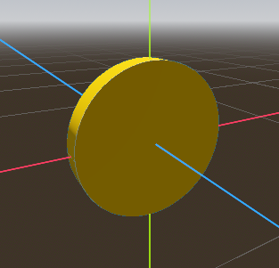

Disco amarelo metálico. Fonte: Autoral.

> Sim, eu não encontrei uma textura mais bonita (e de graça), então tive que ensinar você a fazer isso. Peço perdão pelos meus crimes.

Feito isso, vamos adicionar um script que faz a moeda se girar e se mexer, bem como a lógica para quando for encontrada. Conecte um script a cena chamado `prize.gd` com o seguinte conteúdo:

```gdscript
extends Area3D

@export var rotation_speed: float = 2.0

func _ready() -> void:
	body_entered.connect(_on_body_entered)

func _process(delta: float) -> void:
	rotate_y(rotation_speed * delta)
	position.y = 1.0 + sin(Time.get_ticks_msec() * 0.005) * 0.2

func _on_body_entered(body: Node3D):
	if body.name == "Player":
		Manager.next_level()
```

Tudo que fazemos é exportar uma propriedade (a velocidade de rotação). Conectar nossa função `_on_body_entered()` ao sinal `body_entered` emitido pelo nó `Area3D`. Rotacionar a moeda e mexê-la para cima e para baixo com uma função seno a cada frame do jogo. E por fim, caso um objeto do tipo `Player` (nosso jogador) interaja com a moeda, devemos ir para o próximo nível.

Agora se você tem olhos rápidos, vai perceber que estou instanciando uma classe `Manager`, mas de onde ela veio? O que ela é? Bom, responderei essas perguntas em ordem inversa: `Manager` é uma classe que vai controlar o tamanho do nosso labirinto e renovar a cena global sempre que completarmos um nível. Ela existe em um script global, sendo um *Singleton*. Em outras palavras é uma classe onde existe **apenas um** objeto dela no programa inteiro.

Em *FileSystem* crie um novo script chamado `manager.gd`. Feito isso, na aba superior, vá em `Project > Project Settings`, na aba `Globals`, na seção `Autoload`, preencha os campos com o caminho do arquivo e o nome da classe e clique em `+ Add`. Desse modo, teremos um objeto `Manager` acessível por todos os scripts. Sobre o conteúdo de `Manager`, teremos uma variável para o tamanho do labirinto e uma função `next_level`, que incrementará o tamanho do labirinto e troca a cena atual por uma nova. Veja abaixo:

```gdscript
extends Node

var current_level_size = 11

func next_level():
	current_level_size += 4
	get_tree().change_scene_to_file("res://world.tscn")
```

> `change_scene_to_file()` é um método que troca a cena atual por uma salva no disco. Neste caso, a mesma cena, o que re-setará seu estado.

Temos que agora alterar o script `world.gd`, incluindo nossa cena da moeda, atualizando o tamanho do labirinto. Faça as seguintes alterações:

```gdscript
@export var prize_scene: PackedScene

var width = Manager.current_level_size
var height = Manager.current_level_size
...

func generate_maze():
	...
	
	spawn_prize(width - 2, height-2, grid)

...

func spawn_prize(target_x, target_z, grid):
	if grid[target_x][target_z] == true:
		for x in range(target_x, 1, -1):
			for z in range(target_z, 1, -1):
				if grid[x][z] == false:
					target_x = x
					target_z = z
					break

	var prize = prize_scene.instantiate()
	add_child(prize)
	prize.position = Vector3(target_x * spacing, 1.0, target_z * spacing)
```

As alterações são simples, em `spawn_prize()` instanciamos a moeda no ponto mais distante do labirinto (sem ser a parede externa), que no caso é `(width-2, height-2)`. Caso, esse espaço esteja ocupado, tentamos outras posições até achar um espaço vago. Teste a cena mais uma vez, explore o labirinto e veja se tudo está funcionando.

## Juntando Tudo

A essência do jogo está pronta! Temos que juntar a tela inicial com a *gameplay*, incluiremos também uma tela de pausa. Primeiro de tudo, substituiremos o subtítulo da cena `title` por um botão que podemos pressionar para começar o jogo. Na árvore de nós, clique com o botão direito em `Subtitle`, clique em `Change Type`, o ícone irá mudar para um botão. Isso é um jeito fácil de editar nós sem precisar apagá-los.

Com isso, adicione um novo script a cena. Com o seguinte conteúdo:

```gdscript
extends Control

# Caminho para nossa cena principal
@export_file("*.tscn") var main_game_scene: String = "res://world.tscn"

func _ready():
	# Mantém o mouse está visível
	Input.set_mouse_mode(Input.MOUSE_MODE_VISIBLE)
	# Seleciona o foco no botão por padrão.
	$GridContainer/Subtitle.grab_focus()

func _input(event):
	# Se apertar Enter ou clicar no botão, o jogo começa
	if event.is_action_pressed("ui_accept"):
		start_game()

func _on_play_button_pressed():
	start_game()

func start_game():
	# Dica: edite Manager aqui, se você quer mudar o estado incial do jogo ou carregar um save.
	# Começa o jogo.
	get_tree().change_scene_to_file(main_game_scene)
```

Esse script iniciar o jogo quando apertarmos o botão (ou pressionarmos `Enter`).

> `Input.MOUSE_MODE_VISIBLE` é uma configuração que faz o cursor do mouse estar sempre visível (o que acontece por padrão). Sua contra parte é o  `Input.MOUSE_MODE_CAPTURED`, que captura a "atenção" do mouse na tela. Inclua essa configuração no inicialização de `world.tscn` e veja como fica melhor para controlar a direção que o usuário está vendo.

### Tela de Pausa

De vez em quando precisamos fazer uma pausa para lanchinhos em meio as jogatinas. Pausar é quase uma funcionalidade esperada de qualquer jogo, portanto, vamos criar uma cena para isto.

Nossa nova cena será do tipo `Node2D`, dentro dele teremos um `ColorRect` 100% e metade transparente, ou seja `A` valerá `128`. Não esqueça de colocar o *preset* para `Full Rect`. Feito isso, inclua um `VBoxContainer` centralizado na tela, com dois botões: `Resume` e `Quit`. Utilize `Theme Overrides` para mudar a fonte, a cor do texto e o tamanho para *HorrorMaster*, vermelho e 72 px, respectivamente. Bem como, altere o espaçamento dentro do container para `16`. Salve como `paused_menu.tscn`.

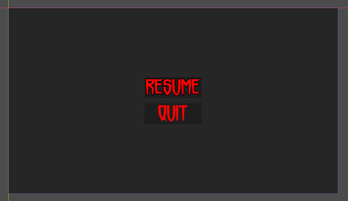

Tela de pausa. Fonte: autoral.

Então, crie um novo script associado a essa cena. Veja abaixo:

```gdscript
extends CanvasLayer

func _ready():
	process_mode = Node.PROCESS_MODE_ALWAYS
	hide()

func _input(event):
	if event.is_action_pressed("ui_cancel"):
		if get_tree().paused:
			resume_game()
		else:
			pause_game()

func pause_game():
	get_tree().paused = true
	Input.set_mouse_mode(Input.MOUSE_MODE_VISIBLE)
	show()
	
func resume_game():
	get_tree().paused = false
	Input.set_mouse_mode(Input.MOUSE_MODE_CAPTURED)
	hide()
	

func _on_resume_pressed():
	resume_game()
	
func _on_quit_pressed():
	get_tree().quit()
```

Em `_ready()`, definimos que essa cena deve rodar independentemente de qualquer coisa, mas deve iniciar escondida. Em `_input()` esperamos que o usuário pressione `Esc` para pausar ou continuar o jogo na tela de pausa. Criamos duas funções responsáveis por congelar e prosseguir com o jogo.

> O atributo `paused` congela as funcionalidades de um nó e seus filhos, impedindo efeitos físicos e de colisão. Usamos `Node.PROCESS_MODE_ALWAYS` para dizer que um nó não deve ser pausado, mesmo que seu nó-pai esteja.

As funções `_on_resume_pressed` e `_on_quit_pressed` servem para serem *linkadas* com seus respectivos botões. Dessa vez, isso será feito no Editor. Para cada um dos botões, vá em `Node` (está ao lado de `Inspector` na divisão direita da tela). Procure pela seção `Signal` por `BaseButton > pressed`, clique e depois em `connect`. Ponha o mesmo nome da função que você declarou mais cedo e conecte a função com tal sinal. Dessa maneira, os botões devem reagir as respectivas funções.

Por último, adicione o menu pausado à *gameplay*. Teste e veja se tudo está funcionado.

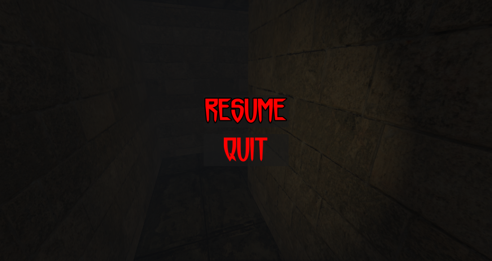

Tela de Pausa. Fonte: Autorial

## Toques Finais: Efeitos Sonoros

O jogo está muito divertido por si só, mas um bom video game tem uma música de fundo e efeitos sonoros. Esse será o toque final para acabar este jogo!

Na pasta `audios` temos três arquivos de áudio que serão utilizados neste tutorial. Primeiramente, a música de fundo. Crie uma nova cena do tipo `AudioStreamPlayer`, nomeada `IdleBackgroundMusic`, nas propriedades carregue em `stream` o arquivo com o sufixo `possessed_intro.wav`, e configure `Volume dB` para `-20dB`, assim o áudio não ficará estourado. Instancie essa cena em `title.tscn` e `paused_menu.tscn`.

Para `title.tscn`, vá novamente nas propriedades da música e ative a opção `Autoplay` para ela começar automaticamente quando o jogo iniciar. Já para `paused_menu.tscn`, adicione `$IdleBackgroundMusic.play()` no final da função `paused_game` e `$IdleBackgroundMusic.stop()` no final de `resume_game`. Desse jeito, o áudio tocará apenas quando o jogo estiver pausado.

> O nó `AudioStreamPlayer` serve para tocar faixas de áudio de modo global (sem direção). O que é ideal para músicas de fundo, UI, etc. Para sons direcionais usamos as versões `AudioStreamPlayer3D` e `AudioStreamPlayer2D`.

Isso foi apenas a música da nossa UI, agora para a gameplay. Crie um nó filho do tipo `AudioStreamPlayer` em `World`, escolha o arquivo que termina com `whispers-loop-mix-2`, ponha o volume para `-20dB` e ative o `Autoplay`. Experimente rodar a cena, ouça os sussurros e gritos, se estiver muito alto, abaixo o volume para menos decibéis.

Por último, faça o mesmo em `prize.tscn`. Chame o nó de `AcquiredSound` e utilize o arquivo com `badhorrormoviesound` escrito. O volume deve ser um pouco mais alto, `-6dB` e deixe o `Autoplay` desativado. Na função `_on_body_entered()` em `prize.gd`, faça a seguinte atualização:

```gdscript
func _on_body_entered(body: Node3D):
	if body.name == "Player":
		$AcquiredSound.play()
		await $AcquiredSound.finished
		Manager.next_level()
```

Agora tocamos o efeito sonoro e esperamos que ele acabe com `await $AcquiredSound.finished` antes de partir para o próximo nível.

## Conclusão

Com isso concluímos nossa implementação de *Dreadhalls*! Veja o resultado final rodando a partir de `title.tscn` e  aproveite o jogo, divirta-se um pouquinho e reflita sobre tudo que você aprendeu nesta aula, porque não foi pouca coisa. 

Se ainda estiver atrás de mais desafios ou quer colocar em pratica o que aprendeu, aqui vão umas sugestões do que você pode fazer:
- Adicionar instruções do jogo no menu de pausa.
- Adicionar um controle do volume no menu.
- Colocar um texto indicando o nível atual do labirinto durante a gameplay.
- Introduzir buracos no chão que o jogador deve saltar (o salto já está implementado), bem como uma tela de *Game Over*.

Por enquanto é isso, espero que tenha gostado e até a próxima aula!

[^1]: https://pt.wikipedia.org/wiki/Backtracking
