# Aula 10: Portal

Bem-vindo de volta caro aluno. Chegamos ao último projeto deste curso: O jogo **Portal**!

Portal é um jogo de 2007 onde você deve resolver quebra-cabeças, criando portais através da sua "*portal gun*"[^1]. Nossa implementação será &mdash; obviamente &mdash; mais simples que o original, mas o que importa será o conhecimento adquirido!

Nessa aula aprenderemos sobre: Modelos 3D; a segurar uma arma; implementar *Raycasting*; Shaders; Teleporte; e criar salas com a ferramenta *Constructive Solid Geometry* (CSG).

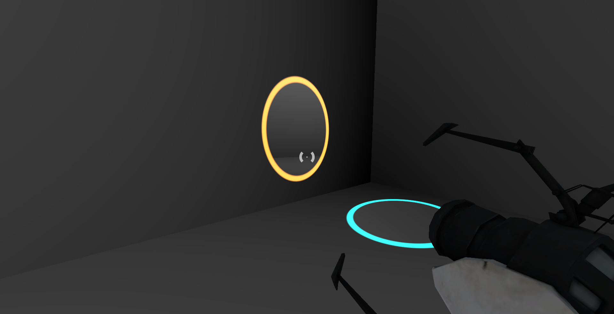

Showcase do nosso Portal. Fonte: Autoral.

## Criando e Organizando o Projeto

Como nas outras aulas, o código-fonte do projeto está disponível nessa pasta. Rode o projeto e brinque um pouco antes de começar a programar. Pense em como você implementaria cada uma das funcionalidades. 

Além disso, diferente da aula anterior vamos te mostrar como criar um projeto bem organizado. Isso é uma opinião um tanto quanto subjetiva, mas eu prefiro uma organização baseada em ***objetos***, em outras palavras teremos uma pasta para o jogador, outra para o portal, etc. Enquanto outras pessoas podem preferir separar por ***função***, ou seja uma pasta só para scripts outra para cenas e por aí vai. Não existe certo nem errado, vou te mostrar meu jeito, se não gostar você pode seguir outro. 

Feitos os avisos, crie um novo projeto no Godot.

## *The World* (De novo)

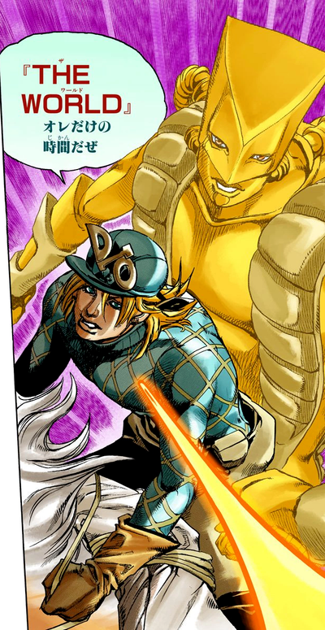

Sim, é a mesma piada. Fonte: https://jojowiki.com/High_Voltage_(story_arc)

Vamos direto para o ambiente, batize a cena de `main.tscn` com o tipo `WorldEnvironment` e crie um novo *Environment* nas configurações. Por enquanto não vamos mexer nessa cena, mas é nela que vamos instanciar todas as outras.

## Construindo o Personagem

Crie uma pasta `player` com uma cena &mdash; chamada `player.tscn` &mdash;  do tipo `CharacterBody3D`. Faremos algo similar a aula passada, crie um `CollisionShape3D` no formato de uma capsula, logo após, um nó `MeshInstance3D` também no formato de capsula . Com isso, crie um `Node3D` &mdash; chame de `Head`&mdash; com um nó filho `Camera3D`. Reposicione a `Head` para cima em `0.7` unidades (assim a cabeça está a 1,70m do chão).

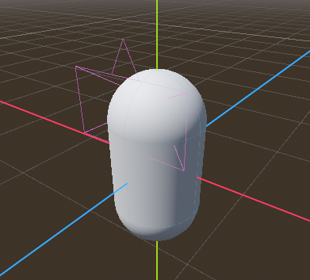

Quase temos um personagem de Fall Guys aqui. Fonte: Autoral.

### A *Portal Gun* 

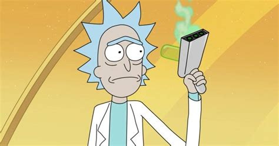

*Portal Gun*. Pera não estamos falando dessa! Fonte: https://comicbook.com/anime/news/rick-and-morty-season-6-portal-gun-broken-confirmed/

Vamos adicionar ao nosso personagem a **Portal Gun** (Arma de Portal)! Iremos baixar o modelo e fixá-lo no nosso jogador. Primeiro de tudo, baixe o modelo (encontre-o [aqui](https://free3d.com/3d-model/portal-gun-from-portal-2-74735.html?dd_referrer=) e obrigado *myulline-annatar*) e jogue numa pasta chamada `player/gun/model` (crie a pasta `gun` também). Dentro dessa nova pasta, crie uma cena com o nó raiz `PortalGun` e tipo `MeshInstance3D`, como *mesh* escolha nosso arquivo `PortalGun.obj`. Salve a cena.

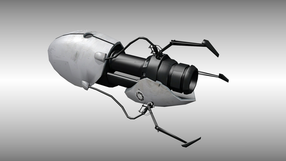

Portal Gun. Agora sim. Fonte: https://free3d.com/3d-model/portal-gun-from-portal-2-74735.html?dd_referrer=

Instancie essa cena em nosso jogador como filho de `Head` pois queremos que ela se mova junto com o movimento de cabeça do player. Ajuste a escala e posição da arma no editor para que ela aponte para o centro da tela. Você também pode usar os valores que eu encontrei:

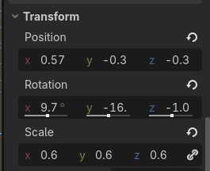

Transformações. Fonte: autoral.

### Programando o Jogador

O código que usaremos será basicamente idêntico ao da aula anterior (pelo menos por enquanto). Ao criar um novo script utilize o construtor padrão que `CharacterBody3D` fornece e adicione a função para o movimento do mouse.

```gdscript
func _unhandled_input(event: InputEvent) -> void:
	if event is InputEventMouseMotion:
		rotate_y(-event.relative.x * MOUSE_SENSITIVITY)
		Head.rotate_x(-event.relative.y * MOUSE_SENSITIVITY)
		Head.rotation.x = clamp(Head.rotation.x, -PI/2, PI/2)
```

Contudo dessa vez, vamos permitir que as teclas `WASD` possam ser usadas para mover o jogador. Em `Project` no canto maior superior esquerdo, vá em `Project Settings` e no popup, clique na aba `Input Map`. Ative a opção `Show Built-in Actions` para visualizar os eventos e as teclas associadas por padrão pelo Godot. Busque por `ui_left`, `ui_right`, `ui_up` e `ui_down`, para cada uma delas, clique no `+` e pressione a tecla correspondente (A, D, W, S, respectivamente). Aproveite para dar uma olhada em outros eventos e teclas atreladas.

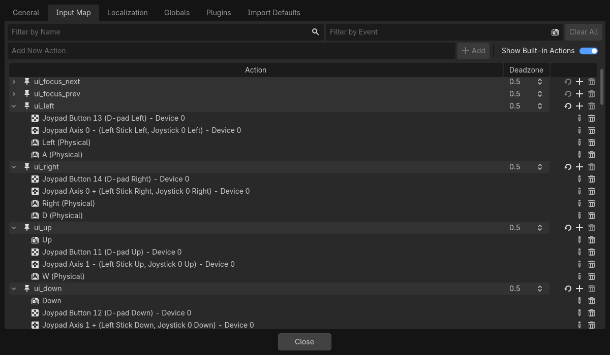

Fonte: Configuração de teclas. Fonte: Autoral.

Antes que eu me esqueça, para melhorar o controle do mouse, inclua na função `_ready()` a seguinte linha:

```gdscript
Input.set_mouse_mode(Input.MOUSE_MODE_CAPTURED)
```

### Mirando no Alvo

Como última adição ao nosso jogador, vamos colocar uma mira no centro da tela. Para fazer isso, crie um novo nó filho de `Player` do tipo `CanvasLayer`, depois um filho do tipo `Control`, mude seu nome para `Crosshair`,  use o *preset* `Full Rect` no Editor e vá em `Mouse > Filter` e coloque para `Ignore`, isso fará com que o controle ignore ações do mouse, impedindo que a tela trave. Desse modo, adicione um filho ao controle do tipo `TextureRect`, configurando para a seguinte imagem:

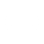

Um agradecimento a *Kenny's Crosshair Pack* pela imagem. Se quiser ver a coleção toda clique [aqui](https://kenney.nl/assets/crosshair-pack). Em seguida, vá em `Visibility` na imagem, selecione `Self Modulate` e configure a transparência para `0.64`.

Se tudo estiver funcionando corretamente, esse deve ser o resultado de rodar a cena.

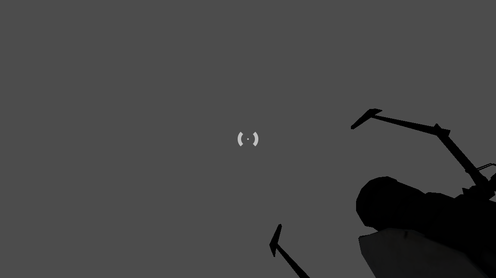

Visão do Player. Fonte: autoral.
## Criando Salas com CSG

Para a próxima etapa, vamos criar um nível/sala. Na última aula criamos as salas de modo procedural, mas agora, teremos níveis pré-montados. Faremos isso utilizando a ferramenta *Constructive Solid Geometry* do Godot [^4], que permite prototipar estruturar de maneira fácil e rápida, inclusive permite exportá-las para plataformas profissionais, ex.: *Blender*. A ferramenta CSG permite criar formas básicas e combiná-las de diversas maneiras: união, intersecção e subtração. Por isso, também é chamada de **Operadores Booleanos**.

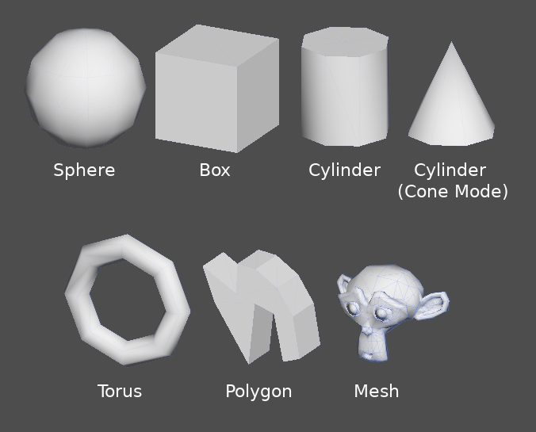

Formas básicas do CSG. Fonte: https://docs.godotengine.org/en/stable/tutorials/3d/csg_tools.html

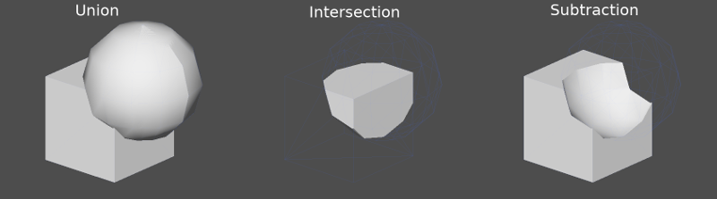

Combinação de formas. Fonte: https://docs.godotengine.org/en/stable/tutorials/3d/csg_tools.html

Agora teremos um trabalho artístico, você pode projetar sua sala do jeito que preferir ou seguir este tutorial.

Se decidiu seguir essas instruções, então crie uma cena chamada `Room` com nó raiz `CSGCombiner` que permite aplicar operações sobre vários blocos do CSG. Em seguida crie uma sala com o nó `CSGBox` de tamanho `(20, 10, 20)` e ative `Flip Faces` para que o cubo se torne uma caixa.

Agora faremos um corredor, crie um novo `CSGBox` de tamanho `(8, 4, 4)`, ligue com um das faces do cubo e inverta as faces. Este corredor irá para uma torre, então crie outra caixa de tamanho `(10, 20, 10)`. Para chegar ao topo, inclua plataformas adicionando filhos à torre, invertendo as faces e utilizando a operação de *subtração*. (Se quiser saber, o tamanho das plataformas é `(3, 0.5, 3)`). Vá de nó em nó adicionando um `StandardMaterial` com o efeito `Metallic` ao máximo (1.0). Isso evita que você se encontre em uma sala completamente branca. 

Por último mas não menos importante, crie dois nós do tipo `OmniLight3D` e posicione em cada sala. Para o salão, coloque no centro e configure o valor `Range` para `15.0`, enquanto na torre, coloque a no topo e seu alcance para `25.0`.

> [!Note]
> O tipo `OmniLight3D` cria uma fonte de luz que projeta raios em todas as direções com certa intensidade (`Range`). É perfeito para tochas, lanternas e outras fontes de luz próximas.

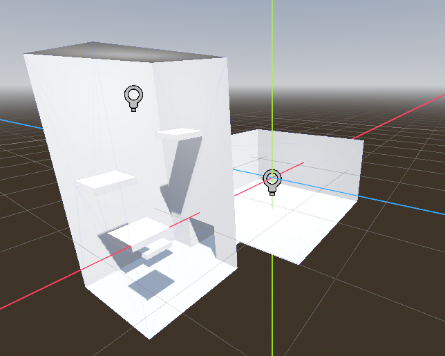

Resultado da Sala 1. Fonte: autoral

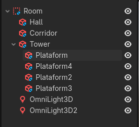

Árvore de nós da Sala 1. Fonte: autoral.

Por último, voltem no nó raiz e ative a opção `Use Collision`, desse modo, nossas mesh funcionarão como caixas de colisão, nos poupando um trabalhão.

Espero que tenha percebido o poder do CSG. Com alguns materiais e um pouco mais de criatividade você pode criar um conjunto básico de salas para serem combinadas usando geração procedural. Se quiser investir nesse assunto olhe [aqui](https://docs.godotengine.org/en/stable/tutorials/3d/csg_tools.html).

## Portais!

### Um pouco da teoria

Primeiro, pense um pouco, o que é um portal? Bom ele é uma ruptura no espaço-tempo, um buraco 2D em um espaço 3D que mostra a saída do outro buraco. A questão é como representar isso em um computador? Reflita sobre como você faria isso antes de ler a resposta.

A resposta é até que simples, nosso portal precisa mostrar aquilo que o portal de saída está vendo, o que pode ser feito colocando as informações de uma câmera como *material* do portal. O detalhe é que essa outra câmera precisa estar &mdash; em relação ao portal de saída &mdash; na mesma distância e orientação que a câmera do jogador está do portal original. Veja a imagem abaixo, para ver se você pegou a ideia:

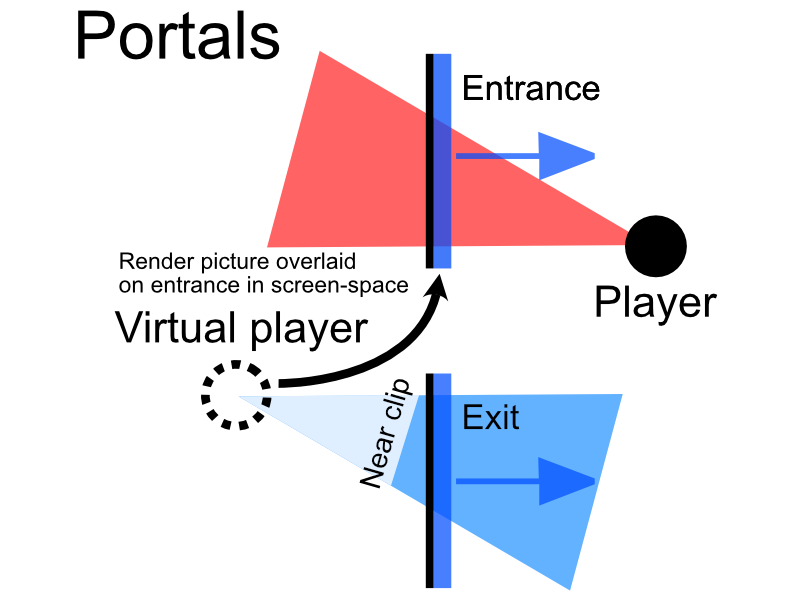


Diagramação do portal. Fonte: https://github.com/Donitzo/godot-simple-portal-system

Se você ainda está com dúvida de como isso funciona, ou quer uma explicação mais visual, eu recomendo o vídeo a seguir.

 

### Mão na *Mesh*

Com a teoria em mente, vamos à prática. Em uma pasta chamada `portal` crie uma cena de raiz `MeshInstance3D`. Crie uma *mesh* do tipo `QuadMesh`, isso criará um quadrado bidimensional &mdash; configure o tamanho para `(2.0, 2.5)` &mdash; certifique-se que o `Orientation` está setado para `Z` (importante para o script), por último na propriedade `Layers`, desmarque o quadrado `1` e marque `2`. 

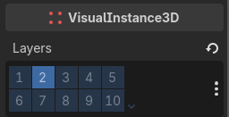

Layers. Fonte: autoral

Essa propriedade é similar ao de um *power point*, estamos jogando um objeto para "frente" ou para "trás". Isso será útil, pois na nossa implementação **não** vamos desenhar um portal dentro do outro. Portanto, a câmera que mostra 

> Nessa aula não vamos implementar portais recursivos pela complexidade e pelo fato de ser computacionalmente mais intenso fazer isso.

Depois disso, adicione um nó filho do tipo `SubViewport`. O nó `SubViewport` funciona como uma janela, mas que não desenha diretamente na sua tela sem que você comande, usaremos isso como a textura da nossa *mesh*. Altere a propriedade `Update Mode` para `Always`, isso serve para atualizar a imagem mesmo que o portal não esteja no espaço de visão do jogador. Para completar essa etapa, adicione uma `Camera3D` como filha da `SubViewport`, na opção `Cull Mask` desabilite o quadrado 2 (ou seja ignore objetos do nível 2, como nossos portais). Por fim, faça essa a câmera utilizada pela *subviewport* habilitando a opção `Current`.

Se tudo deu certo, você tem um quadrado e uma câmera. Yay!

### Escrevendo o Programa de *Shader*

Acontece que ainda não terminamos de configurar nossa mesh ainda precisamos inserir a visão da nossa câmera, o problema é que não temos como descrever isso através da UI do Godot. 

Então está tudo perdido? Pelo contrário! Vamos descer para uma área mais baixa e avançada do desenvolvimento de jogos: a **Computação Gráfica**. A Computação Gráfica é um área da computação dedicada ao "como" transformamos uma tela feita de pixels em desenhos através de código. Isso dito, vamos usar um **Programa de Shader** para resolver nosso problema, também chamado só de *Shader*, ela é um programa que executa para *cada* *pixel* (ou conjunto de pixels) dentro da sua placa de vídeo. Utilizamos shaders quando precisamos executar ações complicadas ou queremos maior desempenho já que estamos explicando diretamente a placa de vídeo o que fazer.  Usar shaders é uma coisa muito comum no ramo profissional, por isso todo Game Engine oferece um interface para você escrever sua própria shader e isso inclui o Godot.

Como isso não é um curso de computação gráfica não vou entrar em muitos detalhes matemáticos e técnicos. Se você quer saber mais sobre, temos um próprio [curso](https://github.com/ConwayUSP/Estado-da-Arte) para isso. Também não vamos falar da sintaxe da linguagem de shaders do Godot. Caso você queira saber mais sobre esse assunto siga esse [link](https://docs.godotengine.org/en/stable/tutorials/shaders/index.html). 

Arquivos de shader no Godot são marcados no final como `.gdshader`, crie um arquivo de nome `Portal.gdshader` na pasta do portal. Clique no arquivo, isso irá abrir um editor de shaders na parte inferior. O código será um pouco longo, então vamos dividir em partes.

```
shader_type spatial;

uniform float fade_out_distance_max = 10.0;
uniform float fade_out_distance_min = 8.0;
uniform vec4 fade_out_color = vec4(0.0);

uniform float border_thickness : hint_range(0.0, 0.5) = 0.05;
uniform float border_softness : hint_range(0.0, 0.2) = 0.02;
uniform float glow_intensity : hint_range(0.0, 10.0) = 2.0;

uniform sampler2D albedo: hint_default_black, source_color;

varying float pixel_distance;
```

Definimos o tipo de shader: `spatial`, que serve para renderizações 3D. Depois criamos  variáveis marcadas como `uniform`, isso quer dizer que podemos definir seus valores através de código na CPU (nosso script), isso é semelhante ao decorador `@export`. Por último temos, `varying`, ela vai servir para trazer valores de um escopo para outro. 

Uma vez, explicado a sintaxe, vamos para a semântica. Essas variáveis uniformes vão servir para criar um efeito de *Fade-Out* e uma borda brilhante ao redor do portal, a última &mdash; `albedo` &mdash; será os dados vindos da SubViewport.

```gdshader
void vertex() {
    vec3 world_position = (MODEL_MATRIX * vec4(VERTEX, 1.0)).xyz;
    vec3 camera_position = (INV_VIEW_MATRIX * vec4(0.0, 0.0, 0.0, 1.0)).xyz;
    
    pixel_distance = distance(world_position, camera_position);
}
```

Sem muita enrolação, a função `vertex` é chamada para cada vértice na tela (considere que tudo na tela é composto de triângulos e portanto possuem vértices). Pegamos a distância em relação à câmera e guardamos em `pixel_distance`.

```gdshader
void fragment() {
	// 1. Create the Oval Mask
    vec2 centered_uv = UV - vec2(0.5);
    float dist_from_center = length(centered_uv);
    
    float mask = smoothstep(0.5, 0.48, dist_from_center);

	// 2. Border Logic
	float border_inner_edge = 0.5 - border_thickness;
	float border_mask = smoothstep(border_inner_edge - border_softness, border_inner_edge, dist_from_center) - smoothstep(0.5 - border_softness, 0.5, dist_from_center);
    
	vec3 glow = fade_out_color.rgb * border_mask * glow_intensity;

	// 3. Color Logic
    vec3 portal_color = texture(albedo, SCREEN_UV).rgb;
    float t = smoothstep(fade_out_distance_min, fade_out_distance_max, pixel_distance);
    
    ALBEDO = mix(portal_color, fade_out_color.rgb, t);
	ALPHA = mask;
	EMISSION = glow;
}
```

Por fim, a função mais longa, `fragment` executa para cada *pixel* (na verdade fragmento, mas de novo sem muitos detalhes) atribuído uma cor. Vamos definir tudo nela, primeiro o formato oval, em que aumentaremos a transparência usando `ALPHA` de modo que as bordas fiquem invisíveis e o centro uma elipse. Depois uma borda brilhante, usando `fade_out_color` e alguns uniformes, definimos a propriedade `EMISSION` para cuidar disso. Por fim, o centro, será a textura que nossa câmera está observado, incluímos também um *Fade-out*, em que quanto mais você se afastar do portal ele vai assumir uma cor única.

Ufa, isso foi longo, agora ta na mora de ligar essa shader com o resto da cena.

### Escrevendo o Script

Nessa seção, vamos criar um script que configure a mesh e movimente a câmera do portal de modo a espelhar o jogador. Crie um script atrelado a nossa cena. Com o seguinte cabeçalho.

```gdscript
extends MeshInstance3D
class_name Portal

@export var fade_out_distance_max:float = 10
@export var fade_out_distance_min:float = 8
@export var fade_out_color: Color = Color.WHITE

@export_range(0.0, 0.5, 0.1) var border_thickness: float = 0.05
@export_range(0.0, 0.2, 0.1) var border_softness: float = 0.02
@export_range(0.0, 10.0, 0.1) var glow_intensity: float = 2.0

@export var exit_portal: Portal
@export var portal_shader: Shader = preload("res://portal/Portal.gdshader")
@export var main_camera: Camera3D

@onready var exit_camera: Camera3D = $SubViewport/Camera3D
@onready var viewport: SubViewport = $SubViewport
@onready var exit_scale = 1.0
```

Uma novidade, ao definir `class_name Portal`, podemos tratar a cena como uma *classe* dentro do código, ou seja podemos aceitar o tipo `Portal` como parâmetro de uma função. Ademais, tudo que fazemos é reexportar algumas variáveis da shader, como a cor da borda e definir como variáveis externas o portal de saída, nosso arquivo de shader e a câmera do jogador (nosso ponto de referência).

```gdscript
func _ready() -> void:
	if not (portal_shader and main_camera):
		push_error("No portal shader or main camera")
	
	if exit_portal == null:
		visible = false
		set_process(false)
		return
	
	material_override = ShaderMaterial.new()
	material_override.shader = portal_shader
	material_override.set_shader_parameter("fade_out_distance_max", fade_out_distance_max)
	material_override.set_shader_parameter("fade_out_distance_min", fade_out_distance_min)
	material_override.set_shader_parameter("fade_out_color", fade_out_color)   

	material_override.set_shader_parameter("border_thickness", border_thickness)
	material_override.set_shader_parameter("border_softness", border_softness)
	material_override.set_shader_parameter("glow_intensity", glow_intensity)

	material_override.set_shader_parameter("albedo", viewport.get_texture())
```

Seguindo para `_ready()`, emitimos um erro com `push_error` caso a shader e a câmera não existam, mas se a saída não existir apenas ocultamos o portal atual, isso será útil quando usarmos a arma de portais. Adiante, criamos uma nova `ShaderMaterial` usando nosso arquivo de shader e setamos as variáveis uniformes. Único ponto destacável, é que nosso `albedo` é a textura de `viewport`, como conversamos anteriormente.

```gdscript
func _process(delta: float) -> void:
	exit_camera.global_transform = real_to_exit_transform(main_camera.global_transform, exit_portal.global_transform)
	
```

A função `_process` já está mais simples, apenas chamamos `real_to_exit_transform` que irá mover a câmera do portal para um posição com base no outro portal e no jogador. Vamos ver como essa função é implementada.

```gdscript
func real_to_exit_transform(real: Transform3D, other: Transform3D) -> Transform3D:
	# Convert from global space to local space at the entrance (this) portal
	var local:Transform3D = global_transform.affine_inverse() * real
	# Compensate for any scale the entrance portal may have
	var unscaled:Transform3D = local.scaled(global_transform.basis.get_scale())
	# Flip it (the portal always flips the view 180 degrees)
	var flipped:Transform3D = unscaled.rotated(Vector3.UP, PI)
	# Apply any scale the exit portal may have (and apply custom exit scale)
	var exit_scale_vector:Vector3 = other.basis.get_scale()
	var scaled_at_exit:Transform3D = flipped.scaled(Vector3.ONE / exit_scale_vector * exit_scale)
	# Convert from local space at the exit portal to global space
	var local_at_exit:Transform3D = other * scaled_at_exit
	return local_at_exit
```

Bom, temos uma função mais longa, porém nada muito complicado. Apenas pegamos a distância entre o portal e o jogador, invertemos a direção e reposicionamos com base no outro portal, resolvendo problemas de escala no meio do caminho é claro. Isso é tudo que é necessário para fazer nosso portal funcionar.

### O Teleporte

Pensou que acabamos com o script? Muito pelo contrário, estamos só começando, vamos implementar o teletransporte agora!


As Branquelas (2024): Fonte: Pinterest

Nosso portal vai funcionar da seguinte forma, quando o jogador (ou qualquer objeto) entrar em contato com o portal ele será teletransportado para uma posição fixa na frente do portal a uma distância segura, isso evitará problemas de recursão. Para fazer isso, crie um nó `Marker3D` nomeado `Exit` na cena. `Marker3D` faz exatamente o que o nome diz, é uma **marcação** no espaço 3D, posicione-o em `(0.0, 0.0, 1.0)`.

Desse jeito, crie um nó `Area3D` com um filho `CollisionShape3D` com a forma de um cubo e tamanho `(2.0, 2.0, 0.1)`. Feito isso, crie um novo script e ligue-o ao nó `Area3D` (e não a raiz!). 

```gdscript
extends Area3D

var parent_portal: Portal

func _ready():
	parent_portal = get_parent() as Portal
	if parent_portal == null:
		push_error("The PortalTeleport \"%s\" is not a child of a Portal instance" % name)
	connect("body_entered", _on_body_entered)

func _on_body_entered(body):
	if body.get_meta("teleportable"):
		var exit = parent_portal.exit_portal.get_node("Exit")
		if exit == null:
			push_error("No Exit in exit portal for portal")
		body.global_transform = parent_portal.real_to_exit_transform(body.global_transform, exit.global_transform)
```

Nosso script é simples, nós atrelamos a função `_on_body_entered` ao sinal `body_entered` e caso o corpo tenha um metadado chamado `teleportable` com o valor `true` nós teleportamos o corpo até a posição de saída do portal gêmeo. V
 
Vamos adicionar essa informação ao nosso jogador. Em seu arquivo de cena, vá para o Inspetor e procure por `+ Add Metadata`, dê o nome de `teleportable` e escolha o tipo `boolean`. Marque a opção para `On`. E é só isso, metadados são uma forma simples de adicionar propriedades às suas instâncias.

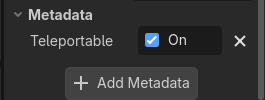

Metadados. Fonte: autoral

## Raycasting e Finalização

Finalmente podemos juntar nossas peças e colocar a arma de portais para funcionar. Volte para a cena global. Inclua a sala, o jogador e duas instâncias do portal, posicione o jogador em algum lugar, mas deixe os portais onde estão. Então, desative ambos os portais clicando no ícone de olho na árvore de nós, eles serão ativados pela arma de portais. 

Agora, na cena do jogador, vamos implementar um sistema de **Raycasting** (Invocação de feixe), ou seja traçaremos um feixe em relação a visão do jogador, que será capaz de detectar colisões com superfícies. No Godot, temos o nó `RayCast3D` que faz justamente isso, adicione-o a cena do jogador como filho da câmera. Então, ajuste `Target Position` para `(0, 0, -50)`, então um feixe enorme de luz aparecera indo ao infinito (na verdade até o -50, mas enfim).

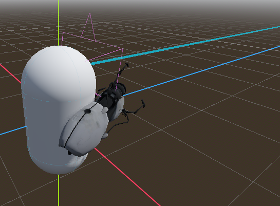

Visão de RayCasting. Fonte: Autoral.

Com isso feito, volte ao script do jogador e adicione novas variáveis para acessarmos os componentes.

```gdscript
@export var portal_blue: Portal
@export var portal_orange: Portal

@onready var raycast: RayCast3D = $Head/Camera3D/RayCast3D
```

Em seguida, vamos criar dois novos eventos de mouse a serem detectados, vá em `Project Settings > InputMap`. Em `Add New Action`, escreva `fire_blue` e adicione, depois inclua neste evento o botão esquerdo do mouse. Faça o mesmo para o botão direito, batizando o evento de `fire_orange`.

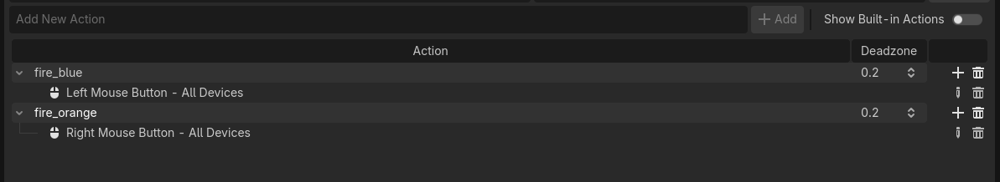

Eventos de mouse. Fonte: Autoral

Com isso pronto, em `_process()` inclua uma nova condicional:

```gdscript
# Handle shooting
if Input.is_action_just_pressed("fire_blue"):
	shoot_portal("blue")

if Input.is_action_just_pressed("fire_orange"):
	shoot_portal("orange")
```

Agora para a implementação de `shoot_portal`:

```gdscript
func shoot_portal(type: String):
	if raycast.is_colliding():
		var point = raycast.get_collision_point()
		var normal = raycast.get_collision_normal()
		var collider = raycast.get_collider()

		var target_portal = portal_blue if type == "blue" else portal_orange
		
		# If the portal is already at this location, "retract" it
		if target_portal.visible and target_portal.global_position.distance_to(point) < 0.5:
			target_portal.visible = false
		else:
			place_portal(target_portal, point, normal)
```

Pode parecer meio confuso, mas tudo que estamos fazendo é caso o raycast tenha detectado uma superfície, pegamos esse ponto, escolhemos um dos portais e caso o portal já esteja naquela localização "retraímos" ele de volta para a arma, caso contrário posicionamos o portal.

```gdscript
func place_portal(portal, point, normal):
	portal.visible = true
	portal.global_position = point
	
	# Align the portal with the wall normal
	# We want the portal's -Z (forward) to match the wall's normal
	if normal.is_equal_approx(Vector3.UP):
		portal.look_at(point - normal, Vector3.FORWARD)
	else:
		portal.look_at(point - normal, Vector3.UP)
	
	# Small offset to prevent Z-fighting with the wall
	portal.global_position += normal * 0.05
```

Por fim, a função `place_portal` é ainda mais simples. Nós ativamos o portal, setando `visible` para `true` e posicionamos ele contra a superfície, dessa forma sua saída sempre será para dentro da nossa sala.
## Conclusão

*Et voilà*! O jogo está pronto. É claro que falta 99% do que faz *Portal* ser *Portal*, mas o principal mecanismo do jogo está implementado, o que não é pouca coisa, acredite.

Ao mesmo tempo que nossa implementação não é perfeita, pois existem alguns erros grotescos &mdash; experimente criar um portal no chão e atravessá-lo. É muito importante frisar como essa mecânica aparentemente simples, é na verdade  complexa e cheia de *trade-offs*. Desde de nossa escolha de não fazer portais recursivos até o momento em que decidimos usar shaders para renderização, estamos traçando nosso próprio caminho/opinião em relação a como o jogo deve funcionar.

Se você gostaria de saber mais sobre como o Portal foi criado e quais foram os desafios e escolhas feitas pelos próprios desenvolvedores da Valve, eu recomendo esse vídeo que vem do curso original de introdução a game dev.


Ficamos por aqui hoje, te vejo na próxima aula!

[^1]: https://en.wikipedia.org/wiki/Portal_(video_game)

[^4]: https://docs.godotengine.org/en/stable/tutorials/3d/csg_tools.html
